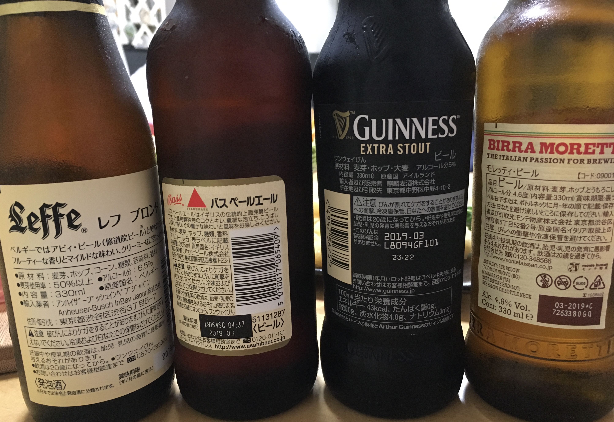

この記事は [Beer Advent Calender 2016](http://www.adventar.org/calendars/1348), 18 日の記事です.

## 前置き

こんにちは.
私はお酒が好きです. 
お酒といっても色々あると思うのですが, 中でもビールが好きでたまりません.
私は本エントリ執筆時点でビール歴 2 年の若僧ですが,
これまでに飲んだ中で個人的に好きなビールを順不同, 
ジャンル無関係に紹介し, 
感想を書きたいと思います.

{ width=400px }

<!--more-->

## ビール！ビール！ビール！

以下にビールとその感想を羅列していきたいと思いますが,
個人的な好みの傾向として, 

* エール系よりもサッポロ黒ラベルといった麦の甘みが残るもののほうが好き
* 赤, 黒ビールも好き

といった感じなので, 
当然ながらそれなりの偏見が混入することと思いますが, 予めご了承下さい :)

### COEDO 伽羅 -kyara- India Pale Lager

埼玉県川越市発祥の伽羅色ビール. 
キレというか苦味というか,
スパイシーなアロマホップ感がありつつも飲み歩きに最適な程度に抑えているといった印象があります.
私は丁度小江戸でビールサーバーで注いでもらい, 観光しながら飲み歩きました.
今思えば, アロマホップ入門という感じの心地よさだったと思います.
(「インドの青鬼」を飲んでからそのような認識に…)

### COEDO 漆黒 -shikkoku- black lager

こちらも埼玉県川越発祥の黒ビール. 
黒ビールはどれも甘めですが, 
おつまみなしでビールだけで飲む時にはその甘さが心地よく感じます.
と言いつつも, このビールは黒ビールの中でも若干甘さ控えめに私は感じました.

### Budweiser

有名なアメリカ発祥ビール.
個人的にはアメリカ発祥のビールはどれも薄味なイメージが私はあるのですが,
それが活かされた一本だと思います.
夏場とかで水のように飲めるスッキリ感と若干の甘みが好きです.

### YEBISU with Joel Robuchon 余韻の時間

ヱビスとJoel Robuchonのコラボビール.
あの Joel Robuchon とコラボ...アツい！と思い,
コンビニで並び始めた途端に即購入した思い出があります.
こういうコラボビールの面白さって私個人としてはやはり元々の味をどうやって変えてくるかだと思うのですが,
後味が通常の YEBISU ビールよりも甘く風味がかかっていたように感じました.
口に入れた瞬間の YEBISU 感と後からコラボビールを思い出させる味の変化がとても飲んでいて面白かったです.
ところで, 最近このビールを一切店頭で見なくなってしまったのですが,
今はこれ売っているのでしょうか.期間限定だったのでしょうか.

### cruzcampo & Mahou Negra

この二本は御茶ノ水にあるスペイン料理店, El Chateo del Puente にて飲みました.
スペイン料理店で出てくるビールなので, 
当然ですがスペイン発ビールです. 
まず cruzcampo ビールについてですが, 
一言で言うととてつもなく飲みやすいビールでした. 
かなりさっぱりしていて、夏には持ってこいという味です.
これこそ, スペイン観光でもしながら飲み歩きしたいところです...若干薄味です.
Mahou Negra は黒ビールです.
名前は「魔王」としておきながら, 結構甘いです.
といってもギネス程は甘くない印象でした.
おつまみなしで飲めます.

### Mahou & Estrella Damm Barcelona

こちらの二本も前述したスペイン料理店で飲んだ二本です.
Mahou Negra を注文したら, 普通の Mahou も飲みたくなってしまいました.
感想としては, 万人ウケするような全体的にとてもバランスの取れたビールだと思いました.
甘みと苦味, どちらが強いというわけでもなくずっと飲んでいても飽きない味です.

Estrella Damm Barcelona は, これまた万人ウケするような全体的にとてもバランスの取れた(ry
しかし, Mahouとは当然ながら違って若干スッキリ目のイメージがあります.
濃厚ながら万人ウケの Mahou, スッキリながら万人ウケの Estrella Damm Barcelona といったところでしょうか.

### Löwenbräu & Corona Extra

ドイツのレーベンブロイ, メキシコのコロナ.
私はレーベンブロイ, かなりお気に入りです.
全てのビールの中で5本の指の中に入るぐらい好きです.
なんと説明すれば良いのでしょうか, 甘みとコクが有りながらも濃厚すぎずスッキリすぎず,
料理がとても美味しくなるビールだと思います.
スーパーなどで瓶ビールのどれをおすすめするかと言われたら, 私はレーベンブロイを間違いなく推します.
一方, コロナビールは若干ホップかエールが効いているのか,
爽やかながら少し癖のあるビールという印象がありますが, 肉料理に凄く合います.
特にフレンチのフルコースなんかで一品一品の味を締めたい,
口の中の味を一新したいという時に持ってこいだと私は思います.

### Heineken

これまた有名な銘柄, ハイネケン.
薄味ながらバドワイザよりも少し風味高い印象があります.
ソーセージとかと一緒に飲むととても美味しかった思ひ出.

### サッポロ黒ラベルエクストラブリュー

私はサッポロビールがとても好きです.
特にあの後味...グッとくるビール特有の甘さ.
たまりません. そんなサッポロビールのエクステンション, 黒ラベルエクストラブリュー.
これはその後味をさらに強めた一品です.
おつまみなしでもガンガン行ける甘み, 最高です.
最近見ないのですが, これもまた限定販売でした.

### YEBISU MEISTER

通常ヱビスのエクステンションビール.
ヱビスらしい苦味がそのまま,
それに対してコクを強めた一品でした.
私はどちらかというとヱビスよりもプレモル派なのですが, YEBISU MEISTER はかなりお気に入りです.
特に酢豚などと合わせて食べた時は最高でした. これもまた限定販売です. 確か.

### ASAHI The Dream

ここに来てなのですが,
全てのビールの中でこのビールが一番のお気に入りです.
元々スーパードライが好きなのですが,
ザ・ドリームは私の中では悠々とそれを超えて来ました
甘みと爽快感のバランスが絶妙ですし、その後のコクも強くてとても良いです.
夏場でも冬場でも, このビール持ち前のポテンシャルの高さで美味しく過ごせます.
缶ビールの中でどれか一つ勧めるとするならば, 間違いなくこの一缶を推します.

### Sapporo 冬物語

最近に飲んだのがこのサッポロビール冬物語です.
元々サッポロビールは好きなので絶対旨いだろうなあと確信しながら買ったのですが,
やはりとても好きな味でした.
通常のサッポロビールの甘み-爽快感+濃厚さといった感じで,
やはり飲んでいると夏向きでないようには思いました (当然の結論).

### アサヒドライプレミアム 焙煎仕立て

いつも注文するネットスーパーから試飲缶を頂いて飲んだものです.
このビールはギフト限定となっておりスーパーやコンビニには並んでいないとのこと.
肝心の味ですが,
個人的な好みとしてははまずまずといったところでした.
最初の一口はやはり風味高く,
甘みを感じますが後味に苦味が来てとても良いバランスをもっています.
しかしその苦味も少し経つとスッと消えていくような印象でした.
やはりギフト専用ビールだけあって,
全体的にとてもお上品な味に感じました.
また, 飲めば飲むほど最初の一口目に感じた味から変化していくように思いました.
試飲缶の一缶だけしか飲んでいないのでなんとも言えませんが, 
個人的な好みとしてはまずまずと言ったものの, 改めて飲みたくなるビールです.

## ビールは良いぞ

というわけで, ビールは美味しいです.
今年もビール浸りな一年を送りましたが来年も浸りたいと思います.
ビールは良いぞ.

[Beer Advent Calender 2016](http://www.adventar.org/calendars/1348),
次回は 19 日, horimislime さんに続きます.
