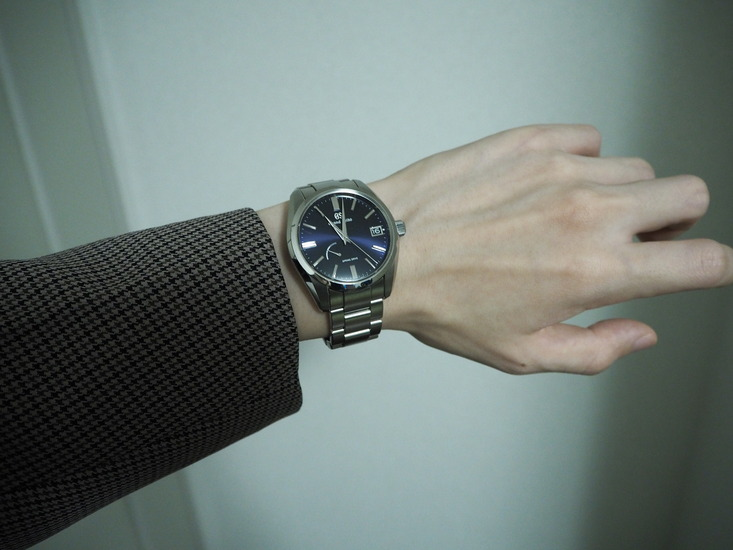
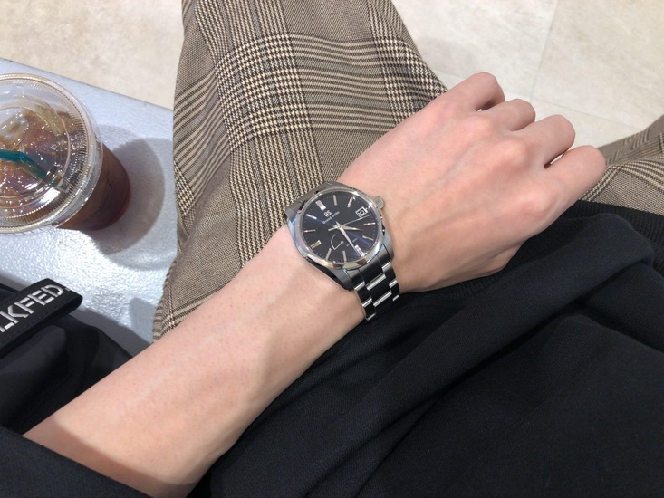

## SBGA439 を入手した

{ width=550 }

[Grand Seiko Heritage Collection SBGA439](https://www.grand-seiko.com/jp-ja/collections/sbga439)
(以下 SBGA439) は Grand Seiko (以下 GS) を象徴するカラーダイアルで,
GS 独自の機構である [9R65](https://www.grand-seiko.com/jp-ja/collections/movement/springdrive/9r65)
スプリングドライブムーブメントが搭載されています.
この度本実機を手にしたので, まだ 2 週間程しか経っていませんが,
着用してみての所感を残したいと思います.

## ムーブメント

SBGA439 について語るにはスプリングドライブの話題を避けては通れませんので少し簡単に取り上げます.
1999 年セイコーがスプリングドライブを発表したその後の 4 年, より効率の良い自動巻機構の開発を経て,
72 時間のパワーリザーブである GS 初の 9R スプリングドライブムーブメント, キャリバー 9R65 が誕生します.
同ムーブメントは, 現在も 9R スプリングドライブの標準的なムーブメントとして多くのモデルに搭載されており,
本稿で取り上げる SBGA439 もそのうちの 1 つです.
外から見て分かるものとして, 同機構特有のスイープ運針は目を見張るものがありますね.

まるで壁掛け時計を見ているかのようです.
平均月差 $\pm 15$ 秒 (日差 $\pm 1$ 秒相当) ということで,
純粋な機械式時計と比較することは無意味ではありますが,
昨今の ROLEX のムーブメント精度 (日差 $\pm 2$ 秒) に勝る精度を誇っています.
 
先日 [THE SEIKO MUSEUM GINZA](https://museum.seiko.co.jp/) に遊びに行ったのですが,
そちらでちょうどスプリングドライブの展示があったので, 下図に示します.

<iframe src="https://assets.pinterest.com/ext/embed.html?id=314477986493078644" height="359" width="345" frameborder="0" scrolling="no" ></iframe>

## 着用感

筆者は手首周り 15.5cm 程の細腕なので,
40mm サイズのケース幅を持つ腕時計は少し心配でした.
しかしながら冒頭の画像のとおり特にそこまで見た目に違和感が出ることはありませんでした.
つけ心地についても特に問題はなく, サイズ感が合うようコマ調整を行えばブレスレットの馴染みは良いです.
ラグまで含めるとケースが少し分厚めで，手に取るとそこそこの重量を感じるのですが,
これもブレスレットのおかげなのか程よい重厚感に収まるといった体感です.
 
夜間での視認性については,
インデックスの磨き上げとダイヤルの光沢によって,
月明かり等の自然光が少しでもあれば問題なく時刻が読み取れるので, 日常生活においては全く問題なさそうというのが
2 週間つけてみての見解です.

## 良い点

上記記載の内容以外で個人的に良いなあと思ったところを書き連ねます.
当然内容は筆者の感情ベースなので,
「人それぞれ感じ方は違うだろうけど」という枕詞がすべての文頭に置かれていると思って下さい:raised_hand:

### パワーリザーブ/デイト表示が便利

機械式時計[^1]はパワーリザーブよりも長い間静止させておくとゼンマイが緩みきり, 
止まってしまいます. 従って, 次に使う時にはゼンマイを巻き上げて時刻等を合わせなければなりません.
パワーリザーブ表示は, あとどれくらいで緩みきってしまうのかがわかるので,
完全に止まってしまう前に巻き上げることができ管理上便利です[^2][^3].
  
余談ですが, デイト表示も個人的には中々便利に感じています.
これを便利/邪魔と思うかは人それぞれだと思うのですが,
個人的に, 便利/邪魔の指標は使用シーンに依存するのかなと思っています.
筆者はたまたまお役所に諸々の用事があった際この SBGA439 をつけていったのですが,
お役所の資料というのは高確率で手書きで日付を書かなければならないので,
その際にスマホを取り出して「今日何日だっけ」といういつもの動作を省くことができ,
便利だなあと思いました:v:
 
まあ, 日付くらい自分の感覚として覚えておけよというとそれまでなのですが,
たまたま便利だなと思うことができた, ということで...

### GS ブランドを象徴するカラーダイヤルが美しい

<iframe src="https://assets.pinterest.com/ext/embed.html?id=314477986493078742" height="359" width="345" frameborder="0" scrolling="no" ></iframe>

GS ブランドの象徴カラーである紺色のダイヤルは,
身につけているそれがより GS のものであることを意識させてくれます.
紺色といっても単一の見え方ではなく,
光のあたり具合や見る角度によって黒にも見えたりメタリックブルーにも見えたりと表情を変えるので,
見ごたえのある腕時計だと感じています.

### その他

- 竜頭操作によるゼンマイの巻き上げ感が心地よい
- 裏蓋の GS を象徴する獅子の紋章が印象的
- ワンプッシュ三つ折れ方式中留の付け外しが容易
- 日常生活用強化防水 10 気圧なので急な雨に降られても安心

{ width=550 }

## 気になるところ

ここまで割と肯定的な内容で占めていましたが,
あくまで個人的に気になっているところについても紹介しようと思います.
といっても今の所 1 点だけです.
この SBGA439 (というか GS ヘリテージコレクション全般) は,
若者向けではなく,
また割とビジネスやフォーマルといった少し堅いシーン向きの腕時計であるという一定の周知があると思っているのですが,
この想定に外れたシーンやシチュエーションで着用すると, やはり少し違和感があるということです.
まあ, これは TPO を弁えていないということと同義なので, それはそうという感じではありますね.

{ width=550 }

と言いつつも,
上で述べた周知から意識を外して単純に時計の見た目と雰囲気だけにフォーカスして考えてみると,
革ベルトというわけでもないし,
ケースの分厚さはスポーティーにも感じとれるしで,
意外といけるかもしれない?とも思ったのでした.

## 総括

落ち着いた GS ブランドカラーの紺色に精度の高いムーブメント,
ケースやブレスレットの仕上げからしても, 良質な実用腕時計として一生使える一本といえそうです.
40 代から上の年代におけるビジネス/フォーマルなシーンに相応しい一本ではありますが,
20 代から所持しておいてここぞという場面でさり気なく扱えるとそれなりの気品が演出できそうという観点を踏まえると,
持っておいて損はないのかなと思います.

[^1]: 純機械式ではないけど, ここではスプリングドライブも含めることとします
[^2]: 個人的には磁気と, 常に動かし続けることによる内部機構の消耗を懸念してしまうため, ワインディングマシンはあまり好きではありません...
[^3]: 普段は ROLEX Explorer 1 ref.124270 というシンプル 3 針表示のものをよく使うからかもしれません.
