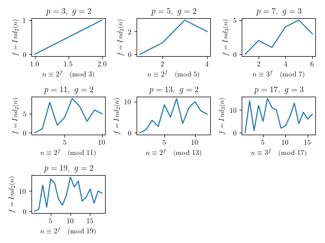

エルガマル暗号が離散対数問題の応用であることは認知していたものの, 
きっちりと自分でまとめたことが無かったと思うので, 
それに関連する諸々の前提についてもふまえて, 一度書くことにした. 
また, その処理系を[実装した](#impl).
本エントリでは, 同暗号プロトコルの話の前にまず前提を示し, 
その後, 実装の観点から見た要点を示す.

<!--more-->

<br><i>※ 内容にはできる限り注意を払っておりますが, 筆者は暗号プロトコル等に関する専門家ではないため, 注意してください. 間違った箇所, 不自然な箇所等があれば, ご報告いただけると幸いです.</i>

## ユークリッドの互除法

これは, とても有名なアルゴリズムだと思われるので, 
わざわざ特別取り上げる必要はないようにも思ったのだが,
本エントリでは最大公約数を存分に利用するので, これを自明として取り上げないのも頂けない. 
したがって, 簡単に説明, 証明をして終わりとする. ユークリッドの互除法は以下で定義される.

<div class="m-def">
<header class="m-def-title"><p><span id="euclidean">ユークリッドの互除法</span></p></header>
<div class="m-def-content">
\\(2\\) つの自然数 \\(a, b\in\mathbb{N}\\) の最大公約数を求めるアルゴリズム.
  </div>
</div>

最大公約数を求める方法として, 素因数分解をひたすら行うのには, 計算量的に限界がある.
そこで, 古代ギリシャの数学者ユークリッドは, 
この問題を幾何学的に考察した(図示された例は調べるとたくさんある).
たとえば $a=12345678,\ b=87654321$
の最大公約数を求めるとする(以下これを $\gcd(a,b)=c$ と書く).
これをユークリッドの互除法は,

\\[\begin{array}{rr}
87654321&=&12345678\cdot 7&+&1234575\\
12345678&=&1234575\cdot 9&+&1234503\\
1234575&=&1234503&+&72\\
1234503&=&72\cdot 17145&+&63\\
72&=&63&+&9\\
63&=&\underbrace{9}_{c}\cdot 7
\end{array}
\\]

より \\(\gcd(a,b)=9\\) というように解く. これで最大公約数を求まる根拠を以下証明する.

<div class="m-lem">
<header class="m-lem-title"><p>補題 1</p></header>
<div class="m-lem-content">
\\(\gcd(a,b)=\gcd(a-b, b)=\gcd(a-2b,b)=\gcd(a-3b,b)=\cdots\ (a, b\in\mathbb{N})\\) が成り立つ.
</div>
</div>

<div class="m-proof">
<header class="m-proof-title"><p><span id="lemma1">補題 1</span></p></header>
<div class="m-proof-content">
**証明**: $a,\ b$ の公約数を $d$ とすると, 
$d\mid a\land d\mid b \Rightarrow d\mid a-b$.
また $a-b$ と $b$ の公約数を $e$ とすると, $e\mid a-b\land e\mid b\Rightarrow e\mid (a-b)+b=e\mid a$.

\\(\therefore\\) 公約数の全体が一致するから, 最大公約数も一致して, 
$\gcd(a,b)=\gcd(a-b,b)$. これを繰り返すと \\[
\gcd(a,b)=\gcd(a-b,b)=\gcd(a-2b,b)=\gcd(a-3b,b)=\cdots
\\]
</div>
</div>

<div class="m-prop">
<header class="m-prop-title"><p><span id="prop1">命題 1</span></p></header>
<div class="m-prop-content">
  ユークリッドの互除法により \\(c\\) が最大公約数となる.
</div>
</div>

<div class="m-proof">
<header class="m-proof-title"><p>命題 1</p></header>
<div class="m-proof-content">
\\(a, b\in\mathbb{Z}^{+}\\) があるとき, 除算は
\\(a=bq+r,\ 0\leq r\lt b\\) と表せる.
[補題 1](#lemma1) より, $\gcd(a,b)=\gcd(a-bq,b)=\gcd(b,r)$ がいえる.
ここで,

\\[
\begin{array}{ll}
a&=&bq_1+r_1& (0\lt r_1\lt b),& \gcd(a,b)&=&\gcd(b,r_1)\\
b&=&r_1q_2+r_2& (0\lt r_2\lt r_1),& \gcd(b,r_1)&=&\gcd(r_1,r_2)\\
r_1&=&r_2q_3+r_3& (0\lt r_3\lt r_2),& \gcd(r_1,r_2)&=&\gcd(r_2,r_3)\\
\cdots &&& \cdots &&& \cdots \\
r_i&=&r_{i+1}q_{i+2}+r_{i+2}& (0\lt r_{i+2}\lt r_{i+1}),& \gcd(r_i,r_{i+1})&=&\gcd(r_{i+1},r_{i+2})\\
\cdots &&& \cdots &&& \cdots \\
r_{n-2}&=&r_{n-1}q_n+r_n&(0\lt r_n\lt r_{n-1}),&\gcd(r_{n-2},r_{n-1})&=&\gcd(r_{n-1},r_n)\\
r_{n-1}&=&r_nq_{n+1}&& \gcd(r_{n-1},r_n)&=&r_n
\end{array}
\\]

として, $(n+1)$ 回で割り切れたとすると, $r_n$ が最大公約数 $c$ となる. 
</div>
</div>

## ガロア体

ある集合に対して, 加法および乗法における結合律の満足と分配律の成立が両立する演算を定義する. この公理を体の公理といい,
それを満たす集合を体, とくに位数が有限である体を有限体, ガロア体といい, 
これを素数 $p$ を位数として $GF(p)$ と書く. 

このような体は位数を素数で構成すると簡単に構成でき[^1], これを素体という. 
いま, $k\in\mathbb{Z}$ と合同な整数の全体を $\overline{k}$ と表し, これを $k$ を含む剰余類という.  
なお, 一般に $a\equiv b\pmod{c} \Leftrightarrow \overline{a}=\overline{b}$ である.
ガロア体は, \\(\mathbb{Z}/p\mathbb{Z}\\)(以下これを簡単のため, \\(\mathbb{Z}_p\\) と書く.) を整数を $p$ で割った余りから構成される素体として, 次のように構成することで, その同型となる.
\\[\mathbb{Z}_p={\overline{0},\cdots, \overline{p-1} \pmod{p} }\\]

例えば, $GF(2) = \{0, 1\}$ であり, このときの四則演算は「整数の世界で四則演算をして, それを $2$ で割った余り」と定義する[^2].
なおこの演算規則は加算が XOR に, 乗算が AND に対応する.
```Haskell
Prelude> :m +Data.Bits
Prelude Data.Bits> let finitef :: Int -> [Int]; finitef p = [x `mod` p | x <- [0..p-1]]
Prelude Data.Bits> finitef 2
[0,1]
Prelude Data.Bits> map (`mod` 2) (finitef 2) == (map (`xor` 0) $ finitef 2)
True
Prelude Data.Bits> map ((`mod` 2) . (+1)) (finitef 2) == (map (`xor` 1) $ finitef 2)
True
Prelude Data.Bits> map ((`mod` 2) . (*0)) (finitef 2) == (map (.&. 0) $ finitef 2)
True
Prelude Data.Bits> map (`mod` 2) (finitef 2) == (map (.&. 1) $ finitef 2)
True
```

## オイラーの $\phi$ 関数

オイラーの $\phi$ (トーシェント)関数は, 正整数 $n$ に対する $1$ から $n$ までの自然数のうち
$n$ と互いに素なものの個数を $\phi(n)$ として与えることによって定まる乗法的関数[^3]である. 
この関数は \\(p_i\\) を $n$ の素因数として, 次の式で定義できる[^4].

<div class="m-def">
<header class="m-def-title"><p><span id="totientf">オイラーの \\(\phi\\) 関数</span></p></header>
<div class="m-def-content">
\\[\phi(n)=n\displaystyle\prod_{i=1}^k(1-\dfrac{1}{p_i})\\]
  </div>
</div>

例えば $\phi(14) = 6$ である($14 = 2 \cdot 7$ だから, 
$14(1-\dfrac{1}{2})(1-\dfrac{1}{7}) = 6$. これを列挙すると, $1,3,5,9,11,13$). 
特に, $n$ が素数である場合, $1$ から $n-1$ のうち $n$ の素因数である 
$n$ を因数としてもつことはないから \\(n\\) が素数のとき $\phi(n) = n - 1$ が成り立つ.

以下で, \\(p\\) が素数のとき, 先頭から $100$ 個の素数 
\\(p_i=p_0,p_1,p_2,\cdots,p_{99}\\)
に対して, \\(\phi(p_i)=p_i - 1\\) であることを確認する. 

```Haskell
{-# OPTIONS_GHC -Wall #-}
module Main where

import Data.Numbers.Primes (primes)
import Data.List (nub)
import Data.Tuple.Extra (first, second, dupe)
import Data.Ratio ((%), numerator)

primeFactors :: Int -> [Int]
primeFactors = flip go primes
    where
        go _ [] = []
        go n xxs@(x:xs) 
            | n < (x^(2 :: Int)) = [n | n > 1]
            | otherwise = let (d, r) = n `quotRem` x in
                if r == 0 then x:go d xxs else go n xs

totient :: Int -> Int
totient = numerator . uncurry (*) . first (% 1) . second (foldr (\x acc -> (x % x - 1 % x) * acc) 1 . nub . primeFactors) . dupe

main :: IO ()
main = print $ and $ take 100 [totient p == (p - 1) | p <- primes]
```

## フェルマーの小定理

<div class="m-lem">
<header class="m-lem-title"><p><span id="lemma2">補題 2</span></p></header>
<div class="m-lem-content">
奇素位数 $p$ のガロア体 \\(GF(p)\\) の既約剰余類郡を 
\\(\mathbb{Z}^{\ast}_{p}={\overline{1},\overline{2},\cdots,\overline{p-1}}\\) としたとき, 
\\(^\exists b,^\exists c \in \mathbb{Z}^{\ast}_{p} (b \neq c)\\) があって,
\\(ba\equiv ca\pmod{p}\\) となる \\(a \in \mathbb{Z}^{\ast}_{p}\ (\gcd(a, p)=1)\\) は存在せず, 
\\(\mathbb{Z}^{\ast}_{p}\\) の異なる項は非合同.
</div>
</div>

<div class="m-proof">
<header class="m-proof-title"><p><span id="lemma2">補題 2</span></p></header>
<div class="m-proof-content">
$\gcd(a, p) = 1$ であるから $ba\equiv ca\pmod{p}$ の両辺から $a$ を約せて $b\equiv c\pmod{p}$. 
$b < p$ および $c < p$ から従い $b = c$ となり不条理.
</div>
</div>

<div class="m-thm">
<header class="m-thm-title"><p><span id="fermatstheorem">フェルマーの小定理</span></p></header>
<div class="m-thm-content">
  \\(p\\) が素数 \\(\Rightarrow\ ^\forall a\ (\gcd(a,p) = 1)\\) に対して, \\[a^{p-1}\equiv 1\pmod{p}\tag{2}\\]
</div>
</div>

<div class="m-proof">
<header class="m-proof-title"><p>フェルマーの小定理</p></header>
<div class="m-proof-content">
[補題 2](#lemma2) より従って, \\(\mathbb{Z}^{\ast}_{p}\\) の各要素と $a$ の積は全て異なり, 
かつ \\(\mathbb{Z}^{\ast}_{p}\\) はそれらで尽くされる. 
また, それらの積の $\pmod{p}$ は $\pmod{p}$ の既約代表系 \\({1, 2, \cdots, p-1}\\) のすべての積と合同:
$$1\cdot 2\cdot\cdots\cdot(p-1)\equiv (a)(2a)\cdots(p-1)a\pmod{p}$$
$$(p-1)!\equiv (p-1)!\cdot a^{p-1}\pmod{p}$$
$\gcd((p-1)!, p) = 1$ であるから, 両辺からこれを約し, 

\\[a^{p-1}\equiv 1\pmod{p} \\]
</div>
</div>

簡単に確認[^5].

```Haskell
Prelude> :m +Data.Numbers.Primes
Prelude Data.Numbers.Primes> let fermatLT :: Integer -> [Integer]; fermatLT p = [a^(p-1) `mod` p | a <- [1..p-1], gcd p a == 1]
Prelude Data.Numbers.Primes> and $ map ((all (1==)) . fermatLT) $ take 50 primes
True
```
## 原始元

<div class="m-def">
<header class="m-def-title"><p>位数</p></header>
<div class="m-def-content">
\\(n \in\mathbb{Z}^{+},\ a \in\mathbb{Z},\ \gcd(n, a) = 1\\) に対して \\(a^d\equiv 1\pmod{n}\\) 
のような最小の \\(d\in\mathbb{Z}^{+}\\) を \\(a\\) の\\(\pmod{n}\\) での位数といい, 
これを \\(d=\mathrm{ord}_n(a)\\) と書く. 
</div>
</div>

ただし, 以下添え字 $n$ は明確である場合には省くこととする. 
たとえば $p=7$ としたときの $1 \leq a\leq 6$ の $a$ の冪 $\pmod 7$ を一覧にすると次のとおりである.

```Haskell
Prelude> let f p = foldr (\x acc -> [a^x `mod` p | a <- [1..p-1]] : acc) [] [1..p]
Prelude> mapM_ print $ f 7
[1,2,3,4,5,6]
[1,4,2,2,4,1]
[1,1,6,1,6,6]
[1,2,4,4,2,1]
[1,4,5,2,3,6]
[1,1,1,1,1,1]
[1,2,3,4,5,6]
```

6 乗ですべて $\equiv 1\pmod{7}$ というのが, 先に述べたフェルマーの小定理であるが,
それよりも前に $\equiv 1\pmod{7}$ となる数があることがわかる.
これをいま述べた \\(\mathrm{ord}\\) で表せば, 
\\(\mathrm{ord}(1)=1, \mathrm{ord}(2)=3, \mathrm{ord}(3)=6, 
\mathrm{ord}(4)=3, \mathrm{ord}(5)=6, \mathrm{ord}(6)=2\\) である. 
また, この結果が $\phi(6) = 2$ と整合であることが確認できる. 
\\(\mathrm{ord}(3), \mathrm{ord}(5)\\) が他と相違なる部分は, 
$1$ から $6$ までの数がちょうど $1$ 回ずつ現れることである. このように,

<div class="m-def">
<header class="m-def-title"><p><span id="primitive_root">原始根</p></header>
<div class="m-def-content">
\\(\pmod{n}\\) での位数が \\(\phi(n)\\) である整数
</div>
</div>

を $n$ の原始根という.

同様に, 原始元とは, 奇素数 $p$ と元 $a \in \mathbb{Z}^{+} (a < p)$ があって,
$p$ を法とする剰余類で累乗していくと, 
$1$ から $p-1$ のすべての元をつくす郡(巡回郡)を構成する元 $a$ をいう.
これは, 

* $a^{p-1}$ で初めて $a^{n} \equiv 1\pmod{p}$ となるような元 $a$(生成元であるから)
* 位数が$p-1$ となる元 $a$

ともいえる. 

とくになにも考えず, 与えられた素数 $p$ に対する $GF(p)$ の原始元を素朴に生成してみる.

```Haskell
{-# OPTIONS_GHC -Wall #-}
module Main where

import Data.List (findIndices)
import Data.Numbers.Primes (primes)

primitiveElem :: Integer -> [Integer]
primitiveElem p = go [((a^n `mod` p) == 1, a) | a <- [2..p-1], n <- [1..p-1]]
    where
        go [] = [];
        go xs@(x:_) = let d = drop (fromIntegral (p-1)) xs in 
            case findIndices fst $ take (fromIntegral (p-1)) xs of 
               [i] | i == fromIntegral (p-2) -> snd x:go d
                _ -> go d

main :: IO ()
main = mapM_ (print . primitiveElem) $ take 100 $ drop 1 primes
```

<a href="https://wandbox.org/permlink/1ESn07fY95vwqEpv" id="thiscode">実行結果</a>[^7]. 
上の冪の一覧のとおり, 素数 $p$ を位数とするガロア体はその原始元を $a$ として
$$GF(p)= \left\{0, 1, a, a^{2}, \cdots, a^{p-2}\tag{3}\right\}$$ と構成されることがわかる.
$p=7$ であれば, 原始根は $\phi(6)=2$ であり, その $1$ つは $g=3$ であるからこの冪乗 
$n\equiv g^{f}\pmod{7}$ で $p-1=6$ までの全て, 
すなわち先の \\(\mathrm{ord}(3)\\) の縦の列が得られる.

```Haskell
Prelude> [3^x `mod` 7 | x <- [1..6]]
[3,2,6,4,5,1]
```

## 離散対数問題

$(3)$ を前提とし $g^{f}\equiv n\pmod{p}\ (1\leq n \leq p-1)$ を満たす
$f$ は $0\leq f\leq p-2$ のうち, ただ $1$ つだけ存在する. これを $n$ の指数または離散対数といい, 
\\(f=\log_{g}n\pmod{p}\\) および \\(\mathrm{Ind}f=\mathrm{Ind}_{g}(n)\\) と書く. 
この $n$ を真数, または離散真数という. 
以下は, \\(3\leq p \leq 19\ (p\ is\ prime)\\) でその最小の原始根 $g$ の冪乗
\\(n\equiv g^f\pmod{p}\\) の昇順を $x$ 軸, 
\\(\mathrm{Ind}f=\mathrm{Ind}_{g}(n)\\) を $y$ 軸として,
それぞれの各離散対数をプロットした図[^8]である.



これを見てもわかるように, $f$ の値に規則性は見られず, 予測困難な振る舞いをすることがわかる.
例えば, $p=19,\ g=2,\ n=3$ とすると

```Haskell
Prelude> head [f | f <- [0..17], 2^f `mod` 19 == 3 `mod` 19]
13
```
より $f=13$ であることがわかる. この場合, まだ $p$ が小さい素数であるからこそ, 
このような総当たりで解が得られるのだが,
大きな $p$ に対する総当たりでは, 実用的な時間で解を得ることができない.
これを離散対数問題という.
エルガマル暗号は, $g$ と $f$ から $n$ を求めることは容易であるが,
いま述べたように $g$ と $n$ から $f$ を求めることは困難であるという事実を利用することで,
公開鍵暗号方式としての成立および暗号学的安全性の担保を確立する[^9].

<h2><a id="genencanddec" class="disabled">暗号の生成と解読</a></h2>

以上を前提として, 暗号の生成とその解読方法について示す.
受信者は下準備として次の手順で公開鍵と秘密鍵を生成する:

1. 大きな素数 $p$ を選ぶ.
2. $\phi(p-1)$ 個の $p$ の原始根のうち, 任意の $1$ つ $g$ を選ぶ.
3. 任意の正整数 \\(a\in\mathbb{Z}^{+},\ (a < p)\\) を選ぶ.
4. $y\equiv g^a\pmod{p}$ を計算する.
5. 公開鍵を \\({p, g, y}\\), 秘密鍵を \\({a}\\) とする.

平文の列を \\(x_1,x_2,\cdots,x_t\ (x_i < p)\\), 最初の平文を $x$ とし,
発信者は次の手順で暗号文を生成する:

1. 任意の正整数 \\(k\in\mathbb{Z}^{+}\\) を選ぶ.
2. \\(\alpha\equiv g^k\pmod{p}\\) を計算する.
3. \\(z\equiv y^k\pmod{p}\\) と \\(\beta\equiv xz\pmod{p}\\) を計算し, $x$ に対する \\(\gamma ={\alpha,\ \beta}\\) を得る.
4. \\(x_t\\) に到達するまで 1 から 3 の手順を繰り返す. 到達すれば, 暗号文の生成は完了である.

受信者は次の手順で暗号を解く:

1. $\gamma$ から $x$ を得るためには, $y^k$ を要する. 秘密鍵 $a$ を使い, $z\equiv y^k \equiv (g^a)^k\equiv(g^k)^a\equiv\alpha^a\pmod{p}$ と計算する.
2. $x\equiv \dfrac{\beta}{z}\pmod{p}$ であるので, $\pmod{p}$ で $z$ のモジュラ逆数 $zq\equiv 1\pmod{p},\ q\equiv\dfrac{1}{z}\pmod{p}$ を計算する.
3. \\(x\equiv\dfrac{\beta}{z}\equiv\beta q\equiv u\pmod{p}\ (u< p)\\) を計算する. ここで, $x< p$ であるから, この結果が平文である.

実際にこれを手計算で実行してみる.
$p=97$ とする. 従って $g=5$ となる. ここで $a=7$ とする.
$y\equiv 5^7\pmod{97}$ より $y\equiv 5^7\equiv 40\pmod{97}$ だから, 公開鍵は \\({97,5,40}\\),
秘密鍵は \\({7}\\) である. 次に暗号文を作成する.
平文は, 次のアスキーコードで表現された文字列とする.

```Haskell
Prelude> :m +Data.Char
Prelude Data.Char> map ord "OK"
[79,95]
```

ここで $x=79,\ k = 5$ とする. 
$\alpha\equiv 5^5\equiv 21\pmod{97}$ また
$z\equiv 40^5\equiv 10\pmod{97}$ より $\beta\equiv 79\cdot 10\equiv 14\pmod{97}$.
従って, \\(\gamma={21, 14}\\) となる. 
$x=95$ にも同様の計算($k$ は毎度ランダムに選ぶ. 次は $k=6$ であったとした.)を施して, 
全体の暗号文を`[21, 14, 8, 73]`とする. これを解読する.
$z\equiv 21^7\equiv 10\pmod{97}$ で, $z\equiv y^k\pmod{97}$.
$10q\equiv 1\pmod{97}$ だから $q\equiv\dfrac{1}{10}\equiv 68\pmod{97}$.
ここで $u\equiv 14\cdot 68\equiv 97\pmod{p}$ で, $u< p$ だから $x\equiv u\pmod{p}$.
よって $1$ 文字目は $79$. 同様に $2$ 文字目も計算し, 全体の平文が手に入る.
解読の段階で $a=7$ を知らなかった場合, 離散対数問題を解くことに相当するため, 
平文を得るのは非常に困難となる.

## 実装

ここからは, これをプログラムとして実装することを考える.
第一に必要となるものは, 大きな素数の生成器である.
方法としては, ランダムに奇数を生成し, Miller-Rabin 
素数判定法などの確率的素数判定法を用いることが実例として多い[^10]ので, ひとまず素数生成には Miller-Rabin 素数判定法を使うこととする. 

### フェルマーテスト, Miller-Rabin 素数判定法

Miller-Rabin 素数判定法は, フェルマーテストの改良と言えるので, まずその説明から行う.
フェルマーテストは, 先に述べたフェルマーの小定理の対偶[^11]を利用した判定方法であるといえる.

<div class="m-def">
<header class="m-def-title"><p><span id="fermattest">フェルマーテスト</span></p></header>
<div class="m-def-content">
\\(FT_n(a): =\gcd(a, n)=1\\) を満たす \\(n \in\mathbb{Z}^{+}\\) と底 \\(a\in\mathbb{Z}^{+}\\) があって, \\(a^{n-1}\equiv 1\pmod{n}\\) が成り立つか.
</div>
</div>

この答えが yes であるとき $n$ は \\(FT_n(a)\\) をパスしたといえば, 
フェルマーの小定理は, 「$n$ が素数ならば, $n$ 
は $^\forall a(\gcd(a,n)=1)$ に対する \\(FT_n(a)\\) をパスした」といい, 
この対偶をとると,「\\(FT_n(a)\\) をパスしない $\gcd(a,n)=1$ の $a$ があれば, 
$n$ は素数ではない」といえる. 
たとえば, $n=15$ とすると $2^{15-1}\equiv 2^{14}\equiv 4\not\equiv 1\pmod{15}$ であるから 
$15$ は素数ではない. しかしながら, $^\forall a(\gcd(a,n)=1)$ に対して 
\\(FT_n(a)\\) をパスしても $n$ が素数であるとは断言できない. このような

<div class="m-def">
<header class="m-def-title"><p>カーマイケル数</p></header>
<div class="m-def-content">
\\(^\forall a(\gcd(n, a)=1)\\) に対して \\(FT_n(a)\\) をパスする合成数
  </div>
</div>

をカーマイケル数という. 一般的に, そのような $n$ は少ないことが知られている.
ところで, カーマイケル数は奇数である.

<div class="m-prop">
<header class="m-prop-title"><p><span id="prop2">命題 2</span></p></header>
<div class="m-prop-content">
カーマイケル数は奇数
</div>
</div>


<div class="m-proof">
<header class="m-proof-title"><p>命題 2</p></header>
<div class="m-proof-content">
$a^n\equiv a\pmod{n}$ に $a=n-1$ を代入すると $(-1)^n\equiv -1\pmod{n}$ となるが,
このとき $n$ を偶数とすると $1\equiv -1\pmod{n}$ となってしまい不条理. 
$\therefore$ 背理により題意は示された. 
</div>
</div>

一方, 

<div class="m-def">
<header class="m-def-title"><p>\\(a\\) を底とする偽素数</p></header>
<div class="m-def-content">
\\(\gcd(n, a)=1\\) のある \\(a\\) に対して \\(FT_n(a)\\) をパスする合成数
</div>
</div>

を $a$ を底とする偽素数という. 

以下で, 取り敢えず 
$200$ 個の偽素数(結果的にはカーマイケル数)を<a class="disabled" id="modexpref">得てみた</a>[^12]. 

```Haskell
{-# OPTIONS_GHC -Wall #-}
module Main where

import Data.Numbers.Primes (primes)
import Data.Bits (Bits, (.&.), shiftR)

{-# INLINE modExp #-}
modExp :: (Integral a, Bits a) => a -> a -> a -> a
modExp = go 1
    where
        go r _ 0 _ = r
        go r x n m
            | n .&. 1 == 1 = go (r * x `rem` m) (x * x `rem` m) (n `shiftR` 1) m
            | otherwise = go r (x * x `rem` m) (n `shiftR` 1) m

{-# INLINE isFermat #-}
isFermat :: (Integral a, Bits a) => a -> a -> Bool
isFermat n b = modExp b (n - 1) n == 1

pseudoprimes :: [Integer]
pseudoprimes = go [x | x <- [2..], odd x] [x | x <- primes, odd x]
    where
        tryFermat n t = all (isFermat n) $ take t [x | x <- [2..n-1], gcd x n == 1]
        go [] _ = []
        go _ [] = []
        go (x:xs) (p:ps) 
            | x == p = go xs ps 
            | otherwise = if tryFermat x 100 then x : go xs (p:ps) else go xs (p:ps) -- Testing 100 times

main :: IO ()
main = print $ take 200 pseudoprimes
```
実行結果.
```Haskell
[561,1105,1729,2465,2821,6601,8911,10585,15841,29341,41041,46657,52633,62745,63973,75361,101101,115921,126217,162401,172081,188461,252601,278545,294409,314821,334153,340561,399001,410041,449065,488881,512461,530881,552721,656601,658801,670033,748657,825265,838201,852841,997633,1024651,1033669,1050985,1082809,1152271,1193221,1461241,1569457,1615681,1773289,1857241,1909001,2100901,2113921,2433601,2455921,2508013,2531845,2628073,2704801,3057601,3146221,3224065,3581761,3664585,3828001,4335241,4463641,4767841,4903921,4909177,5031181,5049001,5148001,5310721,5444489,5481451,5632705,5968873,6049681,6054985,6189121,6313681,6733693,6840001,6868261,7207201,7519441,7995169,8134561,8341201,8355841,8719309,8719921,8830801,8927101,9439201,9494101,9582145,9585541,9613297,9890881,10024561,10267951,10402561,10606681,10837321,10877581,11119105,11205601,11921001,11972017,12261061,12262321,12490201,12945745,13187665,13696033,13992265,14469841,14676481,14913991,15247621,15403285,15829633,15888313,16046641,16778881,17098369,17236801,17316001,17586361,17812081,18162001,18307381,18900973,19384289,19683001,20964961,21584305,22665505,23382529,25603201,26280073,26474581,26719701,26921089,26932081,27062101,27336673,27402481,28787185,29020321,29111881,31146661,31405501,31692805,32914441,33302401,33596641,34196401,34657141,34901461,35571601,35703361,36121345,36765901,37167361,37280881,37354465,37964809,38151361,38624041,38637361,39353665,40160737,40280065,40430401,40622401,40917241,41298985,41341321,41471521,42490801,43286881,43331401,43584481,43620409,44238481,45318561,45877861,45890209,46483633,47006785,48321001,48628801,49333201]
```
続いて, Miller-Rabin 法について. 
前述したように, Miller-Rabin 法は, フェルマーテストの改良である. 
そもそも, いま判定する $n$ は奇数である前提をおいて十分であるから $n-1$ は偶数となり,
かつ $(n-1) \div 2$ の結果は整数とすることができる. 
したがって 
\\[\displaystyle a^{n-1}\equiv 1\pmod{n}\Rightarrow 
{\underbrace{(a^{(n-1)/2}\bmod n)}_{x}}^2 \equiv 1\pmod{n}\tag{4}\\] がいえる. 
例えば, $(4)$ の右側の式に着目し, $n=35$ とすると, 
$x$ は $\overline{1},\overline{6},\overline{29},\overline{34}$ が $2$ 乗すると 
$\overline{1}$ となるため, 有りうる.
しかし, $n$ が奇素数であるとき, その剰余類は $\pm{\overline{1}}$ しか有りえないのである. 
これは, 次の命題の証明によって証明される.

<div class="m-prop">
<header class="m-prop-title"><p><span id="prop3">命題 3</span></p></header>
<div class="m-prop-content">
法 \\(n\\) が奇素数であるとき, その剰余において「\\(1\\) の自明でない平方根は存在しない. 
\\(\Leftrightarrow\ x\\) は \\(\pm{1}\\) しか存在しえない.」.
</div>
</div>

<div class="m-proof">
<header class="m-proof-title"><p>命題 3</p></header>
<div class="m-proof-content">
$n$ を法とした剰余において $1\pmod{n}$ の非自明な平方根を $x$ とすると 
\\[x^2\equiv 1\pmod{n}=x^2-1\equiv 0\pmod{n}=(x-1)(x+1)\equiv 0\pmod{n}\\] において, 
$n$ は素数であるから $x-1$ または $x+1$ で割り切れなければならないが, $x$ が $\pm{1}$ 
でないとすると, $x-1$ も $x+1$ も $n$ で割り切れず矛盾. $\therefore$ 背理により, 題意は示された. 
</div>
</div>

Miller-Rabin 法は, この性質を利用して, つまり $1\pmod{n}$ の自明でない平方根を求めることで, 合成数を判別する. 先に述べたように $n-1$ は偶数であるから, 何度か必ず $2$ で割り切ることができる. 
割り切る回数を $s$ とすると, $$n-1 = 2^s \cdot d\ (s\in\mathbb{N}, d\ is\ odd)\tag{5}$$ と表せる. 
このときの $d$ は, $n-1$ を繰り返し $2$ で割った結果そのものである.
フェルマーの小定理を $(5)$ と関連づけると,
$$a^{n-1}\equiv a^{2^s\cdot d}\equiv 1\pmod{n}$$ がいえる. 
[命題 3](#prop3) より, この平方根は $\pm{1}\pmod{n}$ である.

<div class="m-def">
<header class="m-def-title"><p>Miller-Rabin 素数判定法</p></header>
<div class="m-def-content">
\\(^\forall a \in \mathbb{Z}^{\ast}_{n}\\) について $$a^d\equiv 1\pmod{n}$$ または $$a^{2^r\cdot d}\equiv -1\pmod{n}\ (0\leq r\leq s-1)$$ が成り立つ. 
</div>
</div>

これは, 予め $a^d$ から始めて次々に $2$ 乗して得られる列
\\(a^d,\underbrace{\cdots, a^{2^{s-1}\cdot d}}_{s}, a^{2^s\cdot d}=a^{n-1}\\) を想像すると, 考えるに容易い. 

例として, 先に確認できた最小のカーマイケル数である
$561$ をこのミラーラビン法で判定してみるとする. 
$n=561,\ a=2$ としたとき, $561-1=2^4\cdot 35$ であるから, 
$2^{35}\equiv 263\pmod{561}$, $2^{2\cdot 35}\equiv 263^2\equiv 166\pmod{561}$,
$2^{4\cdot 35}\equiv 166^2\equiv 67\pmod{561}$, 
$2^{8\cdot 35}\equiv 67^2\equiv 1\pmod{561}$ より条件を満たさない.
よって $a=2$ により, $n=561$ が合成数であることがわかった.

いま述べたように, この手続きで $n$ が合成数であることがわかったとき,
$a$ を <i>witness</i> と言い, そうでないとき $a$ を <i>strong liar</i>, 
$n$ を <i>strong pseudoprime</i> という[^13]. 
すべての合成数には, 多くの <i>witness</i> である $a$ が存在することが知られているが,
そのような $a$ を生成する簡単な方法はまだ知られていない[^14]ため, 
この $a$ は, いま例で述べたように \\(^\forall a\in \mathbb{Z}^{\ast}_{n}\\) または
\\(^\forall a\in (\mathbb{Z}^{\ast}_{n}\setminus {1 })\\)
からランダムに取って, 何度かの試行を行うこととなる. 
しかし $n$ が小さい場合, 特定のいくつかの <i>witness</i>
によるテストで十分であることが知られており[^15],
その場合, すべての $a<2(\ln n)^2$ を試みる必要はない.

以下にミラーラビン法を用いた素数生成の実装例を示す.
今述べたように, 特定のいくつかの <i>witness</i> マジックナンバーを利用することで, 
演算の高速化を図っている.

なおミラーラビン法の試行回数に関してであるが, 
下記の実装では, $t$ を試行回数, $|p|$ を得たい素数 $p$
のビット長としたとき, $|p|\geq 3072$ で $t=64$, $3071\geq |p|\geq2048$ で $t=56$, 
それ以外を $t=40$ とした[^16].
ただし, $n$ の値がマジックナンバーに当てはまる値であった場合,
いま設定した試行回数を無視して, より少ない回数で試行を実行することとしている.

```Haskell
-- miller.hs
{-# OPTIONS_GHC -Wall #-}
module Main where

import Data.Tuple.Extra (first, second, dupe)
import Data.Bool (bool)
import Data.Bits (Bits, (.&.), (.|.), shiftR)
import Control.Monad.Fix (fix)
import System.Random (Random, randomRs, newStdGen, randomRIO)
import System.IO.Unsafe (unsafePerformIO)
import Control.Monad (void)
import System.Environment (getArgs)

type BitSize = Int

{-# INLINE witnesses #-}
witnesses :: (Num a, Enum a, Ord a, Random a) => Int -> a -> IO [a]
witnesses t n 
    | n < 2047 = return [2]
    | n < 1373653 = return [2, 3]
    | n < 9080191 = return [31, 73]
    | n < 25326001 = return [2, 3, 5]
    | n < 3215031751 = return [2, 3, 5, 7]
    | n < 4759123141 = return [2, 7, 61]
    | n < 1122004669633 = return [2, 13, 23, 1662803]
    | n < 2152302898747 = return [2, 3, 5, 7, 11]
    | n < 3474749660383 = return [2, 3, 5, 7, 11, 13]
    | n < 341550071728321 = return [2, 3, 5, 7, 11, 13, 17]
    | n < 3825123056546413051 = return [2, 3, 5, 7, 11, 13, 17, 19, 23]
    | n < 18446744073709551616 = return [2, 3, 5, 7, 11, 13, 17, 19, 23, 29, 31, 37]
    | n < 318665857834031151167461 = return [2, 3, 5, 7, 11, 13, 17, 19, 23, 29, 31, 37]
    | n < 3317044064679887385961981 = return [2, 3, 5, 7, 11, 13, 17, 19, 23, 29, 31, 37, 41]
    | otherwise = take t . randomRs (2, pred n) <$> newStdGen

{-# INLINE millerRabin' #-}
millerRabin' :: Int -> Integer -> Bool
millerRabin' t n = unsafePerformIO $ millerRabin t n

millerRabin :: Int -> Integer -> IO Bool
millerRabin _ 0 = return False
millerRabin _ 1 = return False
millerRabin t n
    | even n = return $ n == 2
    | otherwise = all (\a -> (uncurry (||) . first (==1) . second (==pred n) . dupe . flip (`modExp` q) n) a || 
        any ((==pred n) . flip (modExp a) n . (*q) . (2^)) [0..pred k]) <$> witnesses t n
    where 
        (k, q) = first (pred . length) . second (fst . last) . dupe $ 
            takeWhile ((== 0). snd) $ iterate ((`quotRem` 2) . fst) (pred n, 0) 

{-# INLINE genRndPrime #-}
genRndPrime :: BitSize -> IO Integer
genRndPrime b = let t | b > 3071 = 64 | b > 2047 = 56 | otherwise = 40 in
    fix $ \loop -> uncurry (bool loop) . first return . second (millerRabinV t) . dupe =<< (.|. 1) <$> randomRIO (2^pred b, pred 2^b)

main :: IO ()
main = void . genRndPrime . read . head =<< getArgs -- NOTE: Simplefied implementation
```
禁断の`unsafePerformIO`を使っているが, Haskell によるミラーラビン法の実装をいくつか見たところ, 乱択部分を除いてしまうか, `unsafePerformIO`でむりやり剥がすかのどちらかであるものが多かったため, 今回は`unsafePerformIO`を使った. 
取り敢えず, $512$ ビットの素数(厳密には, ミラーラビン法をパスした整数値)を $500$ 個生成して, $1$ 個毎の平均タイムを取ってみる(Intel Core i5 2.3 GHz).
```sh
$ ghc -O2 miller.hs
$ function test () { c=$(($1)); sum=0; for ((i=0; i<c; i++)); do t=`(time $2 $3) 2>&1 | cut -d' ' -f 3 | sed -e 's/s//'`; sum=$(($sum + $t)); done; echo $(($sum / $c)) }
$ test 500 ./miller 512
0.15404000000000001
```
続いて, $128, 256, 512, 1024, 2048, 4096$ ビットの素数(厳密には(略))を出力してみる.
```sh
Prelude> :l miller.hs
[1 of 1] Compiling Main             ( miller.hs, interpreted )
Ok, one module loaded.
*Main> :m +Control.Monad
*Main Control.Monad> mapM_ (print <=< genRndPrime) $ takeWhile (<=4096) $ iterate (*2) 128
30152684759236306360759189014885017501
17615060719467184202036409862717012145510462718555435021180440677751843010823
4961148527316039571648091952671338492606036840037640470424610573222347642611462698736307409917945445030462370397146417013342380935544024541068881582286519
25584768656119199916533897521508744971267476837365238305752308490292510217984396186262212951588772839265133033518832638176737141863211711861885101826309901436466476910363387059212888058245199487348290889532831748995252985064885609741672898559944700898752387615008473235044774735893904621136647403330417312059
9697176354766878597400959392092693913441120648813644414460016213663985294414931715402479614583881054693029546415327047217815927381224240226473707682349775659198547518238881984785480308932024810985466973637700641819036921605772405440708981576721445103440573178324949184257202763509431134454852179958292647936221069441068206326565638462179605127956309699241768323894074914089121556488610751882542364864592334186293707224875665902283108012729170475600277359162025423140429916611481557282284452570764357791923438513047955145544164761084918980627342758315952165604438369806429356467080379549163687769931548537357143263137
249063954769520791504335518869525636357711675551382844552486591301599804010616669984965046137702990331634027801213287527508276332874010381824423879851102129301619320214358200683875526181170711209609115767952039460200494646156806401006606435356629905145570257996919209012879790948686386135358818589021439012221688336685244502459332857112750109146317838249983592404921237275755397945054535375511514580719834889033600717626042664029019643677615797489694358572078991851764302692237731943089490923440157248660837253585380337652421704176147487644881486339669614376151014612960159779210346160720078183845109588734694671896283469443712214250201417341560450455911188218652929963021457097285664257779489584361468840174197077267520538188995324746759329091599208318255773278559709364894821983283204708493843410191542232134827077779374883928282449194911733594690651507649566828266806932507531936170109029976882137339061468508458205917061060082555112142174457460359680430229131730389715061511723413089333837349054725383074218124443684705492930073805208443422200611436931245986942375223462067885041043866971617179685176389912228173339486617601365377174404775712644963980902603572250337835570653437536036543335033071576503380289418724779934391260111
```
というわけで, 任意のビット数の素数(厳(略))が得られるようになった. 
ところで, これは完全に蛇足なのだが, 同様の実装を C++ で行えば,
これより少し早くなるのではないかと思い, 
Boost.Multiprecision 等を使って, この実装を C++ に移植しようと考えた. 
ただ, ミラーラビン法で素数を得る機能は, 既に同ライブラリ内で実装済みであったので,
一旦それを用いてタイムを計測して, お茶を濁すこととした. 
```cpp
// miller.cpp
#include <boost/multiprecision/cpp_int.hpp>
#include <boost/multiprecision/miller_rabin.hpp>
#include <boost/random/mersenne_twister.hpp>
#include <boost/random/uniform_int_distribution.hpp>
#include <boost/random/random_device.hpp>

constexpr unsigned int check_times(unsigned int s) noexcept
{
    return s >= 3072 ? 64 : s >= 2048 ? 56 : 40;
}

int main(int argc, const char** const argv)
{
    namespace bm = boost::multiprecision;
    if (argc != 2) return EXIT_FAILURE;
    const unsigned int val = boost::lexical_cast<unsigned int>(argv[1]);

    boost::random::uniform_int_distribution<bm::cpp_int> dist(bm::pow(bm::cpp_int(2), val - 1), bm::pow(bm::cpp_int(2), val));
    boost::random_device seed;
    boost::random::mt19937 mt(seed);
    
    for (bm::cpp_int candidate = dist(mt); !bm::miller_rabin_test(candidate, check_times(val)); candidate = dist(mt));
}
```
若干ではあるが, やはり少しは早くなったようだ.
```sh
$ g++-8 -std=c++1z -lboost_random miller.cpp -I/usr/local/include -march=native -O3 -Ofast
$ test 500 ./a.out 512
0.13506000000000004
```
さらに早さを求める場合, 実用途として利用でき, かつお手頃なもので良い選択になるものを考えると, 
やはり libgmp が思い浮かぶ[^17]. 
ただ, 本エントリの内容のメインは素数生成に関してではないので, 一旦ここまでとしておく.

### 原始根の生成
次に必要となるのは原始根 $g$ であるが, この生成を簡単にするためには, 
安全素数という素数を素数生成の段階で生成しておかなければならない[^7]. 安全素数は

<div class="m-def">
<header class="m-def-title"><p>安全素数</p></header>
<div class="m-def-content">
\\(q=2p+1\ (p\ is\ prime)\\) があって, このとき素数となる \\(q\\)
</div>
</div>

をいう[^18]. また, 

<div class="m-def">
<header class="m-def-title"><p>ソフィー・ジェルマン素数</p></header>
<div class="m-def-content">
安全素数 \\(q=2p+1\\) の \\(p=(q-1)\div 2\\)
</div>
</div>

をソフィー・ジェルマン素数という. 例えば, $p=11$ としたとき
$2\cdot 11+1=23$ は素数であるから, $q=23$ を安全素数, 
また $p=11$ をソフィー・ジェルマン素数という.
素数生成の段階でこの安全素数を要するのは, 
原始根 $g$ を求める単純な一般式が知られておらず[^7], 安全素数でない素数に対する原始根
$g$ の確定的な結果を要する場合, [先に求めた](#thiscode)ように
\\(g\not\equiv 1,\cdots,g^{p-2}\not\equiv 1\pmod{p}\\) といった判定が必要となるからである.
$q$ が安全素数であれば, $q-1=2p$[^19] より $q-1$ の素因数は $2$ と $p=(q-1)\div 2$
しかなく, 圧倒的に計算量を減らすことができる.
さて, 安全素数は, $p$ と $q$ がともに素数であれば良いので, 
このどちらにもミラーラビン法を実行してしまうのが一番簡単である[^20].

```Haskell
-- (略)

{-# INLINE genRndSafePrime #-}
genRndSafePrime :: BitSize -> IO Integer
genRndSafePrime b = let t | b > 3071 = 64 | b > 2047 = 56 | otherwise = 40 in
    fix $ \loop -> uncurry (bool loop) . first (return . fst) . second snd . dupe =<< 
            second (uncurry (&&) . first (millerRabin' t . (flip shiftR 1) . pred) . second (millerRabin' t) . dupe) .
                dupe . (.|. 1) <$> randomRIO (2^pred b, pred 2^b)
```
これで, 任意のビット数の安全素数が得られるようになった.
あとは, この安全素数を利用して, [原始根の定義, 性質](#primitive_root)に従い,
\\(g^{q-1}\\) で初めて \\(g^{n}\equiv 1\pmod{q}\\) となる $g$ を選べば良いわけであるが, 
その一連の手順としては, いま安全素数 $q$ があって

1. 任意の \\(2\leq g\leq q-2\\) を選ぶ(当然, $1$ と $p-1$ は\\(g^2\equiv 1\pmod{q}\\) となるから).
2. \\(g^{(q-1)/2}\not\equiv 1\pmod{q}\\) を満たすか判定する. これを満たせば $g$ は $q$ の原始根である. そうでなければ 1 へ戻る.

というように探索することができる.
このとき, 離散対数に対する耐性, すなわちセキュリティの強度に関して, 
この $g$ はとくに関与しないため, 通常小さい原始根から探し出せば良いことになる. 
すると, 次のようにして, 最小の原始根が得られる.

```Haskell
Prelude> :m +Data.Bits
Prelude Data.Bits> :l miller
[1 of 1] Compiling Main             ( miller.hs, interpreted )
Ok, one module loaded.
*Main Data.Bits> [x | x <- [2..100], millerRabin' 40 x && millerRabin' 40 (pred x `shiftR` 1)]
[5,7,11,23,47,59,83]
*Main Data.Bits> let rootFromSafePrime p = head [g | g <- [2..p-2], modExp g (pred p `shiftR` 1) p /= 1]
*Main Data.Bits> map rootFromSafePrime  [x | x <- [2..100], millerRabin' 40 x && millerRabin' 40 (pred x `
shiftR` 1)]
[2,3,2,5,5,2,2]
```

### 鍵と暗号文の生成

上で述べた手順のまま実装できる.

```Haskell
type PublicKey = (Integer, Integer, Integer)
type PrivateKey = Integer
type Keys = (PublicKey, PrivateKey)
type Cryptogram = [Integer]

genKeys :: Integer -> Integer -> IO Keys
genKeys p g = ((y, a) -> ((p, g, y), a)) . first (flip (modExp g) p) . dupe <$> randomRIO (1, pred p)
 
encode :: PublicKey -> String -> IO Cryptogram
encode _ [] = return []
encode (p, g, y) plain = concat <$> mapM (\c -> 
    uncurry (:) . first (flip (modExp g) p) . 
        second ((:[]) . flip (flip modExp 1) p . (toInteger (ord c) *) . flip (modExp y) p) . 
            dupe . toInteger <$> randomRIO (1, maxBound :: Int)) plain
```

### 暗号文の復号

復号に関しても, 上の手順のまま実装するだけであるが, 
モジュラ逆数を得るために拡張ユークリッドの互除法を使うのでそれについて説明する.

$GF(p)$ は体の公理より乗法について可換群となっており,
逆元が存在するはずだから, $^\exists n\in GF(p)$ に対する逆元を $n^{-1}=x\in GF(p)$ とおける.
$GF(p)$ の単位元を考えれば, この \\(n\\) と \\(x\\) の関係は, 
\\(nx\equiv 1\pmod{m}\\) という式で表せる.
この式は勿論, 合同の定義からして, $k$ をある整数としたとき 
\\(nx-1=mk\\) と等価であることがいえる. これを都合の良い形に移行すると, 
\\(nx-mk=1\\). いま知りたいのは, 逆数である $x$ だ. ここで, 拡張ユークリッドの互除法を使う.
拡張ユークリッドの互除法は, 

<div class="m-def">
<header class="m-def-title"><p>拡張ユークリッドの互除法</p></header>
<div class="m-def-content">
<a href="#euclidean">ユークリッドの互除法</a>で求まる \\(\gcd(a,b)\\) に加え, \\[
ax+by=\gcd(a,b)
\\] (ベズーの等式) が成り立つ \\(a,\ b\\) のベズー係数 \\(x,\ y\\) をも同時に求める.
</div>
</div>

アルゴリズムである. 
いまの問題をこの式に当てはめると, \\(nx-mk=\gcd(n,m)\\) となる.
[暗号の生成と解読](#genencanddec)の内容のうち例として用いた値,
$n=10,\ m=97$ を入力として, まず一般解を導いてみる.
いま $n,\ m$ に対して<a href="#euclidean">ユークリッドの互除法</a>を行うと,

\\[\begin{aligned}
97&=&10\cdot 9+7&\Leftrightarrow &7&=&97-10\cdot 9\\
10&=&7+3&\Leftrightarrow &3&=&10-7\\
7&=&3\cdot 2+1&\Leftrightarrow &1&=&7-3\cdot 2
\end{aligned}\\]

より \\[10x+97(-k)=1\\] と表せる. こうして見るとわかるように, これは単なる $1$ 次不定方程式だ.
$1$ 次不定方程式は, \\(\gcd(a,b)=d\\) としたとき \\(d=1\\) ならば解がある.
また, \\(d\gt 1,\ d\mid c\\) でも解がある. 
なぜならば, \\(d=\gcd(a,b)\\) のときは[ユークリッドの互除法](#euclidean)で解が構成できたし,
\\(d\gt 1,\ d\mid c\\) ならば $d$ 倍してやれば良いからだ.
逆に \\(d\not\mid c\\) ならば, その $1$ 次不定方程式は不能となる.
いま述べた例の場合, 解は存在して,

\\[
\begin{array}{lclclcl}
1&=&&=&7-3\cdot 2\\
1&=&7-\cdot 2&=&7-(10-7)\cdot 2&=&7\cdot3 - 10\cdot 2\\
1&=&\cdot 3-10\cdot 2&=&(97-10\cdot 9)\cdot 3-10\cdot 2&=&97\cdot 3-10\cdot 29 
\end{array}
\\]

よって, 特別解 \\(x=-29,\ k=-3\\) が求まった. 
次に, この一般解を求める. いま求めた \\(x,\ k\\) を代入すると $10(-29)+97(3)=1$.
これを元の式から引くと,

\\[
\begin{array}{rr}
& 10x &+ &97(-k) &= 1 \\
-)&10(-29) &+ &97(3) &= 1
\\hline
&10(x+29)&+&97(-k-3)&=0
\end{array}
\\]

で, 変形すると $10(x+29)=-97(-k-3)$ と表せる. 
ここで, 先のユークリッドの互除法により $\gcd(10,97)=1$ であることがわかっているから, 
$x+29=97n\ (n\in\mathbb{Z})$ と表すことができることがわかる.
よって, $x=97n-29,\ k=10n-3$ である. 実際に $n=1$ とすると, $x=68$ となり, これは
先に示した復号化におけるモジュラ逆数の演算例,
$q\equiv \dfrac{1}{10}\equiv 68\pmod{97}$ と整合であることがわかる.

ここで, いま行った一連の作業を一般化しておく. この計算が $(s+1)$ 回で終わったとする.

\\[
\begin{aligned}
&r_1&=&a-bq_1\\
&r_2&=&b-r_1q_2\\
&r_3&=&r_1-r_2q_3\\
&\cdots & & \cdots \\
&r_i&=&r_{i-2}-r_{i-1}q_i\\
&\cdots & & \cdots \\
&r_{s-1}&=&r_{s-3}-r_{s-2}q_{s-1}\\
&d&=&r_{s-2}-r_{s-1}q_s
\end{aligned}
\\]

よって \\(r_i=x_ia+y_ib\\) として \\(x_s,\ y_s\\) を求めればよいこととなる.
まず, \\(r_i=a-bq_i\\) から \\(x_1=1,\ y_1=-q_1\\) について, \\(\\)
を \\(\\) に代入し \\[r_2=b-(a-bq_1)q_2=-aq_2+b(1+q_1q_2)\\] とする.
ここで \\(x_2=-q_2,\ y_2=1+q_1 q_2\\) を初期条件とする.
一般に \\(r_i\\) が \\(a,\ b\\) で表せるとしたとき \\(r_i=x_i a+y_i b\\) と表せるから
\\(x_i,\ y_i\\) の漸化式を次のようにおくことができる.

\\[
\begin{array}{lcl}
r_{i-2}&=&x_{i-2}a+y_{i-2}b \\
r_{i-1}&=&x_{i-1}a+y_{i-1}b \\
r_i&=&x_i a+y_i b
\end{array}
\\]

これらを \\(\\) に代入すると,
\\[x_i a+y_i b=x_{i-2}a+y_{i-2}b-(x_{i-1}a+y_{i-1}b)q_i\\]
両辺の \\(a,\ b\\) の係数を比較すると,

\\[
\begin{array}{lcl}
x_i&=&x_{i-2}-x_{i-1}q_i\ (i\geq 3) \\
y_{i}&=&y_{i-2} - y_{i-1}q_i
\end{array}
\\]

よって, いまのように順に \\(x_3,\ x_4,\ \cdots,\ y_3,\ y_4,\cdots\\) と計算していけば
$d$ の表示式である $d=xa+yb$ の $x$ と $y$ が求まる.
[ユークリッドの互除法](#euclidean)の最後では, 
必ず \\(r_n-1=r_n+q_{n+1} + 0 = r_n\\) となるから, これを停止条件とし, 次のように実装できる.
```Haskell
Prelude> let gcdExt :: Integral a => a -> a -> (a, a, a); gcdExt a 0 = (1, 0, a); gcdExt a b = let (q, r) = a `quotRem` b; (s, t, g) = gcdExt b r in (t, s - q * t, g)
Prelude> gcdExt 10 97
(-29,3,1)
```
この実装と同時に, モジュラ逆数の計算関数を次のように実装できる.
```Haskell
Prelude> let modInv :: Integral a => a -> a -> Maybe a; modInv a m = case gcdExt a m of (x, _, 1) -> Just $ if x < 0 then x + m else x; _ -> Nothing
Prelude> modInv 10 97
Just 68
```
あとは上の手順に従って, 次のように復号関数が実装できる.
```Haskell
decode :: Keys -> Cryptogram -> Maybe String
decode _ [] = Just []
decode _ [_] = Nothing
decode ((p, g, y), a) (x1:x2:xs) = case modExp x1 a p `modInv` p of
     (Just q) -> (:) <$> Just (chr (fromIntegral (modExp (x2 * q) 1 p))) <*> decode ((p, g, y), a) xs
     Nothing -> Nothing
```

### 実行

最後に, ここまでで作ったモジュールをロードして, 暗号化, 復号化を実行してみる.

```Haskell
*Main Lib> :m +System.Environment
*Main Lib System.Environment> p <- genRndSafePrime 16
*Main Lib System.Environment> (pubkey, prikey) <- genKeys p $ rootFromSafePrime p
*Main Lib System.Environment> let f = (=<<) (print . decode (pubkey, prikey)) . encode pubkey
*Main Lib System.Environment> mapM_ f ["hoge", "bar", "foo", "roki"]
Just "hoge"
Just "bar"
Just "foo"
Just "roki"
```

うまくいっているようだ. なお, すべての実装やテストコードは,

<div  class="box has-text-centered is-shadowless">
<i class="fab fa-github mr-2"></i>
<a href="https://github.com/falgon/ElgamalEncryptionHs" id="impl">falgon/ElgamalEncryptionHs - The rustic implementation of ElGamal encryption encoder and its decoder.</a>
</div>

にて公開している.

## 参考文献

* ["Primitive Elements vs. Generators"](https://mathforum.org/library/drmath/view/60779.html) 2018 年 7 月 9 日アクセス.
* 伊東利哉, 辻井 重男 (1989)「[有限体における原始根の生成アルゴリズム](https://ipsj.ixsq.nii.ac.jp/ej/index.php?active_action=repository_view_main_item_detail&page_id=13&block_id=8&item_id=32713)」 2018 年 7 月 9 日アクセス.
* von zur Gathen, Joachim; Shparlinski, Igor (1998), <a class="disabled" id="ref1">"Orders of Gauss periods in finite fields"</a>, Applicable Algebra in Engineering, Communication and Computing
* Robbins, Neville (2006), <a class="disabled" id="ref2">Beginning Number Theory</a>, Jones & Bartlett Learning, ISBN 978-0-7637-3768-9. 
* 「<a id="ref4" href="https://mathtrain.jp/galoisfield">有限体（ガロア体）の基本的な話</a>」 2018 年 6 月 29 日アクセス.
* 「<a id="ref5" href="https://mathtrain.jp/phi">オイラーのファイ関数のイメージと性質</a>」 2018 年 7 月 9 日アクセス.
* Andreas V. Meier (2005), "[The ElGamal Cryptosystem](https://wwwmayr.in.tum.de/konferenzen/Jass05/courses/1/papers/meier_paper.pdf)" 2018 年 7 月 9 日アクセス.
* "<a id="ref6" href="https://nvlpubs.nist.gov/nistpubs/FIPS/NIST.FIPS.186-4.pdf">FIPS PUB 186-4 Digital Signature Standard (DSS)"</a> 2018 年 7 月 9 日アクセス.
* "<a id="ref7" href="https://crypto.stackexchange.com/a/79">How can I generate large prime numbers for RSA?</a>" 2018 年 7 月 9 日アクセス.
* "<a id="ref8" href="https://en.wikipedia.org/w/index.php?title=Miller%E2%80%93Rabin_primality_test&oldid=832585246">Miller–Rabin primality test</a>" 2018 年 7 月 9 日アクセス.
* 「<a id="ref9" href="https://lupus.is.kochi-u.ac.jp/shiota/misc/field/FiniteField.html">有限体― 塩田研一覚書帳 ―」</a>」2018 年 6 月 27 日アクセス.
* "<a id="ref10" href="http://joye.site88.net/papers/JP06pgen.pdf">Fast Generation of Prime Numbers on Portable Devices: An Update</a>" 2018 年 7 月 13 日アクセス.

[^1]: 既約多項式を使うと $p$ が素数でなくても($p$ が位数の素数のべき乗であれば)構成できるが, 本エントリの主題と大きく逸れてしまうため, とくに触れない.
[^2]: 言葉の[参照](#ref4).
[^3]: これに関しては, [数論的関数の用語と例](/roki.log/2018/07/9/arithmeticFunction/)で説明している.
[^4]: [参照](#ref5).
[^5]: エルガマル暗号では素数を扱うこととなるので, 本エントリでは, フェルマーの小定理の一般形であるオイラーの定理($a^{\phi(n)}\equiv 1\pmod{n}\ (\gcd(a, n) = 1, a,n \in \mathbb{Z}^{+})$)に関しては特に触れていないが, 後に[別のエントリ](/roki.log/2018/07/25/eulers_theorem_and_carmichels_theorem/)として取り上げた.
[^6]: この「位数」という単語にはいくつか用例があるので注意. 「<i>群には、群の位数と、元の位数の２通りがあります。 群の位数は、体と同じく、要素の個数を表しますが、 元 $x$ の位数とは $x^n=単位元 e$ となる最小の自然数 $n$ のことです。 元 $x$ の位数が $n$ ならば、$x$ の生成する巡回部分群 $< x > = { e, x, x2, ... }$ の群位数も $n$ になることから同じ用語を使っているようです。</i>」[有限体― 塩田研一覚書帳 ―](#ref9)
[^7]: [このコード](#thiscode)では, 先頭から 100 個の素数 $p$ を位数とした $GF(p)$ の原始元を求めているが, やはり大きな素数 $p$ に対しては, とくに時間がかかる. このような $a$ を法とする原始元を計算する単純な一般式は知られていない(参照1: [von zur Gathen & Shparlinski 1998](#ref1), pp. 15–24: <i>"One of the most important unsolved problems in the theory of finite fields is designing a fast algorithm to construct primitive roots."</i> 参照2: [Robbins 2006, p. 159](#ref2): <i>"There is no convenient formula for computing [the least primitive root]."</i>)が, より高速に見つけ出す方法として確率的アルゴリズムがいくつか知られている.
[^8]: 図は python, matplotlib 等で[生成](https://gist.github.com/falgon/97dc3c1a399422a3ab2818d01b70a14b).
[^9]: しかしながら, [量子フーリエ変換を用いた探索](/roki.log/2018/06/08/qft/)は, この離散対数問題に対しても有効的な解決手段である.
[^10]: ["How can I generate large prime numbers for RSA?"](#ref7), <i>"The standard way to generate big prime numbers is to take a preselected random number of the desired length, apply a Fermat test (best with the base 2 as it can be optimized for speed) and then to apply a certain number of Miller-Rabin tests (depending on the length and the allowed error rate like $2^{−100}$) to get a number which is very probably a prime number."</i>
[^11]: この「対偶」は, 全称命題への対偶であることに留意. 
[^12]: 素朴な実装であることに注意. arithmoi パッケージの`isFermatPP`を使うことも考えたが(これを使うと $20$ 秒ほどで $200$ 個の偽素数が得られた), 計算量を度外視すれば, これは単純に実装できるので書いてしまった. ベキ乗剰余の計算は, 取り敢えず繰り返し二乗法にした.
[^13]: [Miller–Rabin primality test](#ref8), (snip) <i>then n is not prime. We call a a witness for the compositeness of n (sometimes misleadingly called a strong witness, although it is a certain proof of this fact). Otherwise a is called a strong liar, and n is a strong probable prime to base a.</i> (snip) <i>Note that Miller-Rabin pseudoprimes are called strong pseudoprimes.</i>
[^14]: [Miller-Rabin primality test](#ref8), (snip) <i>Every odd composite n has many witnesses a, however, no simple way of generating such an a is known. </i>
[^15]: [Miller-Rabin primality test](#ref8), (snip) <i>When the number n to be tested is small, trying all \\(a \lt 2(\ln n)^2\\) is not necessary, as much smaller sets of potential witnesses are known to suffice</i>
[^16]: この値は, [FIPS PUB 186-4 DSS](#ref6)/APPENDIX/C.3 の "Minimum number of Miller-Rabin iterations for DSA" を参照. このテーブルに関する裏付けの参考として[この回答](https://stackoverflow.com/a/6330138/8345717)を参照.
[^17]: Haskell のライブラリ, Math.NumberTheory.Primes.Testing の`millerRabinV`は, 内部で libgmp を呼び出しているようだ.
[^18]: より一般的には, \\(d\\) 準安全素数というものもあり, その場合素数 $p$ に対して \\((p-1)\div 2^d\\) が素数となる.
[^19]: この場合, $2p$ は準素数といえる.
[^20]: この方法よりも効率の良い方法として, [参考文献](#ref10)の "4.2 Generating safe and quasi-safe primes" に言及がある. また, 既知の部分群の生成元を探す方法もある. DSA はこの方法を採用しているとのこと: [4 The Digital Signature Algorithm (DSA)](#ref6)
