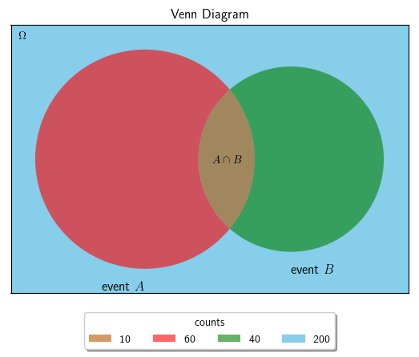
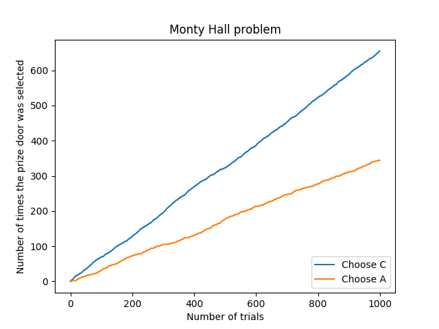

ベイズの定理の導出から, モンティ・ホール問題への応用まで.

## ベイズの定理の導出

事象 $A$
が発生する確率を「\\(P(A) = A\\) が発生する確率 \\(\div\\) すべての事象の数」と書くとき,
ベイズの定理は

<header class="m-thm-title">
ベイズの定理
</header>

  事象 \\(B\\) のもとで事象 \\(A\\) が発生する確率
\\[P(A\mid B)=\dfrac{P(B\mid A)P(A)}{P(B)}\ (P(B)\gt 0)\\]
  

と定義される. 以下ベイズの定理を導出する. 
例として, 起こり得る全ての事象の数を $200$, 
事象 $A$, 事象 $B$(以下単に $A$, $B$ と書く)が発生した回数をそれぞれ $60,\ 40$ とし,
$A$ および $B$ が発生した確率を $10$ とする.
簡単のために, この事象関係を表すベン図を次に示す[^1].

<!--more-->
まず, $A$ および $B$ が発生する確率 $P(A\cap B) = P(B\cap A)$ を求める.
$A,\ B$ がそれぞれ発生する確率は,
\\[\begin{array}{lcl}
P(A)&=&\dfrac{60}{200}=\dfrac{3}{10}\\ P(B)&=&\dfrac{40}{200}=\dfrac{1}{5}
\end{array}\\]
である[^2]. 
$B$ の下で $A$ が発生する確率と, $A$ の下で $B$ が発生する確率は,

\\[\begin{array}{lclcl}
P(A\mid B)&=&\dfrac{10}{40}&=&\dfrac{1}{4}\\
P(B\mid A)&=&\dfrac{10}{60}&=&\dfrac{1}{6}
\end{array}
\\]

である. そもそも, $B$ が発生しなければ, $A$ および $B$ が発生するということはないし,
$A$ が発生しなければ, $B$ および $A$ が発生するということはないので,

\\[\begin{array}{lclclcl}
P(A\cap B)&=&P(A\mid B)P(B)&=&\dfrac{1}{4}\cdot\dfrac{1}{5}&=&\dfrac{1}{20}\\
P(B\cap A)&=&P(B\mid A)P(A)&=&\dfrac{1}{6}\cdot\dfrac{3}{10}&=&\dfrac{1}{20}
\end{array}\\]

である. あとは変形すれば良いだけで,

\\[\begin{array}{lcl}
P(A\mid B)P(B)&=&P(A\cap B)\\
P(A\mid B)&=&\dfrac{P(A\cap B)}{P(B)}\\
P(A\mid B)&=&\dfrac{P(B\mid A)P(A)}{P(B)}
\end{array}\\]

## モンティ・ホール問題

確率論的な話となるとよく挙げられる有名な問題, モンティ・ホール問題をベイズの定理で解く.
モンティ・ホール問題とは, 以下の通りである.

<blockquote>
(snip)プレーヤーの前に閉まった3つのドアがあって、1つのドアの後ろには景品の新車が、2つのドアの後ろには、はずれを意味するヤギがいる。プレーヤーは新車のドアを当てると新車がもらえる。プレーヤーが1つのドアを選択した後、司会のモンティが残りのドアのうちヤギがいるドアを開けてヤギを見せる。

ここでプレーヤーは、最初に選んだドアを、残っている開けられていないドアに変更してもよいと言われる。プレーヤーはドアを変更すべきだろうか？(snip) 
<strong>ゲームのルール:</strong>
<ol>
<li>3つのドア (A, B, C) に（景品、ヤギ、ヤギ）がランダムに入っている。</li>
<li>プレーヤーはドアを1つ選ぶ。</li>
<li>モンティは残りのドアのうち1つを必ず開ける。</li>
<li>モンティの開けるドアは、必ずヤギの入っているドアである。</li>
<li>モンティはプレーヤーにドアを選びなおしてよいと必ず言う。</li>
</ol>
-- <a href="https://ja.wikipedia.org/w/index.php?title=%E3%83%A2%E3%83%B3%E3%83%86%E3%82%A3%E3%83%BB%E3%83%9B%E3%83%BC%E3%83%AB%E5%95%8F%E9%A1%8C&oldid=69027845"><i>モンティ・ホール問題 - wikipedia</i></a>
</blockquote>

いま, この問題をモンティがヤギのドアを開けた後に, 
プレーヤーが景品のドアを開ける条件付き確率問題とし,
プレーヤーが初手で $A$ を選択, それに対しモンティが $B$ を選択したとする[^3]. 
モンティが $B$ を選択したということは, 景品のドアは $A$ または $C$ である.
すなわち, プレーヤーが $A$ を選択し, この選択を変えずに $A$ が景品のドアである確率は 
\\(P(A\mid B)\\),
選択を変え $C$ が景品のドアである確率は
\\(P(C\mid B)\\) と書ける.
このそれぞれの条件付き確率を, 上で導出したベイズの定理の式に当てはめて求めればよい[^4].

* モンティは, プレーヤーが選択した $2$ つのドア以外のどちらかを選択するから, \\(P(B)=\dfrac{1}{2}\\) である.
* プレーヤーが初手で選ぶ段階では, 景品のドアを選ぶ確率は均等であるから, \\(P(A)=P(C)=\dfrac{1}{3}\\) である. 

これらを基に, まず \\(P(A\mid B)\\) について式にすると,

\\[
\begin{array}{lclclcl}
P(A\mid B) &=& \dfrac{P(B\mid A)P(A)}{P(B)} &=& \dfrac{\dfrac{1}{2}\cdot\dfrac{1}{3}}{\dfrac{1}{2}}&=&\dfrac{1}{3}
\end{array}
\\]

\\(P(A\mid B)\\) とは先も述べたように, \\(A\\) 
が景品のドアであると踏んだときに, それが景品のドアである確率である. よって,

* $A$ が景品のドアであれば, モンティは \\(B\\) と \\(C\\) どちらを選択しても良いことになるので,  \\(P(B\mid A)=\dfrac{1}{2}\\) である.

から上式のようになる. 
次に, \\(P(C\mid B)\\) について式にすると,

\\[
\begin{array}{lclclcl}
P(C\mid B) &=& \dfrac{P(B\mid C)P(C)}{P(B)}&=&\dfrac{1\cdot \dfrac{1}{3}}{\dfrac{1}{2}}&=&\dfrac{2}{3}
\end{array}
\\]

\\(P(C\mid B)\\) とは先も述べたように, \\(C\\) 
が景品のドアであると踏んだときに, それが景品のドアである確率である. よって,

* $C$ が景品のドアであれば, モンティは \\(B\\) しか選ぶことができないから, \\(P(B\mid C)=1\\) である.

から上式のようになる.
よって, ドアの選択を変えるべきであるという解が導かれる. 
Wikipedia にも似たような図があるが, 
折角なので, $1000$ 回モンティ・ホール問題を試行した場合において, 
選択を変えて景品のドアを当てた回数と,
選択を変えずに景品のドアを当てた回数をプロットしてみた[^5].

当たり前ではあるのだが, この図からも, 
$C$ に変えた方が当たる回数が多くなっていることを確認できる.

[^1]: 図は matplotlib_venn 他で[生成](https://gist.github.com/falgon/d88e3c0d7d691ab9d97b453e2cec918b).
[^2]: 自明であるが, これを $P(A)=P(A\mid\Omega), P(B)=P(B\mid\Omega)$ と書くこともできる.
[^3]: 他のどのようなドアの組み合わせをとっても, プレーヤーが $1$ つドアを選択し, モンティが $1$ つヤギのドアを選択するという規則には影響しないから, この前提による一般性の欠如を懸念する必要はない.
[^4]: 注: 一応述べておくと, ベイズの定理で使われている変数 \\(A, B, C\\) は, このドア \\(A, B, C\\) とは無関係である.
[^5]: 図は matplotlib で[生成](https://gist.github.com/falgon/5deb211abce5ac715257f55402a22307).
