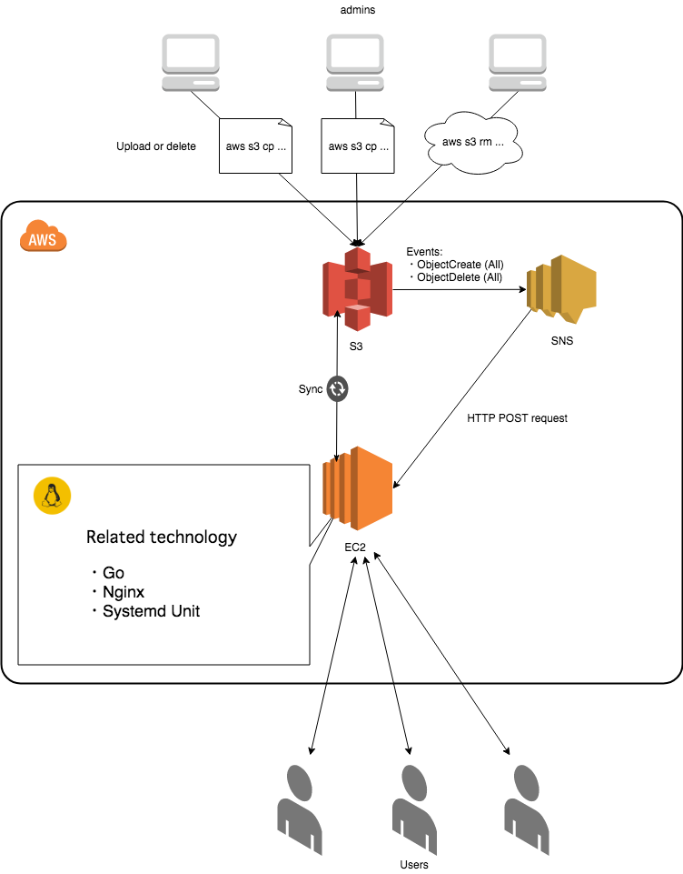

ウェブアプリケーションが EC2 上で動作していて,
そのコンテンツ内容を S3 バケットによって管理しているシチュエーションにおいて, 
S3 バケットの状態を即座にそのウェブアプリケーションに反映させたいという事例はよくあると思う(ステージング云々は, 一旦置いておくとして).
本エントリは, AWS SNS による HTTP リクエストをトリガーに, 
S3 バケットの状態を EC2 上のコンテンツへ即座に反映するための構造と簡単な実装について取り上げる.

<!--more-->

## システムの全体構造

上記の要件を達成する方法はいくつかあるだろうが, 今回は次のような構造を取ることとした.

{ width=400 }

今回 EC2 インスタンス上では, Nginx および Go で実装したウェブアプリケーションサーバを Fast-CGI で動かすこととした.
S3 にコンテンツをアップロードしたり削除等の操作をすると, SNS トピックに対して通知を発行する.
SNS はこれに対して, 設定したエンドポイント(今回は EC2 インスタンス) へ HTTP POST リクエストを発行し, 
EC2 インスタンスはこれに応じて, S3 バケットと同期を実行する. 至ってシンプルな構造である. 

## 実装

EC2 インスタンスで稼働するシンプルなウェブサーバの実装, および各種設定ファイルは, 次のリポジトリの通りである.

<i class="fab fa-github mr-2"></i>
<a href="https://github.com/falgon/tinyGoWebServer">falgon/tinyGoWebServer - Tiny Go Web Server. AWS SNS + S3 + EC2 + Nginx Fast-CGI technology automatically synchronizes content on S3 bucket.</a>

なお, S3 バケットとの同期処理が失敗した場合, 別の SNS トピックを用いて, 失敗の旨のメールを管理者に送信するようにしてある.
リポジトリ内の README にも記してあるが, 同期を実行するスクリプト, およびウェブサーバの実行ファイルは, systemd で管理することを前提として,
[Filesystem Hierarchy Standard](http://www.pathname.com/fhs/) に従い, 配置することとした.
