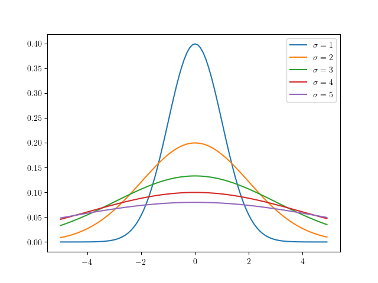

-----
title: 確率論で用いられる言葉の整理
date: 2018-10-28 00:00:00
tags: math, Probability theory
header-warn: この記事は, <a href="https://falgon.github.io/roki.log/">旧ブログ</a>から移植された記事です. よって, その内容として, <a href="https://falgon.github.io/roki.log/">旧ブログ</a>に依存した文脈が含まれている可能性があります. 予めご了承下さい.
-----

当ブログ内では, 
既に確率論の話題として[ベイズの定理](/roki.log/2018/07/26/bayestheorem/)のエントリが存在するが,
今後同様にして確率論の話題を本ブログで取り上げる際に, 
用語へのリファレンスを self-contained で張れるよう, 本エントリにて一度整理しておくこととした.

<!--more-->

## 確率の定義

そもそも一言に「確率」といえども, それは古典的確率, 統計的確率, 公理的確率というように大別できる.

### 古典的確率

古典的確率は, \\(\Omega\\) の要素数といま注目している事象の場合の数の比を用いるもので, 
すべての事象が等確率で発生することを前提条件とする. 理想的なサイコロの出目の確率などがこれに当てはまる.

### 統計的確率

統計的確率は, 「\\(\Omega\\) の部分集合 = 事象」の発生回数と, その試行回数の比を用いるもので,
打率などがこれに当てはまる.

### 公理的確率

公理的確率とは, 確率の公理により定義された確率であり, 同公理における理論体系上では各事象の発生する確率が異なるものをも扱うことができる.
この確率の公理では集合論, 測度論の言葉が使われるが, 同理論に関して深堀りすると本エントリの主題から大きく逸れてしまうため, 
ここではあまり深くは触れずに持ち出すこととしている.

集合のあつまりを一般に集合族というが, 次に示すのはその 1 種である[^1].

<header class="m-def-title">
\\(\sigma\\)-加法族
</header>

  標本空間 \\(\Omega\\) の部分集合族 \\(\mathcal{F}\\) が次の 3 つの性質を満足するとき, \\(\mathcal{F}\\) は \\(\sigma\\)-加法族という.
<ol>
<li>\\(\emptyset\in \mathcal{F}\\)</li>
<li>\\(A\in\mathcal{F}\Rightarrow A^{c}\in\mathcal{F}\\)</li>
<li>\\(\displaystyle A_1,A_2,\cdots\in\mathcal{F}\Rightarrow \bigcup^{\infty}_{i=1}A_i \in\mathcal{F}\\)</li>
</ol>
ここで, \\(A^{c}\\) は集合 \\(A\\) の補集合.

\\(\sigma\\)-加法族は, 空集合と補集合, 加算無限個の集合の和集合について閉じることを要請し,
確率の公理は, この \\(\sigma\\)-加法族の関数に対して次の条件を付与する.

<header class="m-def-title">
コルモゴロフの公理
</header>

\\(\sigma\\)-加法族 \\(\mathcal{F}\\) 上の関数 \\(P\\) が次の 3 つの性質を満足するとき, \\(P\\) を確率関数という.
<ol>
<li>\\(0\leq P(A)\leq 1,\ ^\forall A\in\mathcal{F}\\)</li>
<li>\\(P(\Omega) = 1\\)</li>
<li>\\(A_1,A_2,\cdots\in\mathcal{F}\\) があって, \\(\displaystyle \bigcap^{\infty}_{i=1}A_i = \emptyset\\)(互いに排反)
   \\(\displaystyle\Rightarrow P(\bigcup_{i=1}^\infty A_i)=\sum_{i=1}^\infty P(A_i)\\)</li>
</ol>

可算無限個の事象が互いに排反な事象の和集合の値は, 各事象の値の和となる.

なお, 標本空間を \\(\Omega ={x_1,x_2,\cdots,x_n}\\),
\\(p_1,\dots,p_n\\) がそれぞれ \\(\displaystyle 0\leq p_{i}\leq 1\\) で, 
\\(\displaystyle \sum_{i=1}^{n}p_{i}=1\\) であるとき,
\\(\Omega\\) の部分集合 \\(A\\) に対して関数 \\(P\\) を 
\\(P(A)=\displaystyle\sum_{{i\ |\ x_i\in A}}p_i\\) とすると \\(P\\) 
は確率関数となるから, 統計的確率論の問題は公理的確率論の問題として扱うことができるといえ,
自ずと公理的確率論が統計的確率論の拡張であることがいえる.

### 基本的な言葉

<table class="table">
<thead>
<tr>
<th scope="col">用語</th>
<th scope="col">意味</th>
<th scope="col">表現</th>
</tr>
</thead>
<tbody>
<tr>
<td>標本空間</td>
<td>試行に付随して決まる, 試行の取りうるすべての結果から成る \\(\emptyset\\) でない集合.</td>
<td>\\(\Omega\\)</td>
</tr>
<tr>
<td>標本</td>
<td>標本空間の元. 試行の結果発生しうる個々の事柄.</td>
<td>\\(\omega\in\Omega\\)</td>
</tr>
<tr>
<td>事象</td>
<td>標本空間の部分集合. 試行の結果発生しうる事柄.</td>
<td>\\(A\subset\Omega\\)</td>
</tr>
<tr>
<td>確率変数</td>
<td>ある事象が確率的に取りうる数.
<ul>
<li>確率変数 \\(X\\) の取りうる値 \\(x_1, x_2,\cdots\\) それぞれに対応する確率 
\\(p_1, p_2,\cdots\\) が存在する場合, 
隣り合う数の間に値が存在しない確率変数(サイコロの出目など)をとくに離散型確率変数といい, 
離散確率変数 \\(X\\) がある値 \\(x\\) をとるとき, 標本から実現値 \\(\mathbb{R}\\) への関数 
\\(f(x)\\) を確率質量関数という.
</li>
<li>離散型確率変数でない確率型変数を連続型確率変数という
([\\(\epsilon-\delta\\) 論法](/roki.log/2018/10/4/jacobian/#epsilonDelta-definitionOfLimit)で厳密に説明できる).
</li>
</ul>
</td>
<td>\\(X\\)</td>
</tr>
<tr>
<td>実現値</td>
<td>確率変数がとる具体的な値.</td>
<td>\\(x_n\\)</td>
</tr>
<tr>
<td>確率分布</td>
<td>
確率変数がある値となる確率, 又はある集合に属する確率を与える関数 (JIS 規格より).
</td>
<td>\\(P(A)\\)</td>
</tr>
<tr id="iid">
<td>「独立同一分布に従う」</td>
<td>
確率変数 \\(X_1,X_2,\cdots,X_n\\) が互いに[独立](#isIndependence)で, 
かつそれらが同一の確率分布に従うことをいう. 
<ul>
<li>注意されたいのが, 「独立同一分布」といわれる分布はない. 
この用例は, 「独立同一分布」という分布に従うというようにも捉えられるかもしれないが, 
そのような意味ではない.
</li>
<li>\\(\rm i.i.d\\) 標本 \\(X_1,X_2,\cdots,X_n\\) の同時の確率密度関数は 
\\(f(x_1,x_2,\cdots,x_n)=g(x_1)g(x_2)\cdots g(x_n)\\).
</li>
</ul>
</td>
<td>\\(\rm i.i.d\\), independent and identically distributed.</td>
</tr>
<tr>
<td>
<ul class="min100"><li>算術平均</li><li>相加平均</li><li>単純平均</li></ulL</td>
<td>全体の総和をそれらの個数で割った値. \\(\displaystyle\dfrac{1}{n}\sum^{n}_{i=1}X_i\\).</td>
<td>
<ul>
<li>確率変数 \\(X\\) の平均: \\(\overline{X}\\)</li>
<li>母平均: \\(\mu\\)</li>
</ul>
</td>
</tr>
<tr>
<td>期待値</td>
<td>
確率変数のとりうる値にそれが起こる確率を掛けた値の総和のこと(加重平均). 
すなわち, 確率変数 \\(X\\) の取り得る値 \\(x\\) に関する確率 \\(P(x_i)\\) があって, 
\\[
\begin{cases}
\displaystyle\sum^{n}_{i=1}x_i P(x_i) &:X {\rm は離散的確率変数}\\
\displaystyle\int^\infty_{-\infty} xP(x)dx &:X {\rm は連続的確率変数}
\end{cases}\\]
<ul>
<li id="LinearityExpectedValue">
離散, 連続共に和の期待値は期待値の和(期待値の線形性)[^2]:
\\(\displaystyle E\left[\sum_{i=1}^nX_i\right]=\sum_{i=1}^nE\left[X_i\right]\\),
連続の場合も同様.</li>
</ul>
<dl>
<dt>離散</dt>
<dd><ul>
<li>\\(n\\) 個の \\(P(x_1),P(x_2),\cdots,P(x_n)\\) がすべて等しいとき 
\\(P_i=\dfrac{1}{n}\ (1\leq i\leq n)\\) となり, \\(\overline{X}\\) と等しくなる.</li>
</ul></dd>
<dt>連続</dt>
<dd><ul>
<li>\\(f(x)=xP(x)\\) としたとき, \\(f(x)\\) は確率密度関数といわれる.</li>
<li>連続型確率変数がある 1 点の値をとる確率は 0 である
(0 でなければ, 連続量とはいえない: \\(P(X=a)=\int^{a}_{a}f(x)dx=0\\))
から, 事象 \\(X\\) の確率については \\(a\leq X\leq b\\) と幅を持たせて表す必要がある.
従って, (連続量が表されたグラフを思い浮かべれば想像に容易いが)その \\([a,b]\\) 間の面積が求まれば,
事象 \\(X\\) に対する確率が求まることとなるので,
事象 \\(X\\) が \\(a\\) 以上 \\(b\\) 以下となる確率を 
\\(P(a\leq X\leq b)=\int_a^bf(x)dx\\) とかける.
</li>
<li id="normalizationLaw">
<a href="#KolmogorovAxioms">コルモゴロフの公理</a>より 
\\(\int_{-\infty}^{\infty}f(x)dx=1\\) がいえ, これを規格化条件という.
</li>
<li id="consExpIsCons">
定数 \\(a\\) の期待値は \\(a\\) である: 
\\(E\left[a\right]=\int^\infty_{-\infty}aP(x)dx=a\int^\infty_{-\infty}P(x)dx\\) だから 
\\[E\left[a\right]=a\tag{i}\\]
</li>
<li>定数 \\(a\\) と確率変数 \\(X\\) の和の期待値は, 
確率変数 \\(X\\) の期待値に定数 \\(a\\) を加えた値である:
\\(E\left[a+X\right]=\int^\infty_{-\infty}(a+x)P(x)dx=\int^\infty_{-\infty}aP(x)dx+\int^\infty_{-\infty}xP(x)dx\\) だから \\[E\left[a+X\right]=a+E\left[X\right]\tag{ii}\\]
</li>
<li>定数 \\(b\\) と確率変数 \\(X\\) の積の期待値は, 
確率変数 \\(X\\) の期待値の \\(b\\) 倍の値である:
\\(E\left[bX\right]=\int^\infty_{-\infty}bxP(x)dx=b\int^\infty_{-\infty}xP(x)dx\\) だから 
\\[E\left[bX\right]=bE\left[X\right]\tag{iii}\\]
</li>
<li>定数 \\(b\\) と確率変数の積に定数 \\(a\\) を加えた値の期待値は, 
確率変数 \\(X\\) の期待値の \\(b\\) 倍に \\(a\\) を加えた値である:
\\((i),(iii)\\) より 
\\[E\left[bX+a\right]=bE\left[X\right]+a\tag{iv}\\]
</ul></dd>
</dl>
</td>
<td>
<ul>
<li>確率変数 \\(X\\) の期待値: \\(E\left[X\right]\\)</li>
<li>標本平均 \\(\overline{X}\\) の期待値[^3]: \\(\mu\\)
</ul>
</td>
</tr>
<tr>
<td>条件付き確率</td>
<td>
ある事象が起きる条件のもとで, 別のある事象が起こる確率. 
\\[P(A\mid B)=\dfrac{P(A\cap B)}{P(B)}\ (\because P(A\cap B):=A\ {\rm および}\ B\ {\rm が発生する確率})\\]
<ul>
<li id="isIndependence">
2 つの事象の確率について, 
相互が一方の事象の発生確率がもう一方の事象の発生確率に影響を与えないとき, これを独立であるという. 
すなわち \\(P(A\mid B)=P(A)\\)
</li>
<li>2 つの事象について, 一方の事象が発生したときに, もう一方の事象は発生しないことがいえるとき,
これを排反であるという.
すなわち \\(P(A\mid B)=0\\)
</li>
<li id="MulTheoremConditionalProbability">
\\(P(A\cap B)=P(B)P(A\mid B)\\) 
を条件付き確率の乗法定理という.
</li>
<li>[ベイズの定理](/roki.log/2018/07/26/bayestheorem)</li>
</ul>
</td>
<td>
\\(B\\) の下で \\(A\\) が発生する確率: \\(P(A\mid B)\\)
</td>
</tr>
<tr>
<td>条件付き期待値</td>
<td>
確率変数 \\(X\\) の値が \\(x\\) であるときの \\(Y\\) の期待値. \\(E\left[Y|X=x\right]\\)
\\[E\left[Y|X=x\right]=\sum^{n}_{i=1}y_i\dfrac{P(Y=y_i,X=x)}{P(X=x)}\\]
<ul>
<li>\\(E\left[Y\right]=E\left[E\left[Y|X\right]\right]\\) が成りたつ[^4].</li>
</ul>
</td>
<td>
\\(E\left[Y|X\right],\ E_Y\left[Y|X\right]\\)
</td>
</tr>
<tr>
<td>条件付き分散</td>
<td>
\\(V[X\mid Y]=E[X^2\mid Y]-E[X\mid Y]^2\\)
<ul>
<li>
\\(V\left[Y\right]=E\left[V\left[Y|X\right]\right]+V\left[E\left[Y|X\right]\right]\\) 
が成り立つ (証明略).
</li>
</ul>
</td>
<td>
\\(V\left[Y|X\right],\ V_Y\left[Y|X\right]\\)
</td>
</tr>
<tr>
<td><ul class="min100"><li>規格化</li><li>正規化</li></ul></td>
<td>
ある関数が規格化条件を満足するように定数倍すること. 平均を引いて, 
標準偏差で割る (\\(\dfrac{X-\mu}{\sigma}\\))[^5]
こと.
<ul>
<li>連続的確率変数を扱う場合にのみ使われる言葉.</li>
<li>例えば, \\(f(x)=x\\) は \\([0,1]\\) 上で \\(\int_0^1xdx=\dfrac{1}{2}\\) となってしまうため, 
規格化条件を満たさないが, 全体を 2 倍して \\(f(x)=2x\\) とすると, 
全区間で積分して \\(1\\) になるので規格化条件を満たす. 従って, \\(f(x)=2x\\) は確率度関数となる.
</li>
</ul>
</td>
<td>
N/A
</td>
</tr>
<tr>
<td><ul class="min100"><li>分散</li><li>標本分散</li></ul></td>
<td>
期待値とのずれを表す指標の 1 つ. ずれの総計で各々が相殺しないように二乗和をとり, その個数 \\(n\\) で割った値. すなわち,
\\[\dfrac{1}{n}\displaystyle\sum_{i=1}^n(X_i-E\left[X\right])^2=E\left[(X-E\left[X\right])^2\right]\\]
<ul>
<li>ここで, 確率変数 \\(X_1,X_2,\cdots,X_n\\) の確率分布がすべて等しいとき,
\\(\displaystyle\dfrac{1}{n}\sum^{n}_{i=1}(X_i-\overline{X})^2=\overline{X^2}-\overline{X}^2\\) と高校数学でよくみる形式でかける.</li>
<li>定数の分散は \\(0\\) である: \\(V\left[a\right]=E\left[(a-E\left[a\right])^2\right]=E\left[(a-a)^2\right]\\) だから
\\[E\left[0\right]=0\tag{v}\\]</li>
<li>定数 \\(a\\) と確率変数 \\(X\\) の和の分散は, 確率変数 \\(X\\) の分散である:
\\[\begin{aligned}
V\left[a+X\right]&=&E\left[(a+X-E\left[a+X\right])^2\right] \\
&=&E\left[(a+X-E\left[a\right]-E\left[X\right])^2\right] \\
&=&E\left[(a+X-a-E\left[X\right])^2\right]\\
&=&E\left[(X-E\left[X\right])^2\right]
\end{aligned}\\] だから \\[V\left[a+X\right]=V\left[X\right]\tag{vi}\\]
</li>
<li>定数 \\(b\\) と確率変数 \\(X\\) の積の分散は, 確率変数 \\(X\\) の分散と \\(b\\) の二乗の積である:
\\[
\begin{aligned}
V\left[bX\right]&=&E\left[(bX-E\left[bX\right])^2\right] \\
&=&E\left[(bX-bE\left[X\right])^2\right] \\
&=&E\left[{b(X-E\left[X\right])}^2\right] \\
&=&E\left[b^2(X-E\left[X\right])^2\right] \\
&=&b^2E\left[(X-E\left[X\right])^2\right]
\end{aligned}\\] だから \\[V\left[bX\right]=b^2V\left[X\right]\tag{vii}\\]
</li>
<li>定数 \\(b\\) と確率変数 \\(X\\) の積と \\(a\\) の和の分散は, 
確率変数 \\(X\\) の分散と定数 \\(b\\) の二乗の積である:
\\({\rm (vi), (vii)}\\) より \\[V\left[bX+a\right]=b^2V\left[X\right]\tag{viii}\\]
</li>
</ul>
</td>
<td>
<ul>
<li>確率変数 \\(X\\) の分散: \\(V\left[X\right]\\)</li>
<li>母集団の分散: \\(\sigma^2\\)</li>
<li>標本分散: \\(s^2\\)</li>
<li>標本平均の分散[^6]: \\(V\left[\overline{X}\right]=\dfrac{\sigma^2}{n}\\)</li>
</ul>
</td>
</tr>
<tr>
<td><ul><li>分散</li><li>不偏分散</li></ul></td>
<td>標本数 \\(n\\) で割ったのに対し, \\(n-1\\) で割った値. 標本分散の期待値が母分散に等しくなるように補正したもの(詳細は<a href="#unbiasedVariance">下記</a>): \\(\displaystyle\dfrac{1}{n-1}\sum^n_{i=1}(X_i-E\left[X\right])^2\\)</td>
<td>\\(U^2,\hat{\sigma}^2\\)</td>
</tr>
<tr>
<td>標準偏差</td>
<td>分散の計算で行われた二乗を外した形.</td>
<td>\\(\sqrt{V[X]},\sigma,s\\). 各記号は, 分散の記号と同様にして用いられる慣習がある.</td>
</tr>
</tbody>
</table>

## 不偏分散

上記の表で示した通り, 不偏分散は, 標本分散の期待値が母分散に等しくなるように補正したもののことをいう.
標本分散は, 標本のばらつきの指標を得ることが主な目的であったのに対して, 不偏分散は, 
標本から母分散の推定値を得ることが主な目的であり, その点において両者は異なる.
その目的に従って, 標本分散の期待値 \\(E\left[s^2\right]\\) は, 母分散の \\(\dfrac{n-1}{n}\\) 
倍となっているという事実(\\(E\left[s^2\right]=\dfrac{n-1}{n}\sigma^2\not =\sigma^2\\))から,
標本分散を \\(\dfrac{n}{n-1}\\) 倍する(しかしながら, サンプル数 \\(n\\) が十分に大きいとき,
両者は近似的に等しくなることが[大数の弱法則](#lawOfLargeNumbers)よりいえる). この形が不偏分散である. 

<header class="m-def-title">
不偏分散
</header>

\\[\displaystyle\dfrac{1}{n-1}\sum^n_{i=1}(X_i-E\left[X\right])^2\\]
  

<header class="m-prop-title">
命題 1
</header>

\\[E\left[s^2\right]=\dfrac{n-1}{n}\sigma^2\\]

<header class="m-proof-title">
命題 1
</header>

いま \\(\rm i.i.d\\) 標本 \\(X_1,X_2,\cdots,X_n\\) について考えると,
この標本分散は上記の表で示した通り \\(\displaystyle s^2=\overline{X^2}-\overline{X}^2=\dfrac{1}{n}\sum^{n}_{i=1}(X_i-\overline{X})^2\\) で, 
母分散は \\(\sigma^2=E\left[(X-\mu)^2\right]\\) である. ここで, \\(X_i-\overline{X}=X_i-\mu-\overline{X}+\mu\\) とおくと,

\\[
\begin{aligned}
&=&\dfrac{1}{n}\left[{(X_1-\mu)-(\overline{X}-\mu)}^2+\cdots+{(X_n-\mu)-(\overline{X}-\mu)}^2\right] \\
&=&\dfrac{1}{n}{(X_1-\mu)^2-2(X_1-\mu)(\overline{X}-\mu)+(\overline{X}-\mu)^2+\cdots+(X_n-\mu)^2-2(X_n-\mu)(\overline{X}-\mu)+(\overline{X}-\mu)^2} \\
&=&\dfrac{1}{n}\sum_{i=1}^n(X_i-\mu)^2-2\dfrac{1}{n}\sum_{j=1}^{n}(X_j-\mu)(\overline{X}-\mu)+(\overline{X}-\mu)^2 \\
&=&\dfrac{1}{n}\sum_{i=1}^n(X_i-\mu)^2-2(\overline{X}-\mu)^2+(\overline{X}-\mu)^2 \\
&=&\dfrac{1}{n}\sum_{i=1}^n(X_i-\mu)^2-(\overline{X}-\mu)^2 
\end{aligned}
\\]

である. この期待値は 

\\[
\begin{aligned}
E\left[s^2\right]&=&\dfrac{1}{n}\sum_{i=1}^nE\left[(X_i-\mu)^2\right]-E\left[(\overline{X}-\mu)\right] \\
&=&\sigma^2-E\left[(\overline{X}-\mu)^2\right] \tag{1}
\end{aligned}
\\]

で, \\(\\) の第二項は標本平均分散だから,

\\[
\begin{aligned}
E\left[s^2\right]&=&\sigma^2-\dfrac{\sigma^2}{n}\\
&=&\dfrac{n-1}{n}\sigma^2
\end{aligned}
\\]

## 正規分布, ガウス分布

{ width=350px }

上図[^7]のような, 連続型の確率分布が左右対称である分布を正規分布といい, 
その陰関数は 
\\(f(x)=\dfrac{1}{\sqrt{2\pi}}\exp(-\dfrac{1}{2}(\dfrac{x-\mu}{\sigma})^2)\\) 
であり, これを \\(N(\mu,\sigma)\\) とも書く.
また, その確率密度関数は

<header class="m-def-title">
正規分布の確率密度関数
</header>

標準偏差 \\(\sigma\\), 母平均 \\(\mu\\), 分散 \\(\sigma^2\\) に対して,
\\[f(x)=\dfrac{1}{\sqrt{2\pi}\sigma}\exp(-\dfrac{(x-\mu)^2}{2\sigma^2})\tag{2}\\]
  

である.

また \\(\mu=0,\sigma=1\\) である正規分布をとくに標準正規分布といい(上図青で描かれた分布がそれに該当する),
その場合の陰関数は \\(f(x)=\dfrac{1}{\sqrt{2\pi}}\exp(-\dfrac{1}{2}x^2)\\) となる.
また, これを \\(N(\mu,\sigma)=N(0,1)\\) とも書く.
ここで一度, 式 \\(\\) が規格化条件を満たすことを確認する. 
確認には, [ガウス積分の公式](/roki.log/2018/09/26/GaussianIntegral/#SimilarGaussianIntegral1)を用いる.

<header class="m-prop-title">
命題 2
</header>

\\((2)\\) は規格化条件を満たす.

<header class="m-proof-title">
命題 2
</header>

\\((2)\\) が規格化条件を満たすことは次の式を満たすことである.
\\[\displaystyle\int_{-\infty}^{\infty}f(x)dx=\dfrac{1}{\sqrt{2\pi}\sigma}\int_{-\infty}^{\infty}\exp(-\dfrac{(x-\mu)^2}{2\sigma^2})dx\\]

ここで, \\(x-\mu=y\\) と変数変換すると 
\\[\dfrac{1}{\sqrt{2\pi}\sigma}\int_{-\infty}^{\infty}\exp(-\dfrac{y^2}{2\sigma^2})dy\\]
この積分部分は[ガウス積分の公式](/roki.log/2018/09/26/GaussianIntegral/#SimilarGaussianIntegral1)より,
\\(\sqrt{2\sigma^2\pi}\\) となり \\(f(x)\\) を全区間で積分すると 1 となる. 
よって, \\((2)\\) は規格化条件を満たす. 

正規分布においては, 区間 \\([-\sigma,\sigma]\\) を 1 シグマ区間という.
平均 \\(\pm{1\sigma}\\) 内に収まる確率は $68$ %,  平均 \\(\pm{2\sigma}\\) 内に収まる確率は $95$ %, 平均 \\(\pm{3\sigma}\\) 内に収まる確率は $99.7$ % であると知られている.

## 大数の法則

大数の法則は, 

<header class="m-thm-title">
大数の法則
</header>

  期待値 \\(\mu\\) の \\(\rm i.i.d\\) 無限列 \\(X_1,X_2,\cdots\\) の標本平均 
  \\(\displaystyle\overline{X}=\dfrac{1}{n}\sum_{i=1}^{n}X_i\\) と定数 \\(^\forall c\gt 0\\) に対して,
  \\[\lim_{n\to\infty}P(\left|\overline{X}_{n}-\mu\right|\gt c)=0\\]
  がいえる. これを大数の弱法則という.
  また \\[ P(\lim_{n\to\infty}\overline{X}_n=\mu)=1 \\]
  がいえる. これを大数の強法則という.
  

である. なお, この法則を確率論の用語で, \\(\overline{X}_n\\) が \\(\mu\\) に確率収束するという.
端折って解釈すると, ある母集団から無作為抽出するサンプル数を十分に大きくしたとき, それらから成る標本の平均は, 母平均そのものとみなしてもよいという主張である. 
例えば, サイコロの目の理論的な平均値は \\(\frac{\sum^{6}_{i=1} i}{6}=3.5\\) であるが,
サイコロを例えば 2 回降っただけではこの通りの平均値にならないかもしれない.
しかしながら, これを無限回行えば, その平均は \\(3.5\\) に限りなく近くということである.
ここでは簡単のために大数の弱法則についてのみの証明とする. そのために, まずマルコフの不等式, チェビシェフの不等式の証明を行う.

<header class="m-thm-title">
マルコフの不等式
</header>

  任意の確率変数 \\(X\\) と定数 \\(c\gt 0\\) に対して, \\[ P(\left|X\right|\geq c)\leq \dfrac{E\left[\left|X\right|\right]}{c}\\]
  

<header class="m-proof-title">
マルコフの不等式
</header>

\\(X\\) を連続型確率変数とすると, 確率密度関数 \\(f_X(x)\\) に対して,

\\[
\begin{aligned}
cP(\left|X\right|\geq c)&=&c\int^{\infty}_{c}f_X(x)dx \\
&\leq&\int^{\infty}_{c}\left|x\right|f_X(x)dx \\
&\leq&\int^c_0\left|x\right|f_X(x)dx+\int^\infty_c\left|x\right|f_X(x)dx \\
&=&\int^\infty_0\left|x\right|f_X(x)dx \\ 
&=&E[\left|X\right|]
\end{aligned}
\\]

\\(\therefore P(\left|X\right|\geq c)\leq\dfrac{E[\left|X\right|]}{c}\\). 
\\(X\\) が離散型確率変数である場合は総計により同様にして求まる. 

<header class="m-thm-title">
チェビシェフの不等式
</header>

  \\(E[Y]=\mu,V[Y]=\sigma^2\\) とするとき, \\(^\forall a\gt 0\\) に対して, \\[P(\left|Y-\mu\right|\geq a\sigma)\leq\dfrac{1}{a^2}\Leftrightarrow P(\left|Y-\mu\right|\geq a)\leq\dfrac{\sigma^2}{a^2}\\]
  

<header class="m-proof-title">
チェビシェフの不等式
</header>

[マルコフの不等式](#MarkovsInequality)より, \\(X=(Y-\mu)^2,c=a^2\sigma^2\\) とすると

\\[\begin{aligned}
P((Y-\mu)^2\geq a^2\sigma^2)&\leq&\dfrac{E\left[(Y-\mu)^2\right]}{a^2\sigma^2} \\
&=&\dfrac{\sigma^2}{a^2\sigma^2} \\
&=&\dfrac{1}{a^2}
\end{aligned}
\\]

\\(\therefore P(\left|Y-\mu\right|\geq a\sigma)\leq\dfrac{1}{a^2}\\). 
\\(c=a^2\\) とすると, 
同様にして \\(P(\left|Y-\mu\right|\geq a)\leq\dfrac{\sigma^2}{a^2}\\).

準備が整ったので, 以下[大数の弱法則](#lawOfLargeNumbers)を証明する.

<header class="m-proof-title">
大数の弱法則
</header>

確率変数 \\(\overline{Y}\\) を \\(\rm i.i.d\\) 標本平均 \\(\displaystyle\dfrac{1}{n}\sum_{i=1}^{n}Y_i\\) とすると, 期待値の線型性より
\\(E\left[\overline{Y}\right]=\mu,V\left[\overline{Y}\right]=\dfrac{\sigma^2}{n}\\). 
ここで, [チェビシェフの不等式](#ChebyshevInequality)より \\(P(\left|\overline{Y}-\mu\right|\geq a)\leq\dfrac{\dfrac{\sigma^2}{n}}{a^2}\\) だから,
\\(n\to\infty\\) のとき, 右辺は \\(0\\) に収束する.

## 中心極限定理

中心極限定理は

<header class="m-thm-title">
中心極限定理
</header>

  平均 \\(\mu\\), 分散 \\(\sigma^2\\) の母集団から無作為抽出された標本平均 \\(\overline{X}_n\\) は, 母集団の分布に無関係に, \\(n\\) が十分に大きいとき,
  近似的に平均 \\(\mu\\), 分散 \\(\dfrac{\sigma^2}{n}\\)(標準偏差 \\(\dfrac{\sigma}{\sqrt{n}}\\)) に従う. 
  \\(\Leftrightarrow \rm i.i.d\\) 標本 \\(X_1,X_2,\cdots,X_n\\) があって, \\(E\left[X_i\right]=\mu,V\left[X_i\right]=\sigma^2\\) で, \\(n\to\infty\\) のとき,
  \\(\overline{X}_n\\) の分布は \\(N(\mu,\dfrac{\sigma^2}{n})\\) に近く.
  

という定理である. [大数の弱法則](#lawOfLargeNumbers)とこの中心極限定理ともにサンプル平均 \\(\overline{X}_n\\) の振る舞いに関する定理であるが,
後者においては, サンプル平均と, 真の平均との誤差について論ずる定理である点が異なる. 
つまり, [大数の弱法則](#lawOfLargeNumbers)より \\(\overline{X}_n\approx\mu\\) であることはわかったが, その差 \\(\overline{X}_n-\mu\\) はどのような挙動となるのか,
また \\(0\\) に近づいていくのはわかったが, どのように近づいていくのかについて論じているのが, [中心極限定理](#centralLimitTheorem)である[^8].
中心極限定理は, それが正規分布に近似するといっているので,
起きた事象の珍しさを測るための指標として用いることができ, これが統計における検定に役立つ.
また, すべての平均と分散が定義できるような分布[^9]に対していえることから, 
様々な事象が正規分布に従うことを正当化するための理論的根拠としてよく用いられる.

## 参考文献

* 「[第 2 章 独立確率変数列の極限定理](http://www.math.kobe-u.ac.jp/HOME/higuchi/h23kogi/h23kouki/p1-11.pdf)」 2018 年 10 月 29 日アクセス.
* 「[コーシー分布](https://shoichimidorikawa.github.io/Lec/ProbDistr/cauchy.pdf)」 2018 年 10 月 29 日アクセス.
* 「[正規分布の基礎的な知識まとめ - 高校数学の美しい物語](https://mathtrain.jp/gaussdistribution)」 2018 年 9 月 27 日アクセス.
* 「<a href="https://mathtrain.jp/centrallimit" name="ref1">大数の法則と中心極限定理の意味と関係 - 高校数学の美しい物語</a>」 2018 年 10 月 29 日アクセス.
* 「[条件付き期待値，分散の意味と有名公式 - 高校数学の美しい物語](https://mathtrain.jp/condexpectation)」 2018 年 11 月 12 日アクセス.
* 「[3.3 条件付き期待値](https://mcm-www.jwu.ac.jp/~konno/pdf/statha3.pdf)」 2018 年 11 月 12 日アクセス.

[^1]: \\(\sigma\\)-加法族は, 完全加法族, 可算加法族, \\(\sigma\\)-集合代数, \\(\sigma\\)-集合体ともいわれる.
[^2]: 簡単のため, 確率変数 \\(X, Y\\) に対して \\(E\left[X,Y\right]=E\left[X\right]+E\left[Y\right]\\) を示して証明とする. ここで, \\(\sum_i:=\sum^n_{i=1},\sum_j:=\sum^n_{j=1}\\) とし, 確率変数 \\(X\\) がその取り得る値 \\(x_i\\) となる確率を \\(P(x_i)\\), 同様に \\(Y\\) がその取り得る値 \\(y_j\\) となる確率を \\(P(y_j)\\) とする. また, そのどちらもが同時に発生する確率を \\(P(x_i,y_j)\\) とする. \begin{aligned} E\left[X+Y\right]&=&\sum_i\sum_j(x_i+y_j)P(x_i,y_j) \\ &=&\sum_i\sum_j x_iP(x_i,y_j)+\sum_i\sum_j y_jP(x_i,y_j) \\ &=&\sum_i x_i\sum_j P(x_i,y_j)+\sum_j y_j\sum_i P(x_i,y_j) \\ &=&\sum_i x_iP(x_i)\sum_j y_jP(y_j) \\ &=& E\left[X\right]+E\left[Y\right] \end{aligned} 連続的確率変数に対しても, 積分の線型性から同様. \\(\square\\)
[^3]: \\({\rm (iii)}\\) および[期待値の線形性](#LinearityExpectedValue)より \begin{aligned}E\left[\overline{X}\right]&=&E\left[\dfrac{1}{n}\sum^n_{i=1}X_i\right] \\ &=&\dfrac{1}{n}E\left[X_1+\cdots+X_n\right] \\ &=&\dfrac{1}{n}n\mu \\ &=&\mu \end{aligned} \\(\square\\)
[^4]: 簡単のため, 連続型確率変数 \\(X,Y\\) に対する $E\left[Y\right]=E\left[E\left[Y|X\right]\right]$ を示して証明とする. $E\left[Y\right]$ は条件付き期待値の定義から $$E\left[Y\right]=\int^\infty_{-\infty}\int^\infty_{-\infty}yf(x,y)dxdy$$ ここで, \\(f(x,y)\\) は \\(X,Y\\) の同時確率密度関数である. 従って, \begin{aligned}E\left[Y\right]&=&\int^\infty_{-\infty}\int^\infty_{-\infty}yf(x,y)dxdy \\ &=&\int^\infty_{-\infty}\int^\infty_{-\infty}y\dfrac{f(x,y)}{f(x)}f(x)dxdy \\ &=&\int^\infty_{-\infty}\left[\int^\infty_{-\infty}yf(y|x)dx\right]f(x)dx \\ &=& \int^\infty_{-\infty}E\left[X|y\right]f(x)dydx \\ &=&E\left[E\left[Y|X\right]\right]\end{aligned} \\(\square\\)
[^5]: 平均 \\(\mu\\), 分散 \\(\sigma^2\\) の確率変数 \\(X\\) を正則化した変数 \\(Z=\dfrac{X-\mu}{\sigma}\\) の期待値と分散を確認してみると, 平均は \\(, \\) より \begin{aligned}E\left[Z\right]&=&E\left[\dfrac{X-\mu}{\sigma}\right] \\ &=&\dfrac{1}{\sigma}E\left[X-\mu\right] \\ &=& \dfrac{1}{\sigma}(E\left[X\right]-\mu) \\ &=&\dfrac{1}{\sigma}(\mu-\mu) \\ &=&0\end{aligned} 分散は \\(, \\) より \begin{aligned}V\left[Z\right]&=&V\left[\dfrac{X-\mu}{\sigma}\right] \\ &=&\dfrac{1}{\sigma^2}V\left[X-\mu\right] \\ &=&\dfrac{1}{\sigma^2}V\left[X\right] \\ &=&\dfrac{\sigma^2}{\sigma^2} \\ &=& 1\end{aligned} となり標準正規分布に従うことがわかる.
[^6]: \\(\\) および[期待値の線形性](#LinearityExpectedValue)より \begin{aligned}V\left[\overline{X}\right]&=&V\left[\dfrac{1}{n}\sum^n_{i=1}X_i\right] \\ &=&\dfrac{1}{n^2}V\left[X_1+\cdots+X_n\right] \\ &=&\dfrac{1}{n^2}n\sigma^2 \\ &=&\dfrac{\sigma^2}{n}\end{aligned} \\(\square\\)
[^7]: matplotlib 等で[生成](https://gist.github.com/falgon/63bfa6f2039ad25379d441831f4bb648). 標準偏差 \\(\sigma\\) を \\([1,5]\\) としたとき.
[^8]: [参考文献](#ref1)から一部引用: <i>ベーシックな大数の弱法則は中心極限定理から導出することができます。→[The Laws of Large Numbers Compared](http://www.dklevine.com/archive/strong-law.pdf)(snip) しかし，より一般的な（仮定を弱めた）大数の弱法則は中心極限定理から導出することはできません。つまり「中心極限定理が大数の法則を包含している」と言うことはできないのです。</i>
[^9]: 平均, 分散が定義できない分布の例としてよく挙げられるものの 1 つ: コーシー分布.
