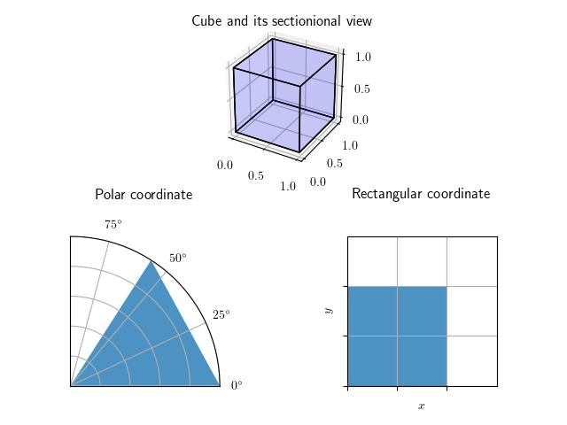

以前のエントリ, [ガウス積分の公式とその証明](/roki.log/posts/2018/%209/26/GaussianIntegral/)で, 
暗に極座標での微小面積が $rdrd\theta$
であるとして書いていたので, その内容についても一応書いておこうというのと,
筆者自身の学習/再整理も兼ねて, ヤコビアンに関して書くこととした.

## 極座標の微小面積

直交座標から極座標へ移行する際に, その微小面積はどうなるかについて考察する.

{ width=500px }

上図[^1]は, \\(1\times 1\times 1\\) の立方体があって, 
その断面をそれぞれ極座標と直交座標で示しているだけであるが,
この断面図のマスの広がり方を見るだけで, 少なくとも極座標における微小面積が \\(drd\theta\\) 
とはならないことに納得できる.
単に \\(drd\theta\\) としてしまうと, 
\\(r\\) が大きくなればなるほど微小面積も伸びて大きくなっていってしまうだろうという想像がつく.

<!--more-->

ここで微小面積を導出するために, \\(r,\theta\\) をともに少しだけ動かして, その幅をそれぞれ \\(\Delta r,\Delta \theta\\) で表した, 次のような配置を考える[^2].

\\(r\\) の距離と \\(\theta\\) の角度で構成された面積, 
つまり上図の \\(\Delta s\\) が微小面積に対応することがわかる. \\(\Delta s\\) の面積は, 
単に全体の扇形の面積から, \\(r\\) と \\(\Delta\theta\\) で構成された扇形の面積を引けばよいので,

\\[\Delta s=\dfrac{1}{2}(r+\Delta r)^2\Delta\theta-\dfrac{1}{2}r^2\Delta\theta
=r\Delta r\Delta\theta+\dfrac{1}{2}(\Delta r)^2\Delta\theta\\]

\\(\displaystyle\lim_{\Delta\theta,\Delta r\to 0} \\) を考えれば,
微小量 \\(\Delta r\Delta\theta\\) の高次の項を無視してよい.
よってこれを微小増分に書き換えれば, \\(\Delta s\\) は \\(rdrd\theta\\) となることがいえる.

...というように, ここまでは幾何学的なイメージを用いて,
直交座標と極座標間における微小面積の遷移について考察したが,
異なる座標系への変換をしようとする度にいちいち図などを用いて考察するのは面倒であり,
従って, より機械的/一般的にこれを実行する手法について考えることは自然な流れと言える.
よって, 以降はそれを主題として話を進めていく.

ところで微積分では, 今もそうして行ったように, 極限の概念を多大に用いるので,
ここで本題に入る前にその定義に関して触れておくこととする.

## \\(\epsilon-\delta\\) 論法

\\(\epsilon-\delta\\) 論法とは簡単にいえば, 無限小, 
無限大といった実数の範囲では定義できない曖昧な概念を, 実数値のみを用いて議論する方法で,
同論法上で極限の式との同値関係を示した定義が次のとおりである.

<header class="m-def-title">
\\(\epsilon-\delta\\) 論文の定義する極限の式との同値関係
</header>

  \\(f\\) を実数の部分集合 \\(D\\) で定義された実数値関数, \\(c\\) を \\(D\\) の極限点, \\(L\\) を実数としたとき,
  \\[\displaystyle
  \lim_{x\to c}f(x)=L\Leftrightarrow(^\forall\epsilon\gt 0,^\exists\delta\gt 0,^\forall x\in D,0\lt\left|x-c\right|\lt\delta\Rightarrow\left|f(x)-L\right|\lt\epsilon)\\]
  

\\(D=[a,b]\\) または \\(D=\mathbb{R}\\) ならば, 閉じた実区間と実数直線は完全集合となり, \\(c\\) は自動的に極限点であるという条件が満たされるので,
簡単のためにこれを \\(D=\mathbb{R}\\) として書き直すと, \\(\epsilon-\delta\\) 論法は

\\[^\forall\epsilon\gt 0,^\exists\delta\gt 0,\ {\rm s.t.}\ ^\forall x\in\mathbb{R}, \left|x-c\right|\lt\delta\Rightarrow\left|f(x)-L\right|\lt\epsilon\\]

となる. 日本語で記述すると「任意の実数 \\(^\forall x\in\mathbb{R}\\) に対して, \\(\left|x-c\right|\lt\delta\\) を満たすならば, すべての正の実数 \\(\epsilon\\) に対して
\\(\left|f(x)-L\right|\lt\epsilon\\) を満たすような \\(\delta\\) が存在する.」となる. 
つまりこの言葉で, 関数 \\(f(x)\\) が \\(x=c\\) で連続であることの定義をいうことができるのである.
これをグラフで表すと, 次のように描けるだろう.
関数 \\(y=f(x)\\) のとる値を赤の線として, \\(x=c\\) のときの Y 座標の値を \\(L\\) とし,
いま \\(\epsilon\\) を適当に取ってきて, \\(c\\) からの幅 \\(\delta\\) を \\(L\\) との幅よりも小さくなるようにとると, 次のようになる.

{ width=300px }

これは, さきに書いた論理式を満たすことがわかる. 上図の \\(\epsilon\\) を見ると, この値はそこそこの大きさがあるように見えるが,
これをさらに小さい値で取ったとしても, \\(\delta\\) をそれよりもさらに小さい幅で取ることができる(=上の論理式が満たされる).
従って, 上で描いた関数 \\(f(x)\\) は \\(x=c\\) で連続であると言える. 逆に, \\(\delta\\) をそれよりもさらに小さい幅で取ることができないのならば, それは連続でないといえることもわかる.
いまこれらを言うのに, 極限の概念を用いることはなかった.
このようにして, 表向きに極限を用いずとも, 関数の連続性の定義ができたということが, \\(\epsilon-\delta\\) 論法の主要な存在意義の 1 つである[^3].

ところで, この「任意の実数 \\(^\forall x\in\mathbb{R}\\) に対して, \\(\left|x-c\right|\lt\delta\\) を満たすならば, すべての正の実数 \\(\epsilon\\) に対して
\\(\left|f(x)-L\right|\lt\epsilon\\) を満たすような \\(\delta\\) が存在する.」というのは, \\(x\\) を \\(c\\) に近づけていくとき, \\(f(x)\\) 自体が \\(L\\) と同じであろうがなかろうが,
\\(L\\) でない他のどのような値と比べても, より \\(L\\) に近づいていくものであるともいえる. 
そのようにより近づいていく値を, その値そのものと同値であるとみなすことが, \\(\epsilon-\delta\\) 論法における極限であるともいえるのである.
つまり, \\(\epsilon-\delta\\) 論法は, **どんなに小さな任意の \\(\epsilon\\) を考えても, \\(\left|x-c\right|\lt\delta\\) であるとき,
\\(\left|f(x)-L\right|\lt\epsilon\\) になるような \\(\delta\\) があるならば, 関数 \\(f(x)\\) の \\(x\to c\\) の極限値 \\(\displaystyle\lim_{x\to c}f(x)\\) を \\(L\\) と同値とみなす**.

## より一般的な変数変換

極限に関して厳密な定義ができたところで, 本題に入るが,
問題そのものを的確に把握することは, 問題を解く上で最も重要な過程であるので, 
異なる座標系への移行という行為が一体どういうことなのかについてここで整理しておく. 

### 異なる座標系への移行とは何か

唐突であるが, \\(D\\) を \\(x,y\\) 平面の閉領域として, \\[
\int\int_{D}(x-y)e^{x+y}dxdy, D={(x,y)|0\leq x+y\leq 2, 0\leq x-y\leq 2}
\\] 
の積分値を計算せよと言われたら, どのように解けば良いのだろうか. 
そのまま計算するよりも, \\(u=x+y,v=x-y\\) とおくと楽なので, 
いま\\(D\\) に変わる新しい領域 \\(E\\) を \\(u,v\\) 平面の閉領域として \\[
\int\int_{E}ve^ududv, E={(u,v)|0\leq u\leq 2,0\leq v\leq 2}
\\]
と書きたくなるが, この積分値は元の領域と等しくない[^4]. 1 次元のときの変数変換を思い出せば, 例えば \\(x=\phi(t)\\) と変数変換したときに, 
\\[\displaystyle\int_{x_1}^{x_2}f(x)dx\not =\int_{t_1}^{t^2}f(\phi(t))dt\\] で \\[\displaystyle\int_{x_1}^{x_2}f(x)dx =\int_{t_1}^{t^2}f(\phi(t))\phi'(t)dt\\]
だったのと同様, 変数変換における双方の対応関係から成る比率で, 埋めあわせをしなければならなかった.
2 重積分においてこの比率は, 元の領域との**面積比**に相当することになる.
つまり, その一般解を得ることで, 異なる座標系間での移行が可能となるのである.

### 幾何学的なアプローチ

微積分学的な言葉を使ったアプローチを行う前に, 図形的意味を重視してまず書くこととする.

そもそも重積分というのは, ある座標系における微小面積と, ある関数 \\(f\\) との値の積の総和の極限を取ることであった.
\\(u,v\\) 座標系というものがあれば, その座標系/定義域における微小面積で, 今述べた操作を行うのである.
というわけで, まず直交座標から一般の座標系への写像となる関数を, \\(x=\phi(u,v), y=\psi(u,v)\\) として考察することとする.

早速であるが, \\(u\\) とそこから少し動いた \\(u+\Delta u\\), \\(v\\) とそこから少し動いた \\(v+\Delta v\\) から成る四角形について考える.
これが, \\(u,v\\) 座標系における微小面積である. 
この四角形のそれぞれの頂点は, 直交座標の言葉で(\\(\phi, \psi\\) 関数を使って),

\\[
\begin{array}{l}
O(\phi(u,v),\psi(u,v)) \\
A(\phi(u+\Delta u, v), \psi(u+\Delta u,v)) \\
B(\phi(u,v+\Delta v), \psi(u,v+\Delta v)) \\
C(\phi(u+\Delta u,v+\Delta v), \psi(u+\Delta,v+\Delta v))
\end{array}\\]

などと書き表わせる(頂点それぞれに, 適当に記号を割り振った. また, わかり易さのために頂点 \\(C\\) を書いたが, 今回これは使わない).

さて, これらの頂点から成る四角形は, 極限の基で近似的に平行四辺形となるということを予めここで言ってしまおう. 
従って, その平行四辺形の面積 \\(S\\) を求めるために, $(\overrightarrow{OA}, \overrightarrow{OB})$ の行列式を求めることとする[^5].
まず, $\overrightarrow{OA}$ について考える. これは単に, \\(A\\) の座標から \\(O\\) の座標を引けば良いが, これは[偏微分](#PartialDerivative)そのもので, 線形近似により,

\\[
\begin{aligned}
\phi(u+\Delta u, v)-\phi(u,v)&\approx&\dfrac{\partial \phi}{\partial u}\Delta u \\
\psi(u+\Delta u, v)-\psi(u,v)&\approx&\dfrac{\partial \psi}{\partial u}\Delta u
\end{aligned}
\\]

と書ける. 従って, $\overrightarrow{OB}$ についても同様に,

\\[
\begin{aligned}
\overrightarrow{OA}&\approx&\left(\dfrac{\partial \phi}{\partial u}\Delta u,\dfrac{\partial \psi}{\partial u}\Delta u\right) \\
\overrightarrow{OB}&\approx&\left(\dfrac{\partial \phi}{\partial v}\Delta v,\dfrac{\partial \psi}{\partial v}\Delta v\right)
\end{aligned}
\\]

と書ける. あとは, これらから成る行列の行列式の絶対値を求めれば良いから,

\\[
\begin{aligned}
S&\approx&\left|{\rm det}\left(
\begin{array}{cc}
\dfrac{\partial \phi}{\partial u}\Delta u&\dfrac{\partial \phi}{\partial v}\Delta v \\
\dfrac{\partial \psi}{\partial u}\Delta u&\dfrac{\partial \psi}{\partial v}\Delta v
\end{array}
\right)\right| \\
&\approx&\left|{\rm det}\left(
\begin{array}{cc}
\dfrac{\partial \phi}{\partial u}&\dfrac{\partial \phi}{\partial v} \\
\dfrac{\partial \psi}{\partial u}&\dfrac{\partial \psi}{\partial v}
\end{array}
\right)\right|\Delta u\Delta v
\end{aligned}
\\]

\\(\Delta u, \Delta v\\) の無限小の極限をとり, 微小増分の式に書き換えれば,

\\[
\begin{aligned}
&\approx&\left|{\rm det}\left(
\begin{array}{cc}
\dfrac{\partial \phi}{\partial u}&\dfrac{\partial \phi}{\partial v} \\
\dfrac{\partial \psi}{\partial u}&\dfrac{\partial \psi}{\partial v}
\end{array}
\right)\right|dudv\tag{1}
\end{aligned}
\\]

\\((1)\\) の行列式の絶対値がヤコビアンである.
いま求めた式 \\((1)\\) は, 後に述べている全微分といわれる操作に相当している.

### 全微分

全微分は, 偏微分に関してもう一度考えることで納得できる.
(先に線形代数的アプローチで, 偏微分は自明なものとして使ってしまったが)そもそも偏微分はなんだったかといえば, 多変数関数の特定の変数以外を定数と捉えて微分することであった. 

<header class="m-def-title">
偏微分
</header>

\\(U\\) を \\(R^n\\) の開部分集合とし, 函数 \\(f:U\to R\\) に対して,
\\({\bf x}=(x_1, \cdots, x_n) \in U\\) の \\(i\\) 番目の変数 \\(x_i\\) における
\\(f\\) の偏微分は \\[\displaystyle
\dfrac{\partial}{\partial x_i}f({\bf x}) := \lim_{\Delta x_i\to 0}\dfrac{f(x_1,\cdots,x_i+\Delta x_i,\cdots,x_n)-f(x_1,\cdots,x_i,\cdots,x_n)}{\Delta x_i}\\]
  

要するに, \\(f\\) が 2 変数関数であれば, 

\\[
\begin{aligned}
\frac{\partial f(x, y)}{\partial x} &:=& \lim_{\Delta \to 0} \frac{f(x + \Delta, y) - f(x, y)}{\Delta}\\
\frac{\partial f(x, y)}{\partial y} &:=& \lim_{\Delta \to 0} \frac{f(x, y + \Delta) - f(x, y)}{\Delta}
\end{aligned}
\\]

である. これを踏まえて, 2 変数関数における全微分を導出することを考える.
簡単に言ってしまえば, 
偏微分が 2 変数以上の関数のただ 1 つを変数とみなして, 
その微小変化に対する変化量を求めることであったのに対し,
全微分は, 全ての変数の微小変化に対する変化量を求めることである.
まず変数 \\(x, y\\) が各々で微小量 \\(\Delta x,\Delta y\\) だけ変化するとき, 
その全体の変化量 \\(\Delta f\\) を次のように表せる.

\\[
\begin{aligned}
\Delta f&=&f(x+\Delta x, y+\Delta y)-f(x,y) \\
&=&f(x+\Delta x, y+\Delta y)-f(x,y+\Delta y)+f(x,y+\Delta y)-f(x,y) \tag{2}
\end{aligned}
\\]

式 \\(\\) の改行位置を変えるとわかりやすいが,

\\[
\Delta f=f(x+\Delta x, y+\Delta y)-f(x,y+\Delta y)
+f(x,y+\Delta y)-f(x,y) \tag{3}
\\]

いま, それぞれの部分に着目すると, \\(f(x+\Delta x, y+\Delta y)-f(x,y+\Delta y)\\) 部分は 
\\(x\\) のみを変化させたときの \\(f\\) の変化量で,
\\(f(x,y+\Delta y)-f(x,y) \\) 部分は \\(y\\) のみを変化させたときの \\(f\\) 
の変化量となっていることがわかる.
この式 \\((2)\\) をさらに変形させると,

\\[\begin{aligned}
\displaystyle
\Delta f&=&\dfrac{f(x+\Delta x, y+\Delta y)-f(x,y+\Delta y)}{\Delta x}\Delta x \\
&+&\dfrac{f(x,y+\Delta y)-f(x,y)}{\Delta y}\Delta y
\end{aligned}
\\]

この式が微分の定義式と酷似していることに気づけば, 
\\(\Delta x,\Delta y\\) の無限小の極限をとり, 微小増分の式に書き換えて,

\\[
\displaystyle
df=\lim_{dx,dy\to 0}\dfrac{f(x+dx, y+dy)-f(x,y+dy)}{dx}dx+
\lim_{dx,dy\to 0}\dfrac{f(x,y+dy)-f(x,y)}{dy}dy \tag{4}
\\]

\\(\displaystyle\lim_{dx,dy\to 0}\\) を考えると,
\\(\lim_{dx,dy\to 0}\dfrac{f(x+dx, y+dy)-f(x,y+dy)}{dx}dx\\) 部分はもはや 
\\(\displaystyle\lim_{dx,dy\to 0}\dfrac{f(x+dx, y)-f(x,y)}{dx}\\) と同然であるので,
すべての値 \\((4)\\) が, 特定以外の変数を変化させない微分となっていることがわかる.
ここで, 記号 \\(\partial\\) を導入して, いまの式を 
\\[df=\dfrac{\partial f}{\partial x}dx+\dfrac{\partial f}{\partial y}dy\tag{5}\\] と書くと, 
これが全微分/完全微分の定義になる. 
多変数関数 \\(f\\) の無限小変化を式 \\((5)\\) のように表せるとき, 
多変数関数 \\(f\\) はその変数において全微分可能であるという.

### 全積分とヤコビアン

先に \\(x=\phi(u,v), y=\psi(u,v)\\) としていたので, \\(x,y\\) の全微分は

\\[
\begin{aligned}
dx&=&\dfrac{\partial\phi}{\partial u}du+\dfrac{\partial\phi}{\partial v}dv \\
dy&=&\dfrac{\partial\psi}{\partial u}du+\dfrac{\partial\psi}{\partial v}dv
\end{aligned}
\\]

となる. いまこれを行列で表すと,

\\[
\begin{aligned}
\begin{pmatrix}
dx \\
dy
\end{pmatrix}=
\begin{pmatrix}
\dfrac{\partial\phi}{\partial u}&\dfrac{\partial\phi}{\partial u} \\
\dfrac{\partial\psi}{\partial v}&\dfrac{\partial\psi}{\partial v}
\end{pmatrix}
\begin{pmatrix}
du \\
dv
\end{pmatrix}
\end{aligned}
\\]

となる. この行列の行列式 

\\[
\begin{aligned}
{\rm det}
\left(
\begin{array}{cc}
\dfrac{\partial\phi}{\partial u}&\dfrac{\partial\phi}{\partial v} \\
\dfrac{\partial\psi}{\partial u}&\dfrac{\partial\psi}{\partial v}
\end{array}
\right)
\end{aligned}
\\]
はヤコビアンといわれ(\\(\\) と同じ), \\(\dfrac{\partial(\phi,\psi)}{\partial{u,v}}\\), また \\({\rm J}(u, v)\\) と表される. 一般に,

<header class="m-def-title">
ヤコビアン
</header>

\\(n\\) 変数関数の全微分を行列で表した式
\\[
\begin{aligned}
\begin{pmatrix}
f_1 \\
\vdots \\
f_n
\end{pmatrix}=
\begin{pmatrix}
\dfrac{\partial f_1}{\partial x_1}&\cdots&\dfrac{\partial f_1}{\partial x_n} \\
\vdots&\ddots&\vdots \\
\dfrac{\partial f_n}{\partial x_1}&\cdots&\dfrac{\partial f_n}{\partial x_n}
\end{pmatrix}
\begin{pmatrix}
dx_1 \\
\vdots \\
dx_n
\end{pmatrix}
\end{aligned}
\\]
の行列の行列式
\\[
\begin{aligned}
{\rm det}\left(
\begin{array}{ccc}
\dfrac{\partial f_1}{\partial x_1}&\cdots&\dfrac{\partial f_1}{\partial x_n} \\
\vdots&\ddots&\vdots \\
\dfrac{\partial f_n}{\partial x_1}&\cdots&\dfrac{\partial f_n}{\partial x_n}
\end{array}\right)
\end{aligned}
\\]
を \\(\dfrac{\partial(f_1,\cdots,f_n)}{\partial(x_1,\cdots,x_n)}\\) また \\({\rm J}(x_1,\cdots,x_n)\\) と書く.

冒頭で述べた直交座標から極座標への変換をこのヤコビアンを使って導くならば,
まず二次元直交座標系から二次元極座標系への対応関係は, 

\\[
\begin{aligned}
\begin{pmatrix}
x \\ y
\end{pmatrix}= 
\begin{pmatrix}
r \cos\theta \\  r \sin\theta
\end{pmatrix}
\end{aligned}
\\]

で, 二次元極座標の変数は \\(r, \theta\\) なのでこれをヤコビアンに与えて,

\\[
\begin{aligned}
J(r,\theta)={\rm det}\left(\begin{array}{cc}
\cos\theta & -r\sin\theta \\
\sin\theta & r\cos\theta
\end{array}\right)=r
\end{aligned}
\\]

一般の 2 重積分は

\\[\int\int_D f(x,y)dxdy=\int\int_E f(\phi(u,v),\psi(u,v))J(u,v)dudv\\] なので, 
極座標における全体の微小面積は \\(rdrd\theta\\) となり, 冒頭で行った図形的解釈のもとに導き出した解と一致することがわかる.
「異なる座標系への移行とは何か」の冒頭で挙げた例題

\\[\int\int_{D}(x-y)e^{x+y}dxdy, D={(x,y)|0\leq x+y\leq 2, 0\leq x-y\leq 2}\\]

も, \\(u=x+y, v=x-y\\) とおいてヤコビアンに与えれば,

\\[
\begin{aligned}
{\rm J}(u,v)&=&{\rm det}\left(\begin{array}{rr} \dfrac{1}{2}&\dfrac{1}{2} \\
\dfrac{1}{2}&-\dfrac{1}{2}\end{array}\right)&=&-\dfrac{1}{2}
\end{aligned}
\\]

絶対値を考えれば良いので,

\\[
\begin{aligned}
&=&\left|{\rm det}\left(\begin{array}{rr} \dfrac{1}{2}&\dfrac{1}{2} \\ \dfrac{1}{2}&-\dfrac{1}{2}\end{array}\right)\right|&=&\dfrac{1}{2}
\end{aligned}
\\]

\\[
\begin{aligned}
\therefore\int\int_D(x-y)e^{x+y}dxdy&=&\int^2_0\int^2_0ve^u\dfrac{1}{2}dudv \\
&=&\dfrac{1}{2}\int^2_0\left[ve^u\right]^2_0dv \\
&=&\dfrac{1}{2}\int^2_0(ve^2-v)dv \\
&=&\dfrac{1}{2}\left[\dfrac{e^2}{2}v^2-\dfrac{1}{2}v^2\right]^2_0 \\
&=&e^2-1
\end{aligned}
\\]

## 参考文献

<ul>
<li>"<a href="http://mathforum.org/library/drmath/view/74707.html">Why Does dxdy = rdrd(theta)? Why Not Just drd(theta)?</a>" 2018 年 10 月 4 日アクセス.</li>
<li>「<a href="http://simanezumi1989.hatenablog.com/entry/2015/06/22/133411">GeoGebraを使ってε-δ論法を可視化してみた</a>」 2018 年 10 月 4 日アクセス.</li>
<li>「<a href="https://jsciencer.com/unimath/bisekibun/3611/" id="ref1">微分の順序</a>」 2018 年 10 月 4 日アクセス.
<li>「<a href="http://eman-physics.net/analytic/total_dif.html">全微分</a>」 2018 年 10 月 4 日アクセス.
<li>"<a href="https://euler.genepeer.com/determinants">The Jacobian & Determinants - Euler, Erdős</a>" 2018 年 10 月 4 日アクセス.
</ul>

[^1]: 図は matplotlib 等で[生成](https://gist.github.com/falgon/e867c610ebdf957a827e2d26bd2ea451).
[^2]: 図は [draw.io](https://www.draw.io/) で作成.
[^3]: 完全に蛇足であるが, 連続性の定義は, 他の様々な前提のための重要な要素となりうる. 例えば, いま, \\(f_x:=\dfrac{\partial f}{\partial x}, f_y:=\dfrac{\partial f}{\partial y}\\) という記法を導入すると, 関数 \\(f(x,y)\\) の偏導関数 \\(f_{x}(x,y), f_{y}(x,y)\\) がそれぞれ偏微分可能であるとき, 4 つの 2 次偏導関数, \begin{aligned} f_{xx}&=&\dfrac{\partial^2f}{\partial x^2}&=&\dfrac{\partial}{\partial x}\dfrac{\partial f}{\partial x} \\ f_{xy}&=&\dfrac{\partial^2f}{\partial y\partial x}&=&\dfrac{\partial}{\partial y}\dfrac{\partial f}{\partial x} \\ f_{yx}&=&\dfrac{\partial^2f}{\partial x\partial y}&=&\dfrac{\partial}{\partial x}\dfrac{\partial f}{\partial y} \\ f_{yy}&=&\dfrac{\partial^2f}{\partial y^2}&=&\dfrac{\partial}{\partial y}\dfrac{\partial f}{\partial y} \\ \end{aligned} を考えることができるが,  \\(f\\) にこの \\(f_{xy}, f_{yx}\\) が存在して, ともに連続であるといえれば, 偏微分の順序交換法則(\\(f_{xy}=f_{yx}\\)) が成り立つことを示せる. この証明は, [平均値の定理](https://ja.wikipedia.org/wiki/%E5%B9%B3%E5%9D%87%E5%80%A4%E3%81%AE%E5%AE%9A%E7%90%86)を補題として証明した上で行わなければならなく大変だが, [参考文献](#ref1)にわかりやすい証明がされている.
[^4]: 正しい解答は末尾にて.
[^5]: 補足: 2 つの二次元ベクトル \\(a_1, a_2\\) から成る 2 次正方行列の行列式の絶対値は, \\(a_1,a_2\\) が定める平行四辺形の面積に等しいのであった. 
