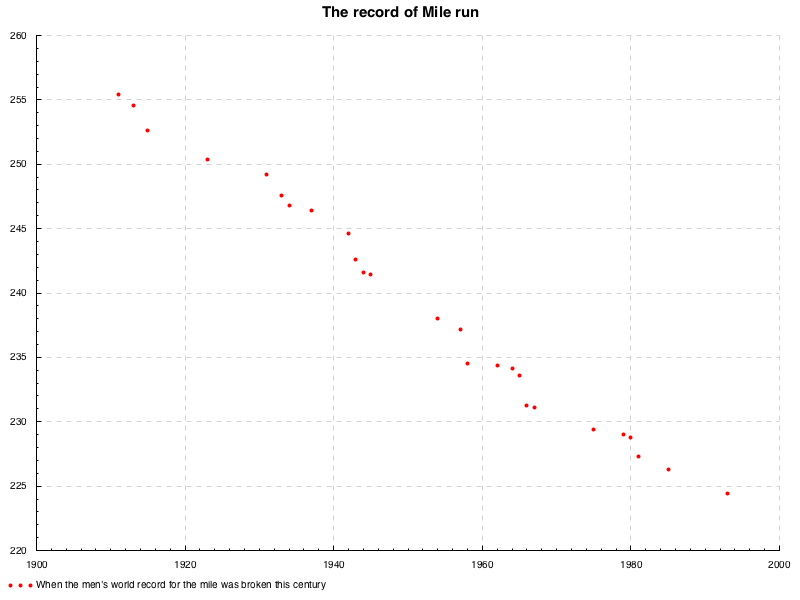
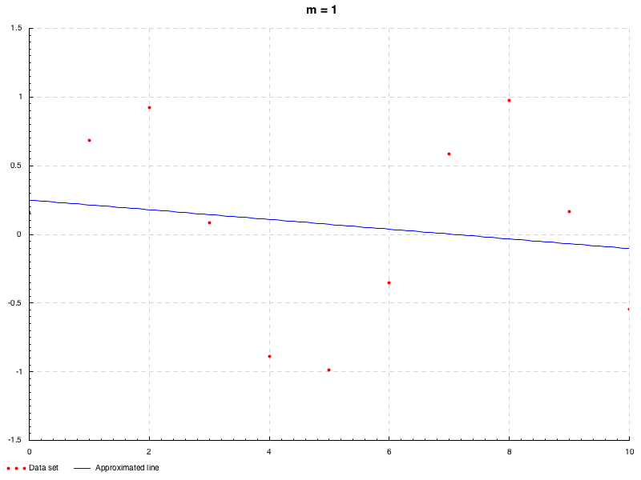
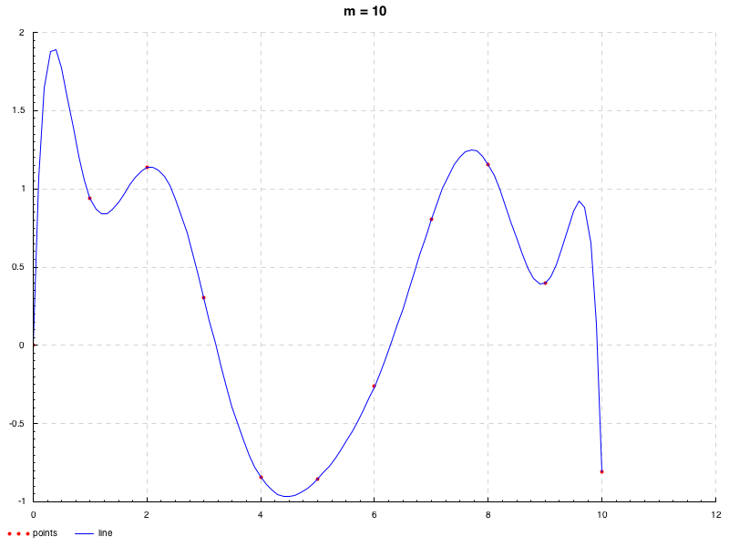
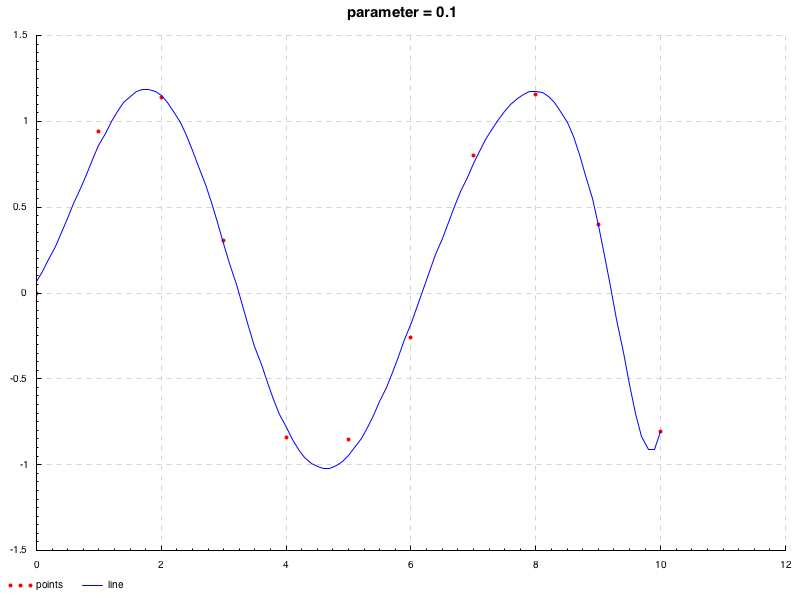
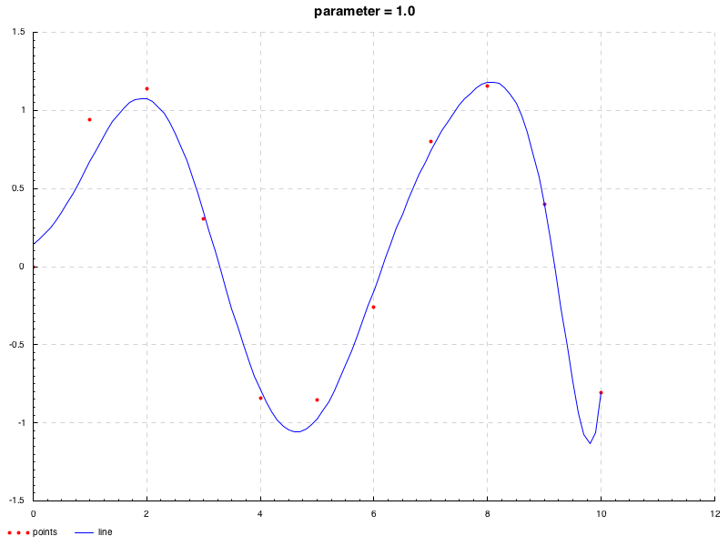
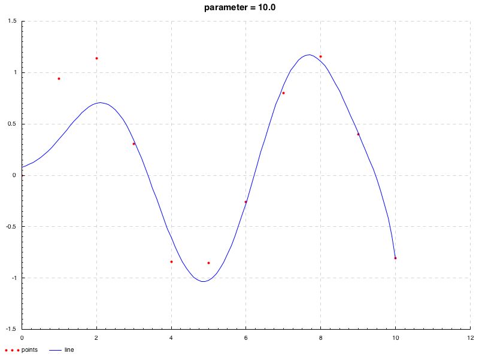
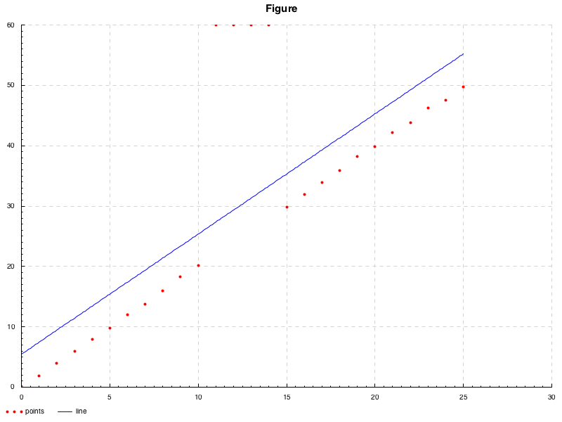

## 要旨

本エントリー(WIP)はカーブフィッティング全般に関して記述したものであり,
それぞれの原理, 性質について学んだ際のメモとして, より単純なものから広く浅く挙げています.
極力ないようにはしていますが, 本内容は独学で得た知見より書いておりますので,
一部正確さが欠けている可能性があることは否めません.
何かありましたら, コメント等で指摘していただけるとありがたいです.
また, 本エントリ内における近似およびプロット等に関する実装は次のリポジトリ

<div class="box has-text-centered is-shadowless">
<i class="fab fa-github mr-2"></i>
<a href="https://github.com/falgon/PlayLinearAlgebra">falgon/PlayLinearAlgebra - My playground about linear albebra: LU decomposition, pseudo inverse, least squared method, etc...</a>
</div>

にまとまっています.

<!--more-->

## 線形回帰

まずは, 回帰解析のうち最も基本的な手法である最小二乗法について.
次のような散布図[^1]を考える.

{ width=600px }

このデータセットは, 
[マイルラン](https://en.wikipedia.org/wiki/Mile_run)という中距離マラソンにおける男子世界記録の遷移を表しており,
横軸が世界記録を更新した年, 縦軸がその記録の秒数となっている.
この散布図は負の相関関係があるといえる.
まあ, 記録の更新というのは, ゴールするまでのタイムが縮んだということをいうので,
これは当たり前の相関関係である.

このような直線的な関係があるようにみえるような散布について,
それなりにそれらの点に相応しいような直線,
つまり各点からの距離が最も小さくなるような直線を引きたいとしよう.
これが本エントリにおける主題である.

### 線形最小二乗法

最小二乗法は, 上記のようなデータの組 $(x_i,y_i)$ が \\(n\\) 組与えられたとき(\\(x_i\\) の全てが等しい場合を除いて)に, 
それらの点に相応しい関数 \\[y_i=a_i+a_ix^1_1+\cdots+a_ix^n_i\tag{i}\\] の係数(傾きと切片)を決定する方法である(定義式は \\((14)\\)). 
なお, このときの線形性とは, 係数 \\(a_k\\) の線形性を意味しており, すなわち応答変数 \\(y\\) は係数 \\(a_k\\) の線形関数を表している.
まずは最もシンプルな例として, 回帰モデルを \\(y=ax+b\\) として考えると, これに対する線形最小二乗法は, 簡単に導出できる:

ある点 \\((x_i, y_i)\\) とモデルとなる直線の誤差, 
すなわち偏差は \\(y_i-(ax_i+b)\\) とかける.
このとき, 各点からの距離が最小であってほしいのだから,
まず総和を \\[\epsilon(a,b):=\displaystyle\sum^{n}_{i=1}(y_i-ax_i-b)^2\tag{1}\\]
とおくこととする. 
いまここで二乗したのは, モデルとなる直線よりも下に点があった場合, 符号が負となり,
これが誤差を相殺してしまったり, 値を負にしてしまうからである.
絶対値を用いないのは, 後の微分計算を可能にするためである.

さて, いま \\((1)\\) の最小値を求めたいわけだが, 
簡単のためにここでまず \\(b\\) を固定したと考える. 
すると, \\((1)\\) は単なる \\(a\\) の二次関数と捉えることができる.
その係数 \\(\displaystyle\sum^{n}_{i=1}x_i^2\\) は正であるので, 
この二次関数は, 下に凸の放物線を描くことがわかる.
よってこの二次関数の最小値は, 接線の傾きを \\(0\\) とした値をとることがいえるので, それを

\\[\frac{\partial\epsilon(a,b)}{\partial a}=0\\]

とかける. 同様に, \\(a\\) を固定したと考えれば, 係数は \\(n\\) でこれは正であるから,
これも下に凸の放物線を描くことがわかる. つまりこの場合の最小値も,

\\[\frac{\partial\epsilon(a,b)}{\partial b}=0\\]

とかける. いま求めたかったのはこのどちらをも満たす \\(a,b\\) であるので,
これらの連立方程式を解けば良いこととなる. 従って \\((1)\\) より

\\[
\begin{aligned}
&&\begin{cases}
&\displaystyle\frac{\partial\epsilon(a,b)}{\partial a}&=&\displaystyle\sum_{i=1}^{n}2(y_i-(ax_i+b))\cdot(-x_i)&=&0 \\
&\displaystyle\frac{\partial\epsilon(a,b)}{\partial b}&=&\displaystyle\sum_{i=1}^{n}2(y_i-(ax_i+b))&=&0
\end{cases}
\end{aligned}
\\]

このような, 線形方程式におけるすべての定数項が $0$ であるものを同次線形系(英:homogeneous linear system)という. この両辺を \\(2\\) で割って,

\\[
\begin{aligned}
&\leftrightarrow
&\begin{cases}
&\displaystyle\sum_{i=1}^{n}(y_i-(ax_i+b))\cdot x_i&=&0 \\
&\displaystyle\sum_{i=1}^{n}(y_i-(ax_i+b))&=&0
\end{cases} \\
&\leftrightarrow
&\begin{cases}
&\displaystyle a\sum_{i=1}^{n}x^2_i&+&\displaystyle b\sum_{i=1}^{n}x_i&=&\displaystyle\sum_{i=1}^{n}x_i y_i \\
&\displaystyle a\sum_{i=1}^{n}x_i&+&bn&=&\displaystyle\sum_{i=1}^{n}y_i 
\end{cases}
\tag{2}
\end{aligned}
\\]

両辺を \\(n\\) で割って,

\\[
\begin{aligned}
&\leftrightarrow
&\begin{cases}
&\displaystyle a\frac{\sum_{i=1}^{n}x^2_i}{n}&+&\displaystyle b\frac{\sum_{i=1}^{n}x_i}{n}&=&\displaystyle\frac{\sum_{i=1}^{n}x_i y_i}{n} \\
&\displaystyle a\frac{\sum_{i=1}^n x_i}{n}&+&b&=&\frac{\sum_{i=1}^ny_i}{n}
\end{cases}
\end{aligned}
\\]
ここで, \\(\frac{\sum_{i=1}^n x_i}{n}\\) は \\(x\\) の総和をその個数で割っているので
\\(x\\) の平均,
\\(\frac{\sum_{i=1}^ny_i}{n}\\) は \\(y\\) の総和をその個数で割っているので 
\\(y\\) の平均であるから,
\\(\overline{x}=\frac{\sum_{i=1}^{n}x_i}{n}, \overline{y}=\frac{\sum_{i=1}^ny_i}{n},
\overline{x^2}=\frac{\sum_{i=1}^{n}x_i^2}{n}, 
\overline{xy}=\frac{\sum_{i=1}^{n}x_i y_i}{n}\\) と平均の記号を用いて書くことができる.
よって, \\(b=-a\overline{x}+\overline{y}\\) を代入すれば \\(a\\) も求まるわけだが, 
一旦これを行列で表現すると,

\\[
\begin{aligned}
\left(\begin{array}{cc}
\overline{x^2} & \overline{x} \\ \overline{x} & 1
\end{array}\right)
\left(\begin{array}{c}
a \\ b
\end{array}\right)
&=&
\left(\begin{array}{c}
\overline{xy} \\
\overline{y}
\end{array}\right)
\end{aligned}
\\]

左辺の行列の行列式 

\\[
\begin{aligned}
{\rm det}\left(\begin{array}{cc}
\overline{x^2} & \overline{x} \\ \overline{x} & 1
\end{array}\right)
\end{aligned}
\\]

は, \\(x_i\\) がすべて等しくない限り \\(0\\) とはならない. 
いまはそのような場合を除いているから, 同行列は正則で

\\[
\begin{aligned}
\left(\begin{array}{c}
a \\ b
\end{array}\right)
&=&\left(\begin{array}{cc}
\overline{x^2} & \overline{x} \\ \overline{x} & 1
\end{array}\right)^{-1}
\left(\begin{array}{c}
\overline{xy} \\
\overline{y}
\end{array}\right) 
\end{aligned}
\\]

より \\((a\ b)^T\\) は

\\[
\begin{aligned}
&=&\left(\begin{array}{c}
\frac{\overline{xy}-\overline{x}\cdot\overline{y}}{\overline{x^2}-\overline{x}^2} \\
\frac{\overline{x^2}\cdot\overline{y}-\overline{xy}\cdot\overline{x}}{\overline{x^2}-\overline{x}^2}
\end{array}\right)\tag{3}
\end{aligned}
\\]

と求まる.  ここで, \\(\overline{xy}-\overline{x}\cdot\overline{y}\\) は共分散,
\\(\overline{x^2}-\overline{x}^2\\) は分散の形になっているので, \\(a\\) は \\(\frac{\mathrm{Cov}(x,y)}{\sigma_x^2}\\) とまとめることができ, よくみる最小二乗法の定義式の形となった.
実際にプログラムにすることを考えるときは, 平均などはどうでもよくて,
単に \\((3)\\) の各項に \\(n\\) を乗じた形で計算すればよい. つまり,

\\[
\begin{aligned}
(2)&\leftrightarrow&
\left(\begin{array}{cc}
\displaystyle \sum_{i=1}^{n}x^2_i &\displaystyle \sum_{i=1}^{n}x_i \\
\displaystyle \sum_{i=1}^{n}x_i &n
\end{array}\right)
\left(\begin{array}{c}
a \\ b
\end{array}\right)&=&
\left(\begin{array}{c}
\displaystyle\sum_{i=1}^{n}x_i y_i \\ \displaystyle\sum_{i=1}^{n}y_i 
\end{array}\right)
\\ 
&\leftrightarrow&
\left(\begin{array}{c}
a \\ b
\end{array}\right)&=&
\left(\begin{array}{cc}
\displaystyle \sum_{i=1}^{n}x^2_i &\displaystyle \sum_{i=1}^{n}x_i \\
\displaystyle \sum_{i=1}^{n}x_i &n
\end{array}\right)^{-1}
\left(\begin{array}{c}
\displaystyle\sum_{i=1}^{n}x_i y_i \\ \displaystyle\sum_{i=1}^{n}y_i 
\end{array}\right) \\
&&&=&\left(\begin{array}{c}
\frac{(\sum^n_{i=1}x_iy_i) n-(\sum^n_{i=1}x_i)(\sum^n_{i=1}y_i)}{(\sum^n_{i=1}x^2_i) n-(\sum^n_{i=1}x_i)^2} \\
\frac{(\sum^n_{i=1}x^2_i)(\sum^n_{i=1}y_i)-(\sum^n_{i=1}x_iy_i)(\sum^n_{i=1}x_i)}{(\sum^n_{i=1}x^2_i) n-(\sum^n_{i=1}x_i)^2}
\end{array}\right)
\end{aligned}
\\]

である. これを用いて, 次のように近似できる.

{ width=600px }

というのが, 最も素朴な最小二乗法の例である[^2]. 
より一般に, \\(y\\) が \\(m\\) 次の多項式 \\(\displaystyle f(x)=b+\sum_{j=1}^{m}a_j x^{j}\\) 
として表されるような場合についても, 同様にしていうことができる.
この場合, 偏差の二乗和は,

\\[\displaystyle\epsilon=\sum^{n}_{i=1}(y_i-b-\sum_{j=1}^{m}a_j x^{j})^2\tag{4}\\]

先と同様, 各変数ごとの偏微分が \\(0\\) となる連立方程式を解けば良いから,

\\[
\begin{aligned}
\begin{cases}
&\displaystyle\frac{\partial\epsilon}{\partial b}&=&\displaystyle-\sum_{i=1}^{n}2(y_i-b-\sum_{j=1}^{m}a_j x^{j})&=&0 \\
&\displaystyle\frac{\partial\epsilon}{\partial a_1}&=&\displaystyle-\sum_{i=1}^{n}2x_i(y_i-b-\sum_{j=1}^{m}a_j x^{j})&=&0 \\
&&&\vdots& \\
&\displaystyle\frac{\partial\epsilon}{\partial a_m}&=&\displaystyle-\sum_{i=1}^{n}2x^m_i(y_i-b-\sum_{j=1}^{m}a_j x^{j})&=&0 
\end{cases}
\end{aligned}
\\]

先の例に合わせて, 両辺を \\(2n\\) で割った行列とすると, 平均の記号を用いて

\\[
\begin{aligned}
\left(\begin{array}{cccc}
1 & \overline{x} & \cdots & \overline{x^m} \\
\overline{x} & \overline{x^2} & \cdots & \overline{x^{m+1}} \\
\vdots & \vdots & \ddots & \vdots \\
\overline{x^m} & \overline{x^{m+1}} & \cdots & \overline{x^{2m}}
\end{array}\right)
\left(\begin{array}{c}
b \\ a_1 \\ \vdots \\ a_m
\end{array}\right)=
\left(\begin{array}{c}
\overline{y} \\
\overline{xy} \\
\vdots \\
\overline{x^my}
\end{array}\right)
\end{aligned}
\\]

なので,

\\[
\begin{aligned}
\left(\begin{array}{c}
b \\ a_1 \\ \vdots \\ a_m
\end{array}\right)&=&
\left(\begin{array}{cccc}
1 & \overline{x} & \cdots & \overline{x^m} \\
\overline{x} & \overline{x^2} & \cdots & \overline{x^{m+1}} \\
\vdots & \vdots & \ddots & \vdots \\
\overline{x^m} & \overline{x^{m+1}} & \cdots & \overline{x^{2m}}
\end{array}\right)^{-1}
\left(\begin{array}{c}
\overline{y} \\
\overline{xy} \\
\vdots \\
\overline{x^my}
\end{array}\right) \\
&=&\left(\begin{array}{cccc}
n & \displaystyle\sum^{n}_{i=1}x_i & \cdots & \displaystyle\sum^{n}_{i=1}x^m_i \\
\displaystyle\sum^{n}_{i=1}x_i & \displaystyle\sum^{n}_{i=1}x_i^2 & \cdots & \displaystyle\sum^{n}_{i=1}x_i^{m+1} \\
\vdots & \vdots & \ddots & \vdots \\
\displaystyle\sum^{n}_{i=1}x_i^m & \displaystyle\sum^{n}_{i=1}x_i^{m+1} & \cdots & \displaystyle\sum^{n}_{i=1}x_i^{2m}
\end{array}\right)^{-1}
\left(\begin{array}{c}
\displaystyle\sum^n_{i=1}y_i \\ \displaystyle\sum^n_{i=1}x_iy_i \\ \vdots \\ \displaystyle\sum^n_{i=1}x_i^my_i
\end{array}\right)
\end{aligned}
\\]

で求まる. 
この正確な解を機械的に求める場合には,
この逆行列を求めなくとも, 
ガウスの消去法などを基本とした解法(直接解法)で解ける.

先のデータは直線的であったので, 今度は曲線が引けそうなデータセットとして, \\(x_i=i-1, y_i=\sin(x_i)+\epsilon, i=1,2,\cdots,11\\) に対し, フィッティングを試行してみる事とする.
ここで \\(\epsilon\\) は \\(\mathrm{N}(0, 0.2)\\) の正規分布に従う確率変数である.
次のアニメーションでは, 次数 \\(1\leq m\leq 9\\) に応じた近似の遷移を観察できる(LU 分解による計算 \\(\to\\) [解説](/roki.log/2019/01/1/LUDecomposition/)).

{ width=600px }

ところで, 冒頭で示した関数 \\((i)\\) の線形回帰モデルは, 次のように表すことができる.

\\[y_i=a_0+\sum^m_{j=1}a_jf_j(x_i^1,x_i^2,\cdots,x_i^n)+u_i,\ i=1,\cdots,m\tag{ii}\\]

ここで, \\(f_j\\) は独立変数 \\(x_{i}^k\\) のスカラー関数, \\(u_i\\) は \\(i\\) 番目のノイズ項(確率変数)である.
線形最小二乗法は, 単にすべてのデータ値に対する偏差の二乗和を最小化する. すなわち, データに関わらず全ての値が同じように扱われる.
これは, すべてのノイズ項 \\(u_i\\) の確率分布が同一であると仮定することと同値であり,
従って, すべての \\(u_i\\) は無相関かつ [i.i.d](/roki.log/2018/10/28/probabilityTerms/#iid) で
\\(\mathrm{N}(0,\sigma^2)\\) (標準正規分布) に従うことを前提としているといえる[^4].

## 一般逆行列

ここまでは, 回帰直線の考え方に沿って近似曲線/直線を得た訳であるが, 
そもそも, \\((x_i,y_i)\\) の組があって線形方程式 \\(y\\) の \\(x\\) 
に関する関数における"適当な"係数が"直接"求まるような行列があれば良いのではないだろうか. 
つまり \\(m\\) を方程式の個数, \\(n'=n+1\\) を未知数の個数とし, \\(X{\boldsymbol a}={\boldsymbol y}\ \ {\rm where}\ X\in\mathbb{R}^{m\times n'}, {\boldsymbol a}\in\mathbb{R}^{n'\times 1}, {\boldsymbol y}\in\mathbb{R}^{m\times 1}\\)[^5] としたとき

\\[
\begin{aligned}
\left(\begin{array}{c}
y_1 \\
y_2 \\
\vdots \\
y_m
\end{array}\right)=
\left(\begin{array}{cccc}
x_1^0 & x_1^1 & \cdots & x_1^n \\
x_2^0 & x_2^1 & \cdots & x_2^n \\
\vdots  & \vdots & \ddots & \vdots \\
x_m^0 & x_m^1 &\cdots & x_m^n
\end{array}\right)
\left(\begin{array}{c}
a_0 \\
a_1 \\
\vdots \\
a_n
\end{array}\right) \\
\left(\begin{array}{cccc}
x_1^0 & x_1^1 & \cdots & x_1^n \\
x_2^0 & x_2^1 & \cdots & x_2^n \\
\vdots  & \vdots & \ddots & \vdots \\
x_m^0 & x_m^1 &\cdots & x_m^n
\end{array}\right)^{-1}
\left(\begin{array}{c}
y_1 \\
y_2 \\
\vdots \\
y_m
\end{array}\right)
=
\left(\begin{array}{c}
a_0 \\
a_1 \\
\vdots \\
a_n
\end{array}\right)\tag{5}
\end{aligned}
\\]

を解いて, それが求まれば良いのではないか, 
ということである(\\(n+1\\) と \\(m\\) は必ずしも等しくないことに注意[^3]). このときに考えられるパターンは, 次のとおりである:

1. \\(n'=m\\) かつそのランク \\({\rm rank}(X)\\) が \\(n'=m\\)(フルランク)ならば, \\(X\\) は正則である. 従って, \\(X^{-1}X{\boldsymbol a}=X^{-1}{\boldsymbol y}\\) として解が求まる. 
2. \\(n'\lt m\\) かつそのランクが \\(n'\\)(列フルランク)ならば, すべての方程式を満たすような解が存在しないことがいえる.  これは, すべての方程式をそれぞれ直線と捉えたときに, それらすべての交点となる一点が存在しないことをイメージするとわかりやすい. 要するに, \\({\boldsymbol a}\\) に対する \\(X\\) と \\({\boldsymbol y}\\) の制約が相互的に成立しないのである. ここで \\({\rm rank}(X)\lt n'\\)(ランク落ち)ならば, 方程式のどこかに重複がある. 
3. \\(m\lt n'\\) かつそのランクが \\(m\\)(行フルランク)ならば, 解が一意とならないことがいえる. これも, 方程式を直線に捉えると, \\({\boldsymbol a}\\) に対する制約が足りないことで, 方程式で構成される直線上のすべてが解となりうることから納得できる. ここで \\({\rm rank}(X)\lt m\\)(ランク落ち)ならば, 方程式のどこかに重複がある. 

いま 2 つの重複がある場合を考えることができたが, 重複を除けば, いま述べたうちのどれかに帰着させることができる.
重複の場合を直線で捉えると, それぞれの方程式が \\(x, y\\) の関係に関して全く異なる解を示しているということなので, それぞれの直線は平行の関係にあることとなる.

まとめると, つまり \\(X{\boldsymbol a}={\boldsymbol y}\\) というように表される線形方程式には, 以上の 3 つのパターン(重複について考えれば 4 パターン)があることがわかる.
これらのすべてのパターンに対して"適当であるような"解を与える逆行列を考えれば, どのような方程式にも"適当であるような"解を与えることができる.
このように, 正則でない行列に対する擬似的な逆行列の定義を一般逆行列という.

<div class="m-def">
<header class="m-def-title"><p><span id="GeneralizedInverse">一般逆行列</span></p></header>
<div class="m-def-content">
  次の式を満たす行列
  \\(X^-\in\mathbb{R}^{m\times n'}\\) 
  を一般逆行列といい,
  \\(X\\) が特異行列ならば \\(X^-\\) は一意ではないが常に存在する. 
  \\[X X^-X = X\\]
  </div>
</div>

"適当であるような"解は様々に考えられるように, 一般逆行列の定義も様々である.
以下やや天下り的ではあるが便宜上の理由より示してしまうと,
いくらかの一般逆行列は次で定めるムーア・ベンローズ一般逆行列(以下 MP 逆行列)に従っており, 
暗に一般逆行列と言ってこの MP 逆行列のことを示すような場合が巷ではある[^6].

<div class="m-def">
<header class="m-def-title"><p><span id="MPPseudoInverse">Moore-Penrose 一般逆行列</span></p></header>
<div class="m-def-content">
次のすべての条件を満たす<a href="#GeneralizedInverse">一般逆行列</a> \\(X^{\dagger}\\) は 
Moore-Penrose 一般逆行列(MP 逆行列)といい, 
その存在は一意[^7]である.
\\[X X^\dagger X=X\tag{6}\\]
\\[X^{\dagger}X X^{\dagger}=X^{\dagger}\tag{7}\\]
\\[(X^{\dagger}X)^T=X^{\dagger}X\tag{8}\\]
\\[(X X^{\dagger})^T=X X^{\dagger}\tag{9}\\]
  </div>
</div>

### 最小二乗形一般逆行列

まず, ケース 2 の場合について考える. これは, 最小二乗形一般逆行列といわれる一般逆行列を用いる.
これが定める"適当であるような"解とは, その名の通り, すべての方程式の二乗誤差が最小である値であり, まさしく上で述べた最小二乗法の値である.

<div class="m-def">
<header class="m-def-title"><p><span id="LeastSquaresGeneralizedInverse">最小二乗形一般逆行列</span></p></header>
<div class="m-def-content">
  正規方程式 \\[{\boldsymbol a}=X^-{\boldsymbol y}\\] の解 
  \\({\boldsymbol a}\\) を二乗誤差最小の値で定める
  <a href="#GeneralizedInverse">一般逆行列</a> 
  \\[^\exists X^-\in\mathbb{R}^{m\times n'}\ {\rm s.t.}\ m\gt n'\land(X X^-)^T = X X^-\\] 
  は \\(X\\) の最小二乗形一般逆行列である.
  </div>
</div>
  

以下, 最小二乗形一般逆行列の定式を求めるが, 上で既に述べた内容と本質的には全く変わらない. 
ここで, 少し扱いやすくするために, \\(n\\) 次多項式を \\(f_n(x)=a_0x^0_i+a_1x^1_i+\cdots+a_nx^n_i=\sum^{n}_{j=0}a_jx^j_i\\),
\\((5)\\) の \\(x_i^j\\) についての行列を \\(X\\) とする. そしてその \\(i\\) 行目を 1 つの縦ベクトルとしたものを 
\\({\boldsymbol x_i}\\) (\\({\rm e.g.}\ \ {\boldsymbol x_1}=(x_1^0, x_1^1, \cdots, x_1^n )^T\\)) とし,
\\((4)\\) の式を

\\[\epsilon=\sum_{i=1}^{m}(y_i-f_n({\boldsymbol x_i}))^2\tag{10}\\]

というように表す(これは \\((4)\\) と全く同じことを書いただけである)とする.
\\(f({\boldsymbol x_i})={\boldsymbol x_i}^T{\boldsymbol a}\\) だから

\\[=\sum_{i=1}^{m}(y_i-{\boldsymbol x_i}^T{\boldsymbol a})^2\\]

\\(({\boldsymbol x_1}^T,{\boldsymbol x_2}^T,\cdots,{\boldsymbol x_m}^T)^T=X\\) なので

\\[=({\boldsymbol y}-X{\boldsymbol a})^T({\boldsymbol y}-X{\boldsymbol a})\\]

ここで, 先にやった, 偏微分を考えることで下に凸な二次関数となることを利用し, その値を \\(0\\) とした上でそれらすべての連立方程式を求め, 最小値を得たことを思いだし,
この式を \\({\boldsymbol a}\\) で微分する(すべての \\({\boldsymbol a_i}\\) で偏微分する, すなわち勾配を求める)と

\\[\nabla\epsilon({\boldsymbol a})=2X^T X{\boldsymbol a}-2X^T{\boldsymbol y}=-2X^T({\boldsymbol y}-X{\boldsymbol a})\\]

\\(\nabla\epsilon({\boldsymbol a})=0\\) とおくと, 

\\[X^T X{\boldsymbol a}=X^T{\boldsymbol y}\\]

と正規方程式が求まった.
ここで, \\(n'=m-1\\) のとき \\(X\\) はヴァンデルモンド行列[^3]となり, \\({\boldsymbol x_1}, \cdots, {\boldsymbol x_m}\\) が相異なるとき \\(X\\) は正則となる.
従って, 正規方程式の解は

\\[{\boldsymbol a}=(X^T X)^{-1}X^T {\boldsymbol y}={X}^{-1}{\boldsymbol y}\\]

とかける. \\(n'\lt m-1\\) ならば行列 \\(X^T X\\) が正則なので, 正規方程式の解は

\\[{\boldsymbol a}=(X^T X)^{-1}X^T{\boldsymbol y}\tag{11}\\]

とかける. 
このとき \\(m\lt n\\) ならば, \\(X^T X\\) が非正則となってしまうから, 最小二乗形一般逆行列は構成できない. この結果から, 時間計算量は多項式時間 \\(\mathrm{O}(n^3)\\) であることがわかる. 
また, 最小二乗形一般逆行列は, [MP 逆行列](#MPPseudoInverse)であることが導出できる[^8].

### 最小ノルム形一般逆行列

次に, ケース 3 の場合を考える. この場合, 最小ノルム形一般逆行列を用いる.
ケース 3 は様々な値が解になりうるということであったが, 
最小ノルム形一般逆行列は, いまそれを \\(X^-\\) としたとき,
\\({\boldsymbol a}=X^-{\boldsymbol y}\\) の解 \\({\boldsymbol a}\\) を
その \\(L^2\\) ノルム \\(\mid\mid {\boldsymbol a}\mid\mid_2\\)
が最小となるように定める.

<div class="m-def">
<header class="m-def-title"><p><span id="MinimumNormGeneralizedInverse">最小ノルム形一般逆行列</span></p></header>
<div class="m-def-content">
  正規方程式 \\[{\boldsymbol a}=X^-{\boldsymbol y}\\] の解 
  \\({\boldsymbol a}\\) をその \\(L^2\\) ノルム \\(\mid\mid {\boldsymbol a}\mid\mid_2\\)
  が最小となる値で定める<a href="#GeneralizedInverse">一般逆行列</a> 
  \\[^\exists X^-\in\mathbb{R}^{m\times n'}\ {\rm s.t.}\ m\lt n'\land(X^- X)^T = X^- X\\]
  は \\(X\\) の最小ノルム形一般逆行列である.
  </div>
</div>

つまり, 解くべきは次に示す制約付き最適化問題/条件付き極小値問題である.

\\[\min_{{\boldsymbol a}}\mid\mid{\boldsymbol a}\mid\mid^2_2\ {\rm s.t.}\ {\boldsymbol y}=X{\boldsymbol a}\\]

条件付き極値の問題はラグランジュの未定乗数法で解ける.
この証明は中々大変なので, 本エントリでは公理として認めた上で用いることとする(TODO).
従って, ラグランジアンを次のように定義する.

\\[\mathcal{L}({\boldsymbol a}, {\boldsymbol \lambda}):=\mid\mid{\boldsymbol a}\mid\mid^2_2+{\boldsymbol \lambda}^T({\boldsymbol y}-X{\boldsymbol a})\\]

ラグランジュの未定乗数法に従い, それぞれの偏導関数から求めて

\\[
\begin{aligned}
\begin{cases}
\frac{\partial}{\partial{\boldsymbol a}}\mathcal{L}({\boldsymbol a})&=&2{\boldsymbol a}-X^T{\boldsymbol \lambda}&=&0 \\
\frac{\partial}{\partial{\boldsymbol \lambda}}\mathcal{L}({\boldsymbol a})&=&{\boldsymbol y}-X{\boldsymbol a}&=&0
\end{cases}
\end{aligned}
\\]

よって

\\[
\begin{aligned}
\begin{cases}
{\boldsymbol a}&=&\frac{1}{2}X^T\lambda \\
{\boldsymbol y}&=&X{\boldsymbol a}
\end{cases}\leftrightarrow{\boldsymbol y}=\frac{1}{2}X X^T\lambda
\end{aligned}
\\]

\\(m\lt n'\\) ならば \\(X X^T\\) は正則なので

\\[\lambda=2(X X^T)^{-1}{\boldsymbol y}\leftrightarrow {\boldsymbol a}=X^T(X X^T)^{-1}{\boldsymbol y}\\]

$X{\boldsymbol a}=X\left\{X^T(X X^T)^{-1}{\boldsymbol y}\right\}=(X X^T)(X X^T)^{-1}{\boldsymbol y}={\boldsymbol y}$ よりこの正規方程式の解が一般逆行列として成立していることが確認できる.

### 制限つき最小二乗法

最後に, 重複がある(ランク落ちである)ケースを考える.
この場合は, \\(X^T X, X X^T\\) がともに特異行列となってしまうため,
対象の行列に対してまず特異値分解(以下 SVD)を行う.

<div class="m-def">
<header class="m-def-title"><p><span id="SVG">特異値分解</span></p></header>
<div class="m-def-content">
\\(^\forall X\in\mathbb{R}^{m\times n'}\\) に対して
\\[
^\exists U\in\mathbb{R}^{m\times m}, ^\exists V\in\mathbb{R}^{n'\times n'},
^\exists \Sigma\in\mathbb{R}^{n'\times m}\ {\rm s.t.}\ 
X = U\Sigma V^T \\ {\rm where}\ \Sigma=\left(\begin{array}{ccccc}\lambda_1&\cdots&0 \\ \vdots&\ddots&\vdots \\ 0&\cdots&\lambda_{r} \\ &&&0 \\ &&&&0 \end{array}\right), \lambda_1\geq\cdots\geq\lambda_{r}\geq 0,r=\mathrm{rank}(X)=\min(m,n')
\\]
このとき \\(U\Sigma V^T\\) を \\(X\\) の特異値分解 
(英: Singular value decomposition) という.
</div>
</div>

これは 

\\[
\begin{aligned}
\displaystyle\sum^{r}_{i=1}\lambda_i{\boldsymbol u_i}{\boldsymbol v_i}^T\ {\rm where}
\ \begin{array}{cc}
({\boldsymbol u_1},\cdots,{\boldsymbol u_m})^T
&=&\left(\begin{array}{ccc}
u_{11}&\cdots&u_{1m} \\
\vdots&\ddots&\vdots\\ 
u_{m1}&\cdots&u_{mm}
\end{array}\right)&=&U \\
({\boldsymbol v_1},\cdots,{\boldsymbol v_{n'}})^T
&=&\left(\begin{array}{ccc}
v_{11}&\cdots&v_{1n'} \\
\vdots&\ddots&\vdots\\
v_{n'1}&\cdots&v_{n'n'}
\end{array}\right)&=&V
\end{array}
\end{aligned}
\\]

と同値であり, 一般に \\(\lambda_i\\) を特異値, \\({\boldsymbol u_i}\\) を左特異ベクトル
\\({\boldsymbol v_i}\\) を右特異ベクトルという.

**TODO: 詳解を追記**

### オーバーフィッティングと正則化およびその評価

先に, 次数に応じた近似の遷移が観察できるアニメーションを示したが, あまり次数を大きくすると, データ点の間で誤差が大きくなってしまうことがある. これをオーバーフィッティングという.
先と同様, \\(x_i=i-1, y_i=\sin(x_i)+\epsilon, i=1,2,\cdots,11\\) に対する各次元での係数を見てみると(\\((5)\\) では, 
係数のベクトルを \\((a_0,a_1,\cdots,a_n)^T\\) と並べているが, 下記は \\((a_n,a_{n-1},\cdots,a_0)^T\\) の順である),

```haskell
λ> :m +Data.Tuple.Extra Data.Maybe System.Random Random.Normal Control.Monad ML.Approx.OLS.ByPinv Utils
λ> let uni = normalIO' (0, 0.2)
λ> let d = zipWith (\x y -> (x, sin x+y)) [0..10] <$> replicateM 11 uni
λ> dd <- d
λ> dd
[(0.0,-5.563765361160251e-4),(1.0,0.9418472638241775),(2.0,1.1378051539092622),(3.0,0.30341406458452413),(4.0,-0.8411970236084821),(5.0,-0.8558604338359868),(6.0,-0.2586281201459223),(7.0,0.8031257237891795),(8.0,1.1562504257723663),(9.0,0.39633872602316167),(10.0,-0.8085898217611907)]
λ> let outCoes i = putStrLn $ maybe "failed" (((++) $ show i ++ " -----\n") . foldr1 (++) . (map ((++ "\n") . show))) $ resolve i dd
λ> mapM_ outCoes [1..10]
1 -----
[-4.168066672607503e-2]
[0.38785329563173637]

2 -----
[6.311957210780993e-3]
[-0.10480023883388496]
[0.4825326537934513]

(略)

9 -----
[6.2497127164502315e-6]
[-2.783924911591259e-4]
[5.143290075166487e-3]
[-5.026523522855991e-2]
[0.2724261548894942]
[-0.7770268952402895]
[1.0147233691594897]
[-0.7860963186273294]
[1.2602569068891822]
[-2.3687551597216985e-4]

10 -----
[-1.626701126479776e-5]
[8.196002759563384e-4]
[-1.7705498506683254e-2]
[0.21421719275219878]
[-1.5895590768542918]
[7.43609912277545]
[-21.670288785218535]
[37.428871273332284]
[-34.68074111840572]
[13.820707197220901]
[-5.563765361160251e-4]
```

\\(m=10\\) で, \\(-21.670\cdots,37.428\cdots,-34.680\cdots,13.820\cdots\\) といった, 絶対値の大きな値が見られる. 実際に \\(m=9, 10\\) でプロットしてみると,

```haskell
λ> mapM_ (\i -> plot $ PP ("./image" ++ show i ++ ".png") ("m = " ++ show i) "points" "line" dd $ fromJust $ implicitFn $ fromJust $ resolve i dd) [9, 10]
```

\\(m=10\\) のモデルによる近似は \\(m=9\\) の場合と比べて激しく振れていることが見てとれる.

<div class="box has-text-centered is-shadowless">
{ width=320px }
{ width=320px }
</div>

天下り的になってしまうが, このような現象は推定する係数に対して標本数が少ないようなときによく遭遇する. その特徴として, いま示したように, 係数の絶対値が大きくなることが挙げられる.
従って, 次数を適当に固定した上で(この場合 \\(n=\\)データ数\\(-1\\), すなわちデータ数から機械的に次数を決定する), 係数を絶対値を制限することができれば, これを防ぐことができるだろう. 
具体的な手法として, 式 \\((4)\\) に対してノルムを加え, その最小化を求めるといったような[^9]手法が広く知られている.
この手法は, ノルムに対して, 次のように平滑化パラメータ \\(\lambda \geq 0\\) 
を作用させることで正則化の強度を設定することができる. 

\\[\epsilon({\boldsymbol a})_\lambda=\sum^m_{i=1}(y_i-f_n({\boldsymbol x}_i))^2+\underbrace{\lambda R({\boldsymbol a})}_{\rm 正則化項}\\]

このような最適化を正則化法という.
こうすると, モデルの変動が大きくなるにつれて正則化項も大きくなり, それが最小化問題へのペナルティとなって, 結果的に滑らかな曲線の推定に繋がる.
ただし, 過剰に大きいパラメータをとると, 高次の項へのペナルティが強くなってしまうことで, 結局, 高次の項を無視するのと同等となってしまい, 低次の関数でモデルを作るのと同等になってしまう. 従って, 依然として適切なパラメータの設定が要されるわけだが, モデルの次数を決定するよりかは楽である. 

またパラメータ \\(\lambda\\) を標本数で割った形式が取られることもある.

\\[\epsilon({\boldsymbol a})_\lambda=\sum^m_{i=1}(y_i-f_n({\boldsymbol x}_i))^2+\underbrace{\frac{\lambda}{m} R({\boldsymbol a})}_{\rm 正則化項}\\]

両者の違いは正則化項の影響度である. 先に, 推定する係数に対して標本数が少ないようなときにオーバーフィッティングはよく起こると述べたが, ならば当然, 標本数が十分である場合には正則化項は必要ない. パラメータ \\(\lambda\\) を標本数で割ってやれば, 標本数の増加に従って正則化項の影響度を抑制できる. どちらを用いるかはその時々で選択の余地があるだろう.

例えば, \\(\lambda\\) を標本数に依らず直接作用させる形式で 
\\(R({\boldsymbol v})\\) を \\(L^2\\) ノルムとする[^9]と,

\\[
\begin{aligned}
\epsilon({\boldsymbol a})_\lambda&=&\sum^m_{i=1}(y_i-f_n({\boldsymbol x}_i))^2+\lambda\sum_{j=0}^{n}a^2_j \\
&=&({\boldsymbol y}-X{\boldsymbol a})^T({\boldsymbol y}-X{\boldsymbol a})+\lambda{\boldsymbol a}^T{\boldsymbol a}
\end{aligned}
\\]

先と同様に \\(\nabla\epsilon({\boldsymbol a})_\lambda=0\\) とおいて,

\\[
\begin{aligned}
\nabla\epsilon({\boldsymbol a})_\lambda&=&-2X^T({\boldsymbol y}-X{\boldsymbol a})+2\lambda{\boldsymbol a} \\
&=&2(\lambda I+X^T X){\boldsymbol a}-2X^T{\boldsymbol y}\\ &=&0
\end{aligned}
\\]

従ってこの正規方程式の解は,

\\[{\boldsymbol a}=(\lambda I+X^T X)^{-1}X^T{\boldsymbol y}\\]

となる. \\({\boldsymbol a}\\) を求めるに際する時間計算量について加味すると,
逆行列を計算するよりも LU 分解を行った方が良いので,

\\[(\lambda I+X^T X){\boldsymbol a}=X^T{\boldsymbol y}\\]

としておく. この正規方程式を用いて, 平滑化パラメータ \\(\lambda=0.1,1,10\\) を適用しプロットすると,

```haskell
λ> mapM_ (\i -> plot $ PP ("./image" ++ show i ++ ".png") ("parameter = " ++ show i) "points" "line" dd $ fromJust $ implicitFn $ fromJust $ resolveRegular i dd) [0.1, 1, 10]
```

次のようになる.

<div class="box has-text-centered is-shadowless">
{ width=320px }
{ width=320px }
{ width=320px }
</div>

問題は, どのようにしてオーバーフィッティングを評価するかである.
データセット \\(\bf x\\) に対し, 真の値 \\(t_i\\) を
$D=\left\{({\bf x_1},t_1), ({\bf x_2},t_2),\cdots,({\bf x_m},t_m)\right\} {\rm where}\ t_i=g+u_i\ (\because\ \ {\text (ii) より})$ 
とし, 回帰分析によって得られるモデル
\\(\hat{f}_n({\bf y_i})=f_n({\boldsymbol x'_i})\ {\rm where}\ {\boldsymbol x'_i}=({\bf y_i^0},{\bf y_i^1},\cdots,{\bf y_i^n})^T (\because \ {\text (10) より})\\)
との差を次のように定義する.

\\[L(t_i, \hat{f}_n({\boldsymbol {\bf x_i}})):=(t_i-\hat{f}_n({\boldsymbol {\bf x_i}}))^2\\]

この \\(L\\) は損失関数といわれる. 
ここで, \\(\bf x_i\\) と \\(t_i\\) が得られる同時確率を考慮すると, 損失の期待値は

\\[
\begin{aligned}
E\left[L(t_i, \hat{f}_n({\bf x_i}))\right]&=&
\int\int(t_i-\hat{f}_n({\bf x_i}))^2P(t_i\cap{\bf x_i})dt_id{\bf x_i} \\
&=&\int\left\{\int(t_i-\hat{f}_n({\bf x_i}))^2P(t_i\mid{\bf x_i})dt_i\right\}P({\bf x_i})d{\bf x_i}\ (\because \href{/roki.log/2018/10/28/probabilityTerms/#MulTheoremConditionalProbability}{\text 条件付き確率の乗法定理})
\end{aligned}
\\]

\\(\int(t_i-\hat{f}_n({\bf x_i}))^2P(t_i|{\bf x_i})\\) 
を最小化したいので, 
これを \\(g({\bf y})=\int(t_i-\hat{f}_n({\bf y_i}))^2P(t_i|{\bf y_i})\\) とおいて

\\[
\begin{aligned}
\frac{\partial}{\partial \hat{f}_n({\bf x_i})} g({\bf x_i})&=&2\int(t_i-\hat{f}_n({\bf x_i}))P(t\mid{\bf x_i})dt_i \\
&=&2\int\left\{\hat{f}_n({\bf x_i})P(t_i\mid{\bf x_i})\right\}dt_i-2\int t_i P(t_i\mid{\bf x_i})dt_i \\
&=&2\hat{f}_n({\bf x_i})\int P(t_i\mid{\bf x_i})dt_i-2\int t_i P(t_i\mid{\bf x_i})dt_i \\
&=&2\hat{f}_n({\bf x_i})-2\int t_i P(t_i\mid {\bf x_i})dt_i\ (\because \href{/roki.log/2018/10/28/probabilityTerms/#normalizationLaw}{\text 規格化条件})
\end{aligned}
\\]

\\(\therefore\\)

$$
\nabla g({\bf x})=0\leftrightarrow \hat{f}_n({\bf x_i})=\int t_i P(t_i\mid{\bf x_i})=E\left[t_i\mid{\bf x_i}\right]
$$

よって, \\(\hat{f}_n\\) は条件付き期待値 $E\left[t_i\mid{\bf x_i}\right]$ 
で決めると最小化されることがわかった. 先に示した損失関数 \\(L\\) は, 一つの点における差なので, 
すべての点における差を次のように定義する(英: mean-square error から).

$${\rm MSE}:=\sum^m_{i=1}L(t_i,\hat{f}_n({\bf x_i}))$$

この期待値をできる限り小さくしたい.

$$E\left[{\rm MSE}\right]=E\left[\sum^m_{i=1}L(t_i,\hat{f}_n({\bf x}))\right]=\sum_{i=1}^mE\left[L(t_i,\hat{f}_n({\bf x}))\right]\ (\because \href{/roki.log/2018/10/28/probabilityTerms/#fn-2}{\text 期待値の線形性})$$

$E\left[L(t_i,\hat{f}_n({\bf x_i}))\right]$ について展開すると,

\\[
\begin{aligned}
E\left[L(t_i,\hat{f}_n({\bf x_i}))\right]&=&
E\left[(t_i-\hat{f}_n({\bf x_i}))^2\right] \\
&=&E\left[(t_i-E\left[t_i\mid{\bf x_i}\right]+E\left[t_i\mid{\bf x_i}\right]-\hat{f}_n({\bf x_i}))^2\right] (\because {\rm augmentation\ trick})\\
&=&E\left[\left\{\underbrace{(t_i-E\left[t_i\mid{\bf x_i}\right])}_{a}+\underbrace{(E\left[t_i\mid{\bf x_i}\right]-\hat{f}_n({\bf x_i}))}_{b}\right\}^2\right] \\
&=&E\left[
\begin{array}{c}
(t_i-E\left[t_i\mid{\bf x_i}\right])^2+ \\
(E\left[t_i\mid{\bf x_i}\right]-\hat{f}_n({\bf x_i}))^2+ \\
2(t_i-E\left[t_i\mid{\bf x_i}\right])(E\left[t_i\mid{\bf x_i}\right]-\hat{f}_n({\bf x_i}))
\end{array}\ 
\right] (\because (a+b)^2=a^2+b^2+2ab\tag{12}) \\
&=&
\begin{array}{c}
E\left[(t_i-E\left[t_i\mid{\bf x_i}\right])^2\right] \\
+E\left[(E\left[t_i\mid{\bf x_i}\right]-\hat{f}_n({\bf x_i}))^2\right] \\
+E\left[2(t_i-E\left[t_i\mid{\bf x_i}\right])(E\left[t_i\mid{\bf x_i}\right]-\hat{f}_n({\bf x_i}))\right]
\end{array}
(\because \href{/roki.log/2018/10/28/probabilityTerms/#fn-2}{\text 期待値の線形性})
\end{aligned}
\\]

第三項について

\\[
\begin{aligned}
E\left[2(t_i-E\left[t_i\mid{\bf x_i}\right])(E\left[t_i\mid{\bf x_i}\right]-\hat{f}_n({\bf x}))\right]&=&2(E\left[t_i\mid{\bf x_i}\right]-\hat{f}_n({\bf x}))E\left[(t_i-g)\right]\ (\because \href{/roki.log/2018/10/28/probabilityTerms/#mjx-eqn-eq%3Aexaxiom3}{E\left[a A\right]=a E\left[A\right]}) \\
&=&2(E\left[t_i\mid{\bf x_i}\right]-\hat{f}_n({\bf x}))(E\left[t_i\right]-E\left[E\left[t_i\mid{\bf x_i}\right]\right])\ (\because \href{/roki.log/2018/10/28/probabilityTerms/#fn-2}
{\text 期待値の線形性}) \\
&=&2(E\left[t_i\mid{\bf x_i}\right]-\hat{f}_n({\bf x}))(E\left[t_i\right]-E\left[t_i\right]) \ (\because \href{/roki.log/2018/10/28/probabilityTerms/#fn-4}{E\left[B\right]=E\left[E\left[B\mid A\right]\right]}) \\
&=&0
\end{aligned}
\\]

\\(\therefore\\)

\\[
\begin{aligned}
E\left[L(t_i,\hat{f}_n({\bf x_i}))\right]&=&
E\left[(t_i-E\left[t_i\mid{\bf x_i}\right])^2\right]+
E\left[(E\left[t_i\mid{\bf x_i}\right]-\hat{f}_n({\bf x}))^2\right] \\
&=&E\left[u^2\right]+E\left[(E\left[t_i\mid{\bf x_i}\right]-\hat{f}_n({\bf x_i}))^2\right]
\end{aligned}
\\]

この第一項は, 真の値と最小化された理想の関数の差であるので, ノイズ項に対応することとなる.
従って, 第一項に関してもう少し潜り込んでみると

\\[
\begin{aligned}
E\left[(E\left[t_i\mid{\bf x_i}\right]-\hat{f}_n({\bf x_i}))^2\right]&=&
E\left[(E\left[t_i\mid{\bf x_i}\right]-E\left[\hat{f}_n({\bf x_i})\right]+E\left[\hat{f}_n({\bf x_i})\right]-\hat{f}_n({\bf x_i}))^2\right]\ (\because {\rm augmentation\ trick})\\
&=&E\left[\left\{
\underbrace{(E\left[t_i\mid{\bf x_i}\right]-E\left[\hat{f}_n({\bf x_i})\right])}_{a}+
\underbrace{(E\left[\hat{f}_n({\bf x_i})\right]-\hat{f}_n({\bf x_i}))}_{b}\right
\}^2\right]\\
&=&E\left[
\begin{array}{c}
(E\left[t_i\mid{\bf x_i}\right]-E\left[\hat{f}_n({\bf x_i})\right])^2+\\
(E\left[\hat{f}_n({\bf x_i})\right]-\hat{f}_n({\bf x_i}))^2+\\
2(E\left[t_i\mid{\bf x_i}\right]-E\left[\hat{f}_n({\bf x_i})\right])(E\left[\hat{f}_n({\bf x_i})\right]-\hat{f}_n({\bf x_i}))^2
\end{array}
\right]\ (\because (12)) \\
&=&\begin{array}{c}
E\left[(E\left[t_i\mid{\bf x_i}\right]-E\left[\hat{f}_n({\bf x_i})\right])^2\right]+\\
E\left[(E\left[\hat{f}_n({\bf x_i})\right]-\hat{f}_n({\bf x_i}))^2\right]+\\
2E\left[(E\left[t_i\mid{\bf x_i}\right]-E\left[\hat{f}_n({\bf x_i})\right])(E\left[\hat{f}_n({\bf x_i})\right]-\hat{f}_n({\bf x_i}))^2\right]
\end{array}\ \\
&&(\because \href{/roki.log/2018/10/28/probabilityTerms/#fn-2}{\text 期待値の線形性}, \href{/roki.log/2018/10/28/probabilityTerms/#mjx-eqn-eq%3Aexaxiom3}{E\left[a A\right]=a E\left[A\right]})
\end{aligned}
\\]

第三項について

\\[
\begin{aligned}
&2E\left[(E\left[t_i\mid{\bf x_i}\right]-E\left[\hat{f}_n({\bf x_i})\right])(E\left[\hat{f}_n({\bf x_i})\right]-\hat{f}_n({\bf x_i}))^2\right]=
2(
\begin{array}{l}
E\left[E\left[t_i\mid{\bf x_i}\right]E\left[\hat{f}_n({\bf x_i})\right]\right]- \\
E\left[E\left[\hat{f}_n({\bf x_i})\right]^2\right]- \\
E\left[\hat{f}_n({\bf x_i})E\left[t_i\mid{\bf x_i}\right]\right]+ \\
E\left[\hat{f}_n({\bf x_i})E\left[\hat{f}_n({\bf x_i})\right]\right]
\end{array}
)
\tag{13}
\end{aligned}
\\]

ここで

* $\href{/roki.log/2018/10/28/probabilityTerms/#mjx-eqn-eq%3Aexaxiom3}{E\left[a A\right]=a E\left[A\right]}
, \href{/roki.log/2018/10/28/probabilityTerms/#consExpisCons}{E\left[a\right]=a} \to E\left[E\left[a\right]\right]=a$ より 
$$E\left[E\left[t_i\mid{\bf x_i}\right]E\left[\hat{f}_n({\bf x_i})\right]\right]=E\left[t_i\mid{\bf x_i}\right]E\left[\hat{f}_n({\bf x_i})\right]$$
* $\href{/roki.log/2018/10/28/probabilityTerms/#consExpisCons}{E\left[a\right]=a} \to E\left[E\left[a\right]\right]=a$ より $$E\left[E\left[\hat{f}_n({\bf x_i})\right]^2\right]=E\left[\hat{f}_n({\bf x_i})\right]^2$$
* $\href{/roki.log/2018/10/28/probabilityTerms/#mjx-eqn-eq%3Aexaxiom3}{E\left[a A\right]=a E\left[A\right]}$ より $$E\left[\hat{f}_n({\bf x_i})E\left[t_i\mid{\bf x_i}\right]\right]=E\left[t_i\mid{\bf x_i}\right]E\left[\hat{f}_n({\bf x_i})\right]$$
* $\href{/roki.log/2018/10/28/probabilityTerms/#mjx-eqn-eq%3Aexaxiom3}{E\left[a A\right]=a E\left[A\right]}$ より $$E\left[\hat{f}_n({\bf x_i})E\left[\hat{f}_n({\bf x_i})\right]\right]=E\left[\hat{f}_n({\bf x_i})\right]^2$$

よって

$$
=
2(
E\left[t_i\mid{\bf x_i}\right]E\left[\hat{f}_n({\bf x_i})\right]-
E\left[\hat{f}_n({\bf x_i})\right]^2-
E\left[t_i\mid{\bf x_i}\right]E\left[\hat{f}_n({\bf x_i})\right]+
E\left[\hat{f}_n({\bf x_i})\right]^2
)
=0
$$

\\(\therefore\\)

\\[
\begin{aligned}
E\left[(E\left[t_i\mid{\bf x_i}\right]-\hat{f}_n({\bf x_i}))^2\right]
&=&
E\left[(E\left[t_i\mid{\bf x_i}\right]-E\left[\hat{f}_n({\bf x_i})\right])^2\right]+E\left[(E\left[\hat{f}_n({\bf x_i})\right]-\hat{f}_n({\bf x_i}))^2\right] \\
&=&
{\rm Bias}\left[\hat{f}_n({\bf x_i})\right]^2+{\rm Var}\left[\hat{f}_n({\bf x_i})\right]
\end{aligned}
\\]

また

\\[
\begin{aligned}
E\left[L(t_i,\hat{f}_n({\bf x_i}))\right]={\rm Bias}\left[\hat{f}_n({\bf x_i})\right]^2+{\rm Var}\left[\hat{f}_n({\bf x_i})\right]+\sigma^2
\end{aligned}
\\]

この一連の展開作業は, バイアス-バリアンス分解といわれる.
バイアスは, 損失の期待値を最小化する $E\left[t|{\bf x_i}\right]$ とのずれの期待値である. 
従って, 関数モデルを複雑にするほど値は減少する.
バリアンスはモデルの分散であり, モデルの複雑さを表す指標である.
従って, 関数モデルを複雑にするほど値は増加する.
両者のこの関係性をバイアスとバリアンスのトレードオフという.
多くの場合, これらが同時に可能な限り低い値をとるモデルのことを,
データセットに対する適切なモデルと言うことができるだろう.

ここで, 先に示したデータセットに対して, 4 次元と 9 次元の線形関数による近似を行い,
それぞれのバイアスとバリアンスを比較する.

```haskell
λ> let bias :: (Real a, Fractional a) => (a -> a) -> (a -> a) -> [a] -> a; bias fh f il = (/(fromIntegral $ length il)) $ sum $ map ((^^2) . uncurry (-) . first f . second fh . dupe) il
λ> let var :: (Real a, Fractional a) => (a -> a) -> [a] -> a; var fh il = let len = fromIntegral  $ length il; s = (/len) $ sum $ map fh il in (/len) $ sum $ map ((^^2) . fh) il
λ> let f = sin
λ> let fhat = fromJust . implicitFn . fromJust . flip resolve dd
λ> bias (fhat 4) f [0..10] > bias (fhat 9) f [0..10]
True
λ> var (fhat 4) [0..10] < var (fhat 9) [0..10]
True
```

先にオーバーフィッティングしてしまった, 
10 次元のモデルと 9 次元のモデルのバイアスとバリアンスを比較する.

```haskell
λ> bias (fhat 9) f [0..10] > bias (fhat 10) f [0..10]
True
λ> var (fhat 9) [0..10] < var (fhat 10) [0..10]
True
```

\\(L^2\\) 正則化(\\(\lambda=0.1,1,10\\))を施した場合を見てみる.

```haskell
λ> import qualified ML.Approx.Regularization.L2 as Reg
λ> let fhat' = fromJust . implicitFn . fromJust . flip Reg.resolve dd
λ> mapM_ (print . (flip (flip bias f) [0..10]) . fhat') [0.1, 1, 10]
1.9110967187955293e-2
2.283386765131595e-2
4.427871557982087e-2
λ> mapM_ (print . (flip var [0..10]) . fhat') [0.1, 1, 10]
0.5855240280868919
0.5530852362842676
0.4586444106136849
```

### 誤差分布が正規分布でない場合の線形回帰

式 \\(\\) 等で, 線形最小二乗法がすべてのノイズ項の確率分布を同一視することを示した. 
この仮定により, 誤差の分布が非対称, あるいは外れ値が顕著に見られるようなデータセットに対する線形最小二乗法の適用結果は, パラメータの推定, 信頼区間およびその統計量について信頼できなくなる.

```haskell
λ> let d n n' p = zipWith (\x y -> (x, 2*x+y)) [n..fromIntegral n'] <$> let uni = normalIO' p in replicateM (succ n') uni
λ> dleft <- d 0 10 (0,0.2)
λ> dright <- d 15 25 (0, 0.2)
λ> let dd = dleft ++ [(x, 60) | x <- take 4 [succ $ fst $ last dleft ..]] ++ dright
λ> plot $ PP "./image.png" "Figure" "points" "line" dd $ fromJust $ implicitFn $ fromJust $ resolve 1 dd
```

\\(\mathrm{N}(0,0.2)\\) の確率誤差の他に, 4 つの外れ値[^10]を仕込んだこのデータへ線形最小二乗法(\\(n=1\\))を施すと, 外れ値に影響された推定が行われることがわかる.

{ width=600px }

これを防ぐ方法はいくつか存在する.
以下, 説明のために改めて, \\(p\\) 個の独立変数を有する多重線形回帰モデルを \\[{\boldsymbol y}=X'{\boldsymbol \beta}+{\boldsymbol u}\\] とする.
ここで \\({\boldsymbol \beta}={\boldsymbol a}\\) で \\(X'\\) は説明変数の行 \\({\boldsymbol x'_i}=(x'_{i1}, x'_{i2},\cdots,x'_{ip})^T\\) 
を有するフルランク行列 \\(X'\in\mathbb{R}^{m\times p}\\) であり, 
\\({\boldsymbol u}\\) は [i.i.d](/roki.log/2018/10/28/probabilityTerms/#iid) かつ
\\(\mathrm{N}(0,\sigma^2)\\) に従う確率誤差のベクトル \\({\boldsymbol u}=(u_1,u_2,\cdots,u_m)^T\in\mathbb{R}^{m\times 1}\\) とする.
なおこの定義に従うと, (Ordinary least squares より)通常の最小二乗法は次の式で定義できる.

\\[
\begin{aligned}
\mathrm{OLS}(X',{\boldsymbol y})&:=&\mathrm{arg}\min_{\boldsymbol {\boldsymbol \beta}}\sum^m_{i=1}r({\boldsymbol \beta})^2_i \tag{14} \\
&=&(11)
\end{aligned}
\\]

ここで \\(r({\boldsymbol \beta})_i\\) は \\(r({\boldsymbol \beta})_i=y_i-{\boldsymbol x}_i{\boldsymbol \beta}\\) である(\\((4)\\) の偏差の部分).
以下, パラメータのベクトル \\({\boldsymbol \beta}\\) を明示的に示す必要がないときには \\(r({\boldsymbol \beta})_i\\) を \\(r_i\\) と示すこととする.

### 最小刈込み二乗法

一言でいえば, この方法は単純に外れ値を最小二乗法の対象から除外してしまう方法である(以下 Least trimmed squares[^11] より LTS と記述)といわれる.

\\[
\begin{aligned}
\mathrm{LTS}(X,{\boldsymbol y},k)&:=&\mathrm{arg}\min_{\boldsymbol \beta}\sum^k_{i=1}r({\boldsymbol \beta})^2_{(i)} \\
&&{\rm s.t.\ } r({\boldsymbol \beta})^2_{(1)}\leq r({\boldsymbol \beta})^2_{(2)}\leq\cdots\leq r({\boldsymbol \beta})^2_{(m)}
\end{aligned}
\\]

ここで \\(r({\boldsymbol \beta})_{(i)}\\) は \\(i\\) 番目に小さい残差を示す.
要するに, \\(m\\) 個の偏差の二乗を昇順で並べ, 
適当なパラメータ \\(k\ (k\leq m)\\) に対して \\(\sum^k_{i=1}(r^2)_{i:m}\\) を最小化する回帰係数を求めることをいう.
当然, \\(k=m\\) とすると, 通常の最小二乗法と同じ結果となるが, \\(k\lt m\\) で設定することで \\(m-k\\) 個の大きな偏差をもつデータを無視できる. 
LTS は次の手順で実行する.

**TODO: LTS の手順**

**TODO: LTS による近似の実装**

また, 各データ点に対して重み(確率分布)を付与し,
それらを単なる算術平均として捉えるのではなく,
期待値として捉えるようにする方法が思いつく. 実際にこれらはそれぞれ名前がついていて, 前者は最小刈り込み二乗法, 後者はロバスト推定といわれる.

**TODO: 最小刈り込みに情報, ロバスト推定による近似の実装**

### 参考文献

1. 「[正規方程式の導出と計算例 - 高校数学の美しい物語](https://mathtrain.jp/seikiequ)」 2018 年 11 月 2 日アクセス.
2. 「<a id="ref1" href="http://tekenuko.hatenablog.com/entry/2017/11/18/214317">Rでスパースモデリング：Elastic Net回帰についてまとめてみる</a>」 2018 年 11 月 5 日アクセス.
3. 川野　秀一, 廣瀬　慧, 立石　正平, 小西　貞則 (2010)「[回帰モデリングと \\(L_1\\) 型正則化法の最近の展開](http://svr4.terrapub.co.jp/journals/jjssj/pdf/3902/39020211.pdf)」, 日本統計学会誌 第 39 巻, 第 2 号, 211 頁 〜 242 頁 pp.211~215, 2018 年 11 月 5 日アクセス.
4. 「[数値計算 大阪大学基礎工学部](https://nagahara-masaaki.github.io/assets/pdfs/lecture13.pdf)」 2018 年 11 月 5 日アクセス.
5. 美添　泰人 (2010)「<a href="https://www.terrapub.co.jp/journals/jjssj/pdf/3902/39020161.pdf" id="ref3">経済と統計の間で</a>」, 日本統計学会誌 第 38 巻, 第 2 号, 161 頁 〜 179  頁 pp.173~175 2018 年 11 月 10 日アクセス.
6. 「[バイアス-バリアンス分解：機械学習の性能評価 - HELLO CYBERNETICS](https://www.hellocybernetics.tech/entry/2017/01/24/100415)」 2018 年 11 月 13 日アクセス.
7. Jurgen A. Doornik (2011) "<a id="ref2" class="disabled">Robust Estimation Using Least Trimmed Squares</a>", Institute for Economic Modelling, Oxford Martin School, and Economics Department, University of Oxford, UK
8. Rousseeuw and B.C. Van Zomeren (1990) "<a id="ref4" class="disabled">Unmasking multivariate outliers and leverage points</a>", Journal of the American Statistical Association, pp.633–639
9. Vincenzo Verardi "<a id="ref5" href="https://www.stata.com/meeting/uk08/VerardiRobustStatisticsinStata.pdf">Robust Statistics Statistics in Stata</a>", 2018 年 11 月 17 日アクセス.

[^1]: データセットは, [Data Set for CHAPTER 2 - DIFFERENTIAL EQUATIONS graphics, models, data](http://math.arizona.edu/~dsl/bmile.htm) を利用させていただいた.
[^2]: 最小二乗法の定義により「\\(\mathrm{Cov}(x,y)\gt 0\leftrightarrow\\)最小二乗法による直線の傾きが正」がいえることで, 「相関係数が \\(0\\) であるとき, 各 \\(x_i,y_i\\) に相関関係がない」を数学的に説明できたと捉えることができる.
[^3]: \\(n'=m\\) で, 同行列のような各行が初項 $1$ の等比数列であるような正方行列をヴァンデルモンド行列という.
[^4]: したがって, 式に起こすと以下の通り: \begin{aligned}E\left[y_i\right]&=&E\left[\sum^m_{j=0}a_jf_j(x_i^0,x_i^1,\cdots,x_i^n)+\epsilon_i\right]\\ &=&\sum^m_{j=0}a_jf_j(x_i^0,x_i^1,\cdots,x_i^n)+E\left[\epsilon_i\right] \\ &=&\sum^m_{j=0}a_jf_j(x_i^0,x_i^1,\cdots,x_i^n) \end{aligned} また, \\[V\left[y_i\right]=V\left[\sum^m_{j=0}a_jf_j(x_i^0,x_i^1,\cdots,x_i^n)+\epsilon_i\right]=V\left[\epsilon_i\right]=\sigma^2\\]
[^5]: 複素行列について扱う場合, 転置行列を随伴行列, 直交行列をユニタリ行列にすれば同様にして求まる.
[^6]: 例えば, Wolfram 言語では[`PseudoInverse`](https://reference.wolfram.com/language/ref/PseudoInverse.html)という組み込みシンボルがあるが, これは MP 逆行列を算出する. また R 言語の[`pinv`](https://www.rdocumentation.org/packages/pracma/versions/1.9.9/topics/pinv)関数も同様.
[^7]: 一意性の証明: いま \\(X\\) に 2 つの相異なる MP 逆行列 \\(A^{\dagger}\not =B^{\dagger}\\) が存在すると仮定する. まず \\(A^{\dagger}\\) について, \\(A^{\dagger} = A^{\dagger} X A^\dagger = A^\dagger(X A^\dagger)^T=A^\dagger(X B^\dagger X A^\dagger)^T=A^\dagger(X A^\dagger)^T(X B^\dagger)^T= A^\dagger X A^\dagger X B^\dagger=A^\dagger X B^\dagger\\). 次に \\(B^\dagger\\) について, \\(B^\dagger = B^\dagger X B^\dagger = (B^\dagger X)^T B^\dagger = (B^\dagger X A^\dagger X)^T B^\dagger = (A^\dagger X)^T (B^\dagger X)^T B^\dagger = A^\dagger X B^\dagger X B^\dagger = A^\dagger X B^\dagger\\). 背理により, \\(A^\dagger=B^\dagger\\). \\(\square\\)
[^8]: 最小二乗形一般逆行列が MP 逆行列であることの証明: \\(X^{\dagger}X=\underbrace{(X^T X)^{-1}X^T}_{X^\dagger} X=I\\) だから \\((6),(7),(8),(9)\\) より \begin{aligned}X X^\dagger X&=&X(X^\dagger X)&=&X\\ X^\dagger X X^\dagger&=&(X^\dagger X)X^\dagger&=&X^\dagger\\ (X^\dagger X)^T&=&I^T&=&I&=&X^\dagger X\\ (X X^\dagger)^T&=&\left\{X(X^T X)^{-1}X^T\right\}^T&=&X(X^T X)^{-1}X^T&=&X X^\dagger\end{aligned} なお最後の式変形では, \\((A B)^T =B^T A^T, (A^{-1})^T=(A^T)^{-1}\\) を用いた. \\(\square\\)
[^9]: このような, \\(\lambda\sum_{j=0}^{n}\left|a_j\right|^q\\) で \\(q=2\\) の場合を Ridge 回帰という. また \\(q=1\\) のとき(すなわち正則化項が \\(L^1\\) ノルム)を Lasso 回帰という. さらに, これらの正則化項の線形結合の形式をとる Elastic Net 回帰というモデルもある(Elastic Net 回帰に関する[参考文献2](#ref1)). この形式で表せる正則化項を用いる回帰をブリッジ回帰という.
[^10]: このような, 線形性の見られるデータセットに従わず, かつ直交座標系における \\(Y\\) 軸方向にデータポイント \\((x'_{ij},y_i)\\) が外れているような点を垂直外れ値(英: vertical outlier)という. また同状況下で \\(X\\) 軸方向に大きく外れているような点を悪いレバレッジ点(英: bad leverage point)という. さらに, \\((x'_{ij},y_i)\\) が大多数のパターンに従うとき, それを良いレバレッジ点(英: good leverage point)という(\\(\to\\)[参考文献8](#ref4), [参考文献9](#ref5)).
[^11]: LTS の歴史的背景および専門家らによる認識に関する言及: <i>Peter Rousseeuw introduced several robust regression estimators, including least median of squares (LMS) and least trimmed squares (LTS), see Rousseeuw (1984) as well as the monograph Rousseeuw and Leroy (1987). LTS converges at rate $n^{\frac{1}{2}}$ with the same assymptotic efficiency under normalityas Huber’s skip estimator. The LMS convergence rate is $n^{\frac{1}{3}}$ and its objective function is less smooth than LTS. As a consequence, as argued in Rousseeuw and van Driessen (2006), LTS is now preferred over LMS.</i> -- [参考文献7 pp.2](#ref2), <i>この他にも残差の 2 乗のメディアンを最少にする LMS (least median of squares) などが提案されているが，いずれも収束が遅く，効率も高くないこともあり，Huber (2009) は根本的な問題の検討が必要と指摘している．</i> -- [参考文献5 pp.174](#ref3)
