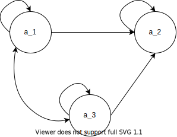
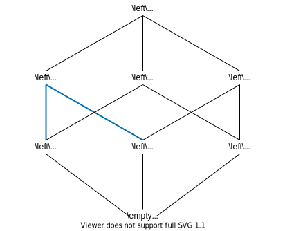

関係 (集合論) について復習.

## 一般的な関係

いま, 二つの要素の順序体を $\left\lt a, b\right\gt$ と書くこととする.
他の異なる順序体 \\(\left\lt c, b\right\gt\\) に対し, 以下の通り定義する.

\\[
\begin{aligned}
\left\lt a,b\right\gt=\left\lt c,d\right\gt&:=&a=c, b=d\\
{\rm デカルト積} = {\rm 直積} = A\times B&:=&\left\{\left\lt a,b\right\gt\mid a\in A, b\in B\right\}
\end{aligned}
\\]

このとき順序体の要素を \\(n\\) 個に拡張したものを \\(n\\)-tuple といい, 以下の通り定義する.

<!--more-->

<header class="m-def-title">
\\(n\\)-tuple の同値関係と直積
</header>

\\[
\left\lt a_1,a_2,\cdots,a_n\right\gt=\left\lt b_1,b_2,\cdots,b_n\right\gt:=(a_1=b_1,a_2=b_2,\cdots,a_n=b_n) \tag{1} \\]
\\[
{\rm デカルト積} =  {\rm直積} = A_1\times A_2\times\cdots\times A_n=\prod_{i=1}^{n}A_i:=\left\{\left\lt a_1,a_2,\cdots,a_n\right\gt\mid a_1\in A_1,a_2\in A_2,\cdots,a_n\in A_n\right\} \tag{2}
\\]
  

なお \\((2)\\) より \\(A^n:=(A_1=A_2=\cdots =A_n)\\) が自明に導ける.
いま集合 \\(A\\) から \\(B\\) に対する二項関係 \\(R\subseteq A\times B\\) があって, 
\\(\left\lt a,b\right\gt\in R\\) ならば \\(a\\) と \\(b\\) は関係 \\(R\\) にあるといい, 
\\(R(a,b)\\) または \\(aRb\\) と書く.

\\[R:=\{\left\lt a,b\right\gt\mid a\in A,b\in B,aRb\}\\]

\\((a,b)\not\in R\\) ならば \\(a\\) と \\(b\\) は関係 \\(R\\) にないといい, 
\\(\overline{R}(a,b)\\) または \\(a\overline{R}b\\) と書く.
このとき \\(A=B\\) ならば二項関係 \\(R\subseteq (A^2=A\times B)\\) を \\(A\\) 上の二項関係という[^1].

例えば, 自然数の集合 \\(\mathbb{N}\\) に対し, その[同値関係](#equivalence_relation) "\\(=\\)" 
を順序体を用いて新たに

\\[R:=\{\left\lt n,n\right\gt\mid n\in \mathbb{N}\}\subseteq\mathbb{N}^2\\]

と定義すると \\(a,b\in \mathbb{N}\\) に対して \\(a R_=b\Leftrightarrow a=b\\) である.
また, 集合 \\(X={1,2,3}\\) に対し, その[順序関係](#ordered_relation) \\(R_\gt\subseteq X^2\\) 
を大なりの関係 "\\(\gt\\)" とすると \\(R_\gt\\) は

\\[R_\gt=\{\left\lt 2,1\right\gt, \left\lt 3,1\right\gt, \left\lt 3,2\right\gt\}\\]

となる. ここで, 逆関係を導入する. 関係 \\(R\\) の逆関係は \\(B\\) から \\(A\\) への関係, すなわち

\\[R^{-1}:=\{\left\lt b,a\right\gt\mid a\in A, b\in B, aRb\}\\]

と定義される. 従って, 例えば集合 \\(X\\) に対する \\(R_\gt\\) の逆関係は 
\\(R_\gt^{-1}={\left\lt 1,2\right\gt, \left\lt 1,3\right\gt, \left\lt 2,3\right\gt}\\) である.

二項関係は, より一般化することができる.

<header class="m-def-title">
\\(n\\) 項関係
</header>

いま複数の集合の直積の部分集合, すなわち \\(n\\) 項関係 \\(R\subseteq\prod_{i=1}^{n}A_i\\) があって,
\\(\left\lt a_1,a_2,\cdots,a_n\right\gt\in R\\) ならば \\(a_1,a_2,\cdots,a_n\\) は 関係
\\(R\\) にあるといい, \\(R(a_1,a_2,\cdots,a_n)\\) と書く.

\\[R:=\{\left\lt a_1,a_2,\cdots,a_n\right\gt\mid a_1\in A_1,a_2\in A_2,\cdots,a_n\in A_n, R(a_1,a_2,\cdots,a_n)\}\subseteq\prod_{i=1}^{n}A_i\\]

また \\(\left\lt a_1,a_2,\cdots,a_n\right\gt\not\subseteq R\\) ならば \\(a_1,a_2,\cdots,a_n\\) は
関係 \\(R\\) にないといい, \\(\overline{R}(a_1,a_2,\cdots,a_n)\\) と書く.
  

ここで, 本ブログ内で特に断りなく使われる一般的な関係に関する記号の表記, その意図について表明しておく.

<header class="m-def-title">
本ブログで使われる一般的な関係に関する記号表記
</header>

任意の二項関係 \\(\lesssim\\) の要素 \\(\left\lt a,b\right\gt\in\ \lesssim\\) に対し:
<ul>
<li>\\(\prec\ :={\left\lt a,b \right\gt\mid \left\lt a, b\right\gt\in\ \lesssim, a\not=b}\\)</li>
<li>
\\(\ll\ :={\left\lt a,b\right\gt\mid\left\lt a, c\right\gt\not\in\ \lesssim\ {\rm かつ}\ \left\lt c,b\right\gt\not\in\ \lesssim}\\)
</li>
</ul>

すなわち, \\(x\prec y\\) は \\(x\\) は真に \\(y\\) の前にある, 
\\(x\ll y\\) は \\(x\\) は \\(y\\) の直前にあることを意味する.

## 主な二項関係の規則

主な二項関係における規則を以下に定義する.

<header class="m-def-title">
反射律
</header>

  二項関係 \\(R\subseteq A\times B\\), また \\(x\in A\cap B\\) があって, \\(\left\lt x,x\right\gt\in R\\) が存在するとき 
  \\(R\\) は反射律を満たすという.
  

例えば, 実数の集合 \\(\mathbb{R}\\) をとってみると, 任意の \\(^\forall x\in\mathbb{R}\\) に対して \\(x\leq x\\) であるから \\(\leq\\) は \\(\mathbb{R}\\) の下で反射律を満たす.
しかし, \\(x\lt x\\) は成立しないので, \\(\lt\\) は \\(\mathbb{R}\\) の下で反射律を満たさない.

<header class="m-def-title">
対称律
</header>

  二項関係 \\(R\subseteq A\times B\\), また \\(x,y\in A\cap B\\) があって, \\(\left\lt x,y\right\gt\in R\\) ならば
  \\(\left\lt y,x\right\gt \in R\\) が存在するとき, \\(R\\) は対称律を満たすという.
  

例えば, 実数の集合 \\(\mathbb{R}\\) をとってみると, 自明な例でいえば, 任意の \\(^\forall x,y\in\mathbb{R}\\) に対して
\\(x=y\\) ならば \\(y=x\\) なので \\(=\\) は \\(\mathbb{R}\\) 
の下で対称律を満たす.
しかし, \\(x\lt y\\) ならば \\(y\lt x\\) ではないので, \\(\lt\\) は \\(\mathbb{R}\\) の下で対称律を満たさない.
また, 別の例として, 例えば平面状のすべての三角形から成る集合 \\(A\\) と, 相似の関係 \\(R\\) を組み合わせると \\(R\\) は
\\(A\\) 上で対称律を満たす. 
\\[R=\{\left\lt x,y\right\gt\mid x,y\in A,x\ {\rm と}\ y\ {\rm は相似}\}\subseteq A^2\\]
なお, これは[同値律](#equiv_relation)を満たす. 対称律の特徴を挙げると:

* 必ずしも \\(x=y\\) ではない
* 真に大きい/小さい関係はあり得ない. \\(R\not=\ \prec\\) かつ \\(R\not=\ \succ\\) (すべてのありとあらゆる集合上で \\(x\prec y ならば y\not\prec x\\) なので)

<header class="m-def-title">
反対称律
</header>

  二項関係 \\(R\subseteq A\times B\\), また \\(x,y\in A\cap B\\) があって, \\(\left\lt x,y\right\gt\in R\\) に対し 
  \\(\left\lt y,x\right\gt\in R\\) 
  が存在するならば \\(x=y\\) のとき, \\(R\\) は反対称律を満たすという.
  

例えば, 集合 \\(A=\{a_1,a_2\}\\) に対して
二項関係を:

* \\(R=\{\left\lt a_1,a_1\right\gt,\left\lt a_2,a_2\right\gt\}\\) とおくと, \\(R\\) は \\(A\\) 上で ([対称律](#symmetric_relation)を満たし) 反対称律を満たす.
なお, これは[同値律](#equiv_relation)を満たす.
* \\(R=\{\left\lt a_1,a_1\right\gt,\left\lt a_1,a_2\right\gt\}\\) とおくと,
\\(R\\) は \\(A\\) 上で ([対称律](#symmetric_relation)を満たさないが) 反対称律を満たす.
* \\(R=\{\left\lt a_1,a_2\right\gt,\left\lt a_2,a_1\right\gt\}\\) とおくと,
\\(R\\) は \\(A\\) 上で ([対称律](#symmetric_relation)を満たすが) 反対称律を満たさない.

反対称律の特徴を挙げると:

* 対象的な二項関係が存在するとき, 必ず \\(x=y\\)

<header class="m-def-title">
推移律
</header>

  二項関係 \\(R\subseteq A\times B\\), また \\(x,y,z\in A\cap B\\) があって, \\(\left\lt x,y\right\gt,\left\lt y,z\right\gt\in R\\) ならば 
  \\(\left\lt x,z\right\gt \in R\\) が存在するとき, \\(R\\) は推移律を満たすという.

例えば, 実数の集合 \\(\mathbb{R}\\) をとってみると, 任意の \\(^\forall x,y,z\in\mathbb{R}\\) に対して \\(x\leq y\\) かつ \\(y\leq z\\) ならば \\(x\leq z\\) なので 
\\(\leq\\) は \\(\mathbb{R}\\) の下で推移律を満たす.
しかし, 例えば自然数の集合 \\(\mathbb{N}\\) に対して
$$R=\left\{\left\lt a, b\right\gt\mid a,b,c\in\mathbb{N}, a=b^2\ {\rm かつ}\ b=c^2\ {\rm ならば}\ a=c^2\ {\rm を満たす}\right\}\subseteq\mathbb{N}^2$$ としたとき,
任意の \\(x,y\in A\\) に対し必ずしも \\(\left\lt x,y\right\gt\in R\\) が存在するとは限らない (反例: \\(16=4^2\\) かつ \\(4=2^2\\) だが \\(16\not=2^2\\)) ので,
\\(R\\) は \\(\mathbb{N}\\) の下で推移律を満たさない.

### 主な二項関係

<header class="m-def-title">
前順序
</header>

  二項関係 \\(R\\) が集合 \\(A\\) 上で<a href="#reflexive_relation">反射律</a>, <a href="#transitive_relation">推移律</a>を同時に満たすとき, \\(R\\) は \\(A\\) 上の前順序関係という.

これは要するに, じゃんけんのような, 3 すくみ,
すなわち グー \\(\lesssim\\) パー \\(\lesssim\\) チョキ \\(\lesssim\\) 
グー \\(\lesssim\cdots\\) といった循環関係がないこと,
グラフで表したときに有向非巡回グラフとなることを要請している.

<header class="m-def-title">
同値
</header>

  <a href="#previous_order">前順序関係</a> \\(R\\) が集合 \\(A\\) 上で<a href="#symmetric_relation">対称律</a>を満たすとき, 
  \\(R\\) は \\(A\\) 上で同値律を満たすという.
  また:
  <ul>
  <li>\\(\{y\in X\mid xRy\}\\) を \\(x\\) の同値類といい, \\(\left[x\right]_R\\) や \\(\left[x\right]\\) と書く.
  このときの \\(x\\) は, 同値類 \\(\left[x\right]\\) の代表元という</li>
  <li>集合 \\(A\\) 上の同値関係 \\(R\\) の同値類全体から成る集合 \\(\{[a]\mid a\in A\}\\) を商集合といい, 
  \\(A/R\\) と書く</li>
  </ul>

まず自明な例でいえば, $=$ は, 空でない任意の集合上で同値関係にあるといえる.
ほかに, 例えば, 整数の集合 \\(\mathbb{Z}\\) について \\(R\\) を整数 \\(p\in\mathbb{Z}\\) を法とする合同関係 \\(\equiv_p\\) とおくと, \\(R\\) は \\(\mathbb{Z}\\) 上の同値関係となる.
\\[R=\equiv_p=\{\left\lt m,n\right\gt\mid m,n\in\mathbb{Z}, m {\rm と}\ n\ {\rm は}\ p\ {\rm で割ったときの余りが等しい}\}\subseteq\mathbb{Z}^2\\]
一つ一つ確認してみると

* 反射律: 任意の \\(m\in\mathbb{Z}\\) に対して \\(m-m=0\cdot p\\) なので \\(m\equiv_p m\\)
* 推移律: 任意の \\(m,n,k\in\mathbb{Z}\\) に対して \\(m\equiv_p n\\) かつ \\(n\equiv_p k\\) と仮定すると, ある \\(d,d'\in\mathbb{Z}\\) に対して \\(m-n=d\cdot p\\) かつ \\(n-k=d'\cdot p\\) で,
このとき \\(m-k=(m-n)+(n-k)=(d+d')\cdot p\\) である. \\(d+d'\in\mathbb{Z}\\) なので, \\(m\equiv_p k\\)
* 対称律: 任意の \\(m,n\in\mathbb{Z}\\) に対して \\(m\equiv_p n\\) と仮定すると, ある \\(d\in\mathbb{Z}\\) に対して \\(m-n=d\cdot p\\) だから \\(n-m=(-d)\cdot p\\) で,
\\(-d\in\mathbb{Z}\\) だから \\(n\equiv_p m\\)

と同値律を満たすことがわかる.

同値類や商集合の例として, 集合 \\(X={1,3,6,10,11,15,16}\subseteq \mathbb{N}\\) の要素 \\(1\\) を代表元とし, 
いまその同値関係を \\(5\\) を法とした合同[^2]で考えると, \\(1\\) の同値類
\\(\left[1\right]_R={x\mid 1\equiv x\pmod{5}}\\) は
\\(\left[1\right]_R={1,6,11,16}\\) である[^3].
また,

\begin{aligned}
\left[1\right]_R&=&\left\{1,6,11,16\right\}\\
\left[3\right]_R&=&\left\{3\right\}\\
\left[6\right]_R&=&\left\{1,6,11,16\right\}\\
\left[10\right]_R&=&\left\{10,15\right\}\\
\left[11\right]_R&=&\left\{1,6,11,16\right\}\\
\left[15\right]_R&=&\left\{10,15\right\}\\
\left[16\right]_R&=&\left\{1,6,11,16\right\}
\end{aligned}

であるので, \\(X/R={{1,6,11,16},{10,15},{3}}\\) である.

<header class="m-def-title">
半順序
</header>

<a href="#previous_order">前順序関係</a> \\(R\\) が集合 \\(A\\) 
上で<a href="#antisymmetric_relation">反対称律</a>を満たすとき, \\(R\\) は \\(A\\) 上の半順序関係といい,
\\(A\\) を半順序集合 (poset) という.

例えば, 集合族上の包含関係 \\(\subset\\) は以下の通り半順序である.

\begin{aligned}
\begin{array}{l}
A\subset A\\
A\subset B{\rm\ かつ}\ B\subset A{\rm\ ならば}\ A=B\\
A\subset B{\rm\ かつ}\ B\subset C{\rm\ ならば}\ A\subset C
\end{array}
\end{aligned}

半順序集合が定義できれば, (最(大|小), 極(大|小))(要素|元)が定義できる.

<header class="m-def-title">
(最(大|小)|極(大|小))(要素|元)
</header>

半順序集合 \\(A\\) の要素 \\(a_0\in A\\) について 

<ul>
<li>\\(^\exists a\in A\ {\rm s.t.}\ a_0\lesssim a\\) なる \\(a\\) が存在しないとき 
\\(a_0\\) を \\(A\\) の最大(要素|元)といい, \\(\max A\\) と書く.
とくに \\(A\\) が複素数の部分集合 \\(A\subseteq\mathbb{C}\\) ならば, \\(\max A\\) を最大値という</li>
<li>\\(^\exists a\in A\ {\rm s.t.}\ a\lesssim a_0\\) なる \\(a\\) が存在しないとき 
\\(a_0\\) を \\(A\\) の最小(要素|元)といい, \\(\min A\\) と書く.
とくに \\(A\\) が複素数の部分集合 \\(A\subseteq\mathbb{C}\\) ならば, \\(\min A\\) を最小値という</li>
</ul>

また \\(a\in A\\) に対し

<ul>
<li>\\(a\gtrsim a_0\\) ならば \\(a=a_0\\) のとき \\(a_0\\) を \\(A\\) の極大(要素|元)という</li>
<li>\\(a\lesssim a_0\\) ならば \\(a=a_0\\) のとき \\(a_0\\) を \\(A\\) の極小(要素|元)という</li>
</ul>
\\(A\\) に最小元が存在するとき, \\(A\\) は点付き (pointed) であるという.
また, 最大値, 最小値あるいは極大値,
極小値を総じて extremum という (<a href="#ref1">参考文献 1</a>, <a href="#ref2">参考文献 2</a>).

例えば, 自然数全体の集合 \\(\mathbb{N}\\) の最小要素は \\(0\\) であるが, 最大要素は存在しない. 
実数全体の集合 \\(\mathbb{R}\\) には最(大|小)要素が存在しない[^5].
集合 \\(X={x_1,x_2,x_3}\\) に対して順序集合 
\\((\wp(X)-{\emptyset,X},\leq)\\)[^6] の極大要素は
\\({x_1,x_2},{x_1,x_3},{x_2,x_3}\\), 
また極小要素は \\({x_1},{x_2},{x_3}\\) である.

半順序集合が定義できれば, (上|下)(界|限)が定義できる.

<header class="m-def-title">
(上|下)(界|限)
</header>

半順序集合 \\((\wp(X),\leq)\\) の空でない部分集合 \\(A\not =\emptyset\\) 
の任意の要素 \\(a\in A\\) に対し,
<ul>
<li>\\(^\exists x\in X\ {\rm s.t.}\ a\lesssim x\\) なる \\(x\\) が存在するならば \\(A\\) は上に有界であるといい, 
\\(x\\) を \\(A\\) の上界という.</li>
<li>\\(^\exists x\in X\ {\rm s.t.}\ x\gtrsim a\\) なる \\(x\\) が存在するならば \\(A\\) は下に有界であるといい, 
\\(x\\) を \\(A\\) の下界という.</li>
<li>\\(A\\) の上界全体の集合 \\(B=\{x\in X | a\lesssim x\}\\) の最小要素 \\(\min B\\) を 
\\(A\\) の上限, 
または最小上界といい, \\(\sup A\\) と書く.</li>
<li>\\(A\\) の下界全体の集合 \\(B=\{x\in X | x\lesssim a\}\\) の最大要素 \\(\max B\\) を 
\\(A\\) の下限, 
または最大下限といい, \\(\inf A\\) と書く.</li>
</ul>
  

例えば, 集合 \\(X={1,\frac{1}{2},\frac{1}{3},\frac{1}{4},\cdots}\\) について, 
上界および最大値は \\(\sup A=\max A=1\\), 下界は \\(\inf A=0\\), 最小値は存在しないといえる.
また, 実数全体の集合 \\(R\\) の空でない部分集合が(上|下)に有界ならば, その(上|下)限が必ず存在する. 
これは, ワイエルストラスの定理といわれる.

<header class="m-def-title">
有向 (directed) 集合
</header>

集合 \\(A\not=\emptyset\\) と<a href="#previous_order">前順序関係</a> \\(R\\) との組 \\((A,R)\\) に対し, 
\\(A\\) の任意の有限部分集合 \\(X\subseteq A\\) の上界 \\(\sup X\in A\\)
が存在するとき, \\(A\\) を有向 (directed) 集合という.

有向集合は, [反対称律](#antisymmetric_relation)を要請されていないので,
必ずしも[半順序](#ordered_relation)集合とはならないことに注意.
例えば, 集合 \\(A=\{a_1,a_2,a_3\}\\) と関係 
\\(R=\{\left\lt a_1,a_1\right\gt,\left\lt a_1,a_2\right\gt,\left\lt a_1,a_3\right\gt,
\left\lt a_2,a_2\right\gt,\left\lt a_3,a_3\right\gt,\left\lt a_3,a_1\right\gt,\left\lt a_3,a_2\right\gt\}\\)
の組は, 半順序でない有向集合である
(\\(\left\lt a_1,a_3\right\gt,\left\lt a_3,a_1\right\gt\in R\\) だが, \\(a_1=a_3\\) は要請していない).

<figure style="text-align:center;" id="directed_but_not_poset_fig">

<figcaption>図 1:  集合 \\(A=\{a_1,a_2,a_3\}\\) と関係 
\\(R=\{\left\lt a_1,a_1\right\gt,
\left\lt a_1,a_2\right\gt,\left\lt a_1,a_3\right\gt,
\left\lt a_2,a_2\right\gt,\left\lt a_3,a_3\right\gt,
\left\lt a_3,a_1\right\gt,\left\lt a_3,a_2\right\gt\}\\) の有向グラフによる図示</figcaption>
</figure>

<header class="m-def-title">
全順序
</header>

<a href="#ordered_relation">半順序関係</a> \\(R\\) が集合 \\(A\\) 上の任意の要素に対して比較可能であるとき, \\(R\\) は \\(A\\) 上の全順序関係という.

任意の全順序集合の有限部分集合は明らかに最大要素がただ 1 つ存在するため有界であるので, 有向集合である.
その他, 例えば, 大小関係 \\(\leq\\) 
は自然数の集合 \\(\mathbb{N}\\) 上で全順序関係である.

<header class="m-def-title">
\\(\omega\\) 鎖
</header>

<a href="#ordered_relation">半順序関係</a> \\(R\\) と集合 \\(A\\) の組 \\(\left(A,R\right)\\)
に対し, 二項関係 \\(\left\{\left\lt a_0,a_1\right\gt,\left\lt a_1,a_2\right\gt,\cdots\right\}\subseteq R\\) に関する \\(A\\) の元の列
\\[a_0\ R\ a_1\ R\ a_2\ R \cdots\\]
を \\(\omega\\) 鎖という.
列 \\(\left\lt a_0,a_1,a_2,\cdots\right\gt\\) は自然数の集合と 1 対 1 に対応し,
\\(i\leq j\Rightarrow \left\lt a_i,a_j\right\gt\in R\\).

\\(\omega\\) 鎖は (関係 \\(R\\) の部分集合と示したように),
自然数の連鎖と同型の半順序集合の部分集合についてをいい,
全順序集合と同じ理由より明らかに有向集合である.
教科書によっては, \\(\omega\\) 鎖が上限を持つ構造を [cpo](#cpo_def)
や \\(\omega\\)-[cpo](#cpo_def) ということがある.

上記で定義した二項関係と集合間の射について定義する.

<header class="m-def-title">
単調 (monotone)
</header>

<a href="#ordered_relation">半順序関係</a> \\(R_0,R_1\subseteq R\\)
と集合 \\(A_0,A_1\subseteq A\\) の組 \\(\left(A_0,R_0\right),\left(A_1,R_1\right)\\) 
と射 \\(f:A_0\rightarrow A_1\\) について以下が成りたつとき, \\(f\\) は単調である (または単調関数) という.
\\[^\forall a_0,a_1\in A_0.\left\lt a_0,a_1\right\gt\in R_0\Rightarrow \left\lt f(a_0),f(a_1)\right\gt\in R_1\\]

## ハッセ図

主に半順序集合の図示の方法としてよく使われるハッセ図について, 以下にいくつかの例を示す.

まずは, 入門書でよく見る例題に習い, 自然数全体の集合 \\(\mathbb{N}\\) の任意の要素 \\(m,n\in\mathbb{N}\\) について,
\\(m\\) が \\(n\\) を割り切ることを
\\(m\mid n\\) と書くとき[^7], 整除関係 \\(\mid\\) は \\(\mathbb{N}\\) 上の半順序であることに関して考察しよう.

\begin{aligned}
\begin{array}{l}
x\mid x\\
x\mid y{\rm\ かつ}\ y\mid x{\rm\ ならば}\ x=y\\
x\mid y{\rm\ かつ}\ y\mid z{\rm\ ならば}\ x\mid z
\end{array}
\end{aligned}

さて, このような一つの有限半順序集合上の関係は, [図 1](#directed_but_not_poset_fig)
と同様にして, 以下のように有向グラフにより表現できる.
いま, 集合 \\(X=\{n\mid n\in\mathbb{N}, 1\leq n\leq 10\}\\) 
に対する整除関係による順序を \\(\ll\\) で考えると,
\\(x\mid y\\) なら \\(y\\) は必ず \\(x\\) の後に存在する (\\(x\lesssim y\\)) ので, 次のような有向非巡回グラフが書ける[^8].

<figure style="text-align:center;">
<figcaption>図2: 整除の下で \\(\ll\\) の関係における \\(X\\) の有限グラフによる図示</figcaption>
</figure>

これをハッセ図では次のように書く.

<figure style="text-align:center;" id="hasse1">
<figcaption>図3: 整除の下で \\(\ll\\) の関係における \\(X\\) のハッセ図による図示</figcaption>
</figure>

有向グラフが \\(x\to y\\) というように矢印で順序を表しているのに対して,
ハッセ図では \\(y\\) を \\(x\\) よりも高い位置に置いて, それぞれを線で結ぶ.
このときの最小値および下限は \\(1\\) であり, 上界は \\(10,8,6,9\\) だが \\(10,8,6,9\\) を比較不可能であるため, 
上限は存在しない.

別の例として, $X=\left\{a, b, c, d\right\}$ とおいたとき, $a\lesssim c, a\lesssim d, b\lesssim c, b\lesssim d$
という半順序関係にある集合 \\((X,\lesssim)\\) 
を考えると, 以下のように示せる.

<figure style="text-align:center;" id="hasse3">
<figcaption>図4: 半順序関係 \\(a\lesssim c, a\lesssim d, b\lesssim c, b\lesssim d\\) のハッセ図による図示</figcaption>
</figure>

このときの下界は \\(a,b\\), 上界は \\(c,d\\) である.
最小元, 最大元, 下限, 上限は \\(a,b\\) および \\(c,d\\) が比較不可能であるため存在しない.

最後にもう 1 つ, 半順序集合 \\((\wp({x_1,x_2,x_3}), \subset)\\) について考えてみる.
先にも示したように, 集合族上の包含関係 \\(\subset\\) は半順序である. 
\\(\emptyset\subset{x_1},{x_1}\subset{x_1,x_2},\cdots\\) と考えていくと,
ハッセ図は次のようになる.

<figure style="text-align:center;" id="hasse2">
<figcaption>図5: 半順序集合 \\((\wp({x_1,x_2,x_3}), \subset)\\) 
のハッセ図による図示</figcaption>
</figure>

このときの最小元および下限は \\(\emptyset\\) であり, 最大元および上限は \\({x_1,x_2,x_3}\\) である.

## 半順序集合の拡張

<header class="m-def-title">
有向半順序 (directed partial order) 集合
</header>

  <a href="#ordered_relation">半順序関係</a> \\(R\\) と<a href="#directed_set_def">有向集合</a> \\(A\\) の組 
  \\((A, R)\\) に対し \\(A\\) を有向半順序 dpo (directed partial order) 集合という.

<header class="m-def-title">
有向完備半順序 (directed-complete partial order) 集合
</header>

<a href="#ordered_relation">半順序</a>集合 \\(A\\) の任意の有向部分集合 \\(X\subseteq A\\) について, 
\\(X\\) の上限 \\(\sup X\in A\\) が存在するとき, \\(A\\) を有向完備半順序
dcpo (directed complete partial order) 集合という.

いま \\(X\subseteq A\\) を有限有向部分集合としたとき, 
有限半順序集合 \\(A\\) の部分集合 \\(X\\) は, \\(A\\) の半順序関係により必ず有向部分集合となる.
つまり, 有限半順序集合は dcpo 集合になる.
従って, [図 3](#hasse1), [図 4](#hasse3), [図 5](#hasse2) で示される集合は
dcpo 集合である
(上記の定義のニュアンスとして, 
たまに任意の部分集合が有向部分集合でなければならないと捉えられる場合があるが,
そうではなく, あくまで有向部分集合として構成可能な部分集合のうちという意味合いである).
教科書によっては, dcpo を単に完備半順序, また cpo ということがある.
また, すべての \\(\omega\\) 鎖はその定義より有向集合であるから,
dcpo は (その部分集合に \\(\omega\\) 鎖が存在する場合) 
\\(\omega\\) 鎖が上限を持つとして \\(\omega\\)-cpo である.
その逆は必ずしも成り立たない. 

<header class="m-def-title">
連続 (continuous)
</header>

<a href="#dcpo_def">dcpo</a> 集合 \\(D,D'\\) について, <a href="#monotone_def">単調関数</a>
\\(f:D\rightarrow D'\\) が以下を満たすとき, (Scott-) 連続 (continuous) であるという.
\\[^\forall A\subseteq D.f(\sup A)=\sup\left\{f(a)\mid a\in A\right\}\\]
ここで \\(A\\) は<a href="#directed_set_def">有向集合</a>.

<header class="m-def-title">
コンパクト (compact)
</header>

<a href="#dcpo_def">dcpo</a> \\(R\\) と集合 \\(D\\) の組 \\((D,R)\\) に対し,
以下の条件を満たすとき, \\(x\in D\\) はコンパクトであるという.
\\[^\forall A\subseteq D. \left\lt x,\sup A\right\gt\in R\Rightarrow ^\exists y\in A.\left\lt x,y\right\gt \in R\tag{\htmlId{compact}{1}}\\]
ここで \\(A\\) は有向集合.
なお, 条件式 \\(\href{#compact}{1}\\) を満たす元全体を次のように書くこともある.
\\[\mathrm{K}(D):=\left\{x\mid\text{条件式}\ \href{#compact}{1}\ \text{を満たす} x\in D\right\}\\]

<header class="m-def-title">
代数的 (algebraic)
</header>

<a href="#dcpo_def">dcpo</a> \\(R\\) と集合 \\(D\\) の組 \\((D,R)\\) に対し,
以下の条件を満たすとき, \\(D\\) は代数的であるという.
\\[^\forall x\in D,A=\left\{a\in\mathrm{K}(D)\mid \left\lt a,x\right\gt\in R\right\}.A\text{ は有向集合}\land\sup A=x\\]

<header class="m-def-title">
基底 (basis)
</header>

<a href="#dcpo_def">dcpo</a> \\(R\\) と集合 \\(D\\) の組 \\((D,R)\\) 対し,
以下の条件を満たすとき, \\(A\subseteq\mathrm{K}(D)\\) を \\(D\\) の基底という.
\\[^\forall x\in D,A=\left\{a\in A\mid \left\lt a,x\right\gt\in R\right\}.A\text{ は有向集合}\land\sup A=x\\]

ここで \\(A\\) が \\(D\\) の基底であるとき, \\(D\\) は代数的であり \\(\mathrm{K}(D)=A\\) である.

<header class="m-def-title">
<a href="#extremum">点付き</a>有向完備半順序 (pointed directed-complete partial order) 集合
</header>

次の 2 つの条件を満たす<a href="#ordered_relation">半順序</a>集合 \\(A\\) を<a href="#extremum">点付き</a>有向完備半順序集合 cppo (pointed directed-complete partial order) という.
<ol>
<li>\\(A\\) は <a href="#dcpo_def">dcpo</a> 集合</li>
<li>\\(A\\) は最小元をもつ</li>
</ol>

以下にいくつかの例を示す.

* 任意の集合 \\(A\\) について, \\(A\\) の部分集合全体の集合 \\(\mathcal{P}(A)=\left\{S\mid S\subseteq A\right\}\\) は,
集合の包含関係 \\(\subseteq\\) との組 \\(\left(\mathcal{P}(A),\subseteq\right)\\) で [cppo](#cpo_def) となる
(さらに, すべての \\(P\subseteq\mathcal{P}(A)\\) について \\(P\\) の上限 \\(\sup P\in\mathcal{P}(A)\\) が存在するから,
\\(\mathcal{P}(A)\\) は[完備束](#lattice_def)でもある)
* [図 3](#hasse1) および [図 5](#hasse2) で示される集合は [dcpo](#dcpo_def) でありかつ最小元をもつため [cppo](#cpo_def) だが,
[図 4](#hasse4) は最小元をもたないため, [cppo](#cpo_def) ではない
* \\((\mathbb{N}, \leq)\\) は, 有向集合として \\(\mathbb{N}\subseteq\mathbb{N}\\) が取れるが, 
その上限は存在しないので, [cppo](#cpo_def) ではない. 
ここで, \\(\infty = \max \mathbb{N}\\) となるように拡張した
\\((\mathbb{N}\cup\{\infty\},\leq)\\) で考えると, [cppo](#cpo_def) になる

教科書によっては, [cppo](#cpo_def) を単に完備半順序, また cpo ということがある.

<header class="m-def-title">
正格, 厳密 (strict)
</header>

<a href="#cpo_def">cppo</a> 集合 \\(D,D'\\) について, 射 \\(f:D\rightarrow D'\\)
が最小元を保つ \\(f(\min D)=\min D\in D'\\) とき, \\(f\\) は正格または厳密であるという.

<header class="m-def-title">
束
</header>

二項演算子 \\(\land,\lor\\)[^9]
のもとで閉じている空でない集合 \\(L\\) の任意の要素 \\(x,y,z\in L\\) に対して, 次の三つの束の公理
<ol>
<li id="lattice1">可換律:\\(x\land y=y\land x, x\lor y=y\lor x\\)</li>
<li id="lattice2">結合律:\\((x\land y)\land z=x\land(y\land z), 
(x\lor y)\lor z=x\lor(y\lor z)\\)</li>
<li id="lattice3">吸収律:\\(x\land(x\lor y)=x,x\lor(x\land y)=x\\)</li>
</ol>
を満たすとき, 集合 \\(L\\) は束であるといい, \\((L,\land,\lor)\\) と表す. 
ここで \\(\lor,\land\\) はそれぞれ, 結び, 交わりと言われる.
いま半順序集合 \\(S\\) の任意の要素 \\(a,b\\) について, 
上限を \\[\sup\left\{a,b\right\}:=\left\{x\mid ^\forall m\in M(x\lesssim m),x\in M\right\}, 
M=\left\{m\mid a,b\lesssim m,m\in S\right\}\\]
下限を \\[\inf\{a,b\}:=\left\{x\mid ^\forall m\in M(x\gtrsim m),x\in M\right\},
M=\left\{m\mid a,b\gtrsim m,m\in S\right\}\\] と書くこととすると,
\\(\sup\left\{a,b\right\},\inf\left\{a,b\right\}\\) はそれぞれ \\(a\lor b,a\land b\\) と同値である.
すなわち, 束とは, \\(x, y\\) 
について上限と下限が存在する半順序集合のことである[^10].
また, 

<ul>
<li>束 \\(L\\) の任意の部分集合が上限と下限をもつとき, 束 \\(L\\) をとくに完備束</li>
<li>束の部分集合が束であるとき, その束をとくに部分束</li>
<li>束 \\(L\\) の任意の要素 \\(^\forall x,y\in L\\) について 
\\(f(x\land y)=f(x)\land f(y), 
f(x\lor y)=f(x)\lor f(y)\\) を満足する単射 
\\(f: L_1\to L_2\\) が存在するとき束 \\(L_1,L_2\\) は同型</li>
<li>束の任意の要素 \\(x,y,z\\) について \\(x\lor(y\land z)=(x\lor y)\land(x\lor z), 
x\land(y\lor z)=(x\land y)\lor(x\land z)\\) を満たす束をとくに分配束</li>
</ul>

という.

例えば, [先の例](#hasse2)でも挙げた \\((\wp({x_1,x_2,x_3}), \subset)\\) は束である.
任意の要素として \\({x_1},{x_2}\\) をとってみると, 
その上限 \\(\sup{{x_1},{x_2}}\\) は 
\\({x_1}\subset{x_1,x_2},{x_2}\subset{x_1,x_2}\\)
なので, \\(\sup{{x_1},{x_2}}={x_1,x_2}\\) である.

<figure style="text-align:center;" id="hasse3">
<figcaption>図6:  半順序集合 \\((\wp({x_1,x_2,x_3}), \subset)\\) のハッセ図による図示, 
\\(\sup\left\{\left\{x_1\right\},\left\{x_2\right\}\right\}\\) を強調</figcaption></figure>

ハッセ図で考えると, 上方向に辺を辿っていったとき, 各ノードそれぞれが順序比較可能でありかつ最小であるものが上限となる.
例えば 

\\[
\begin{aligned}
\sup\left\{\left\{x_1,x_2\right\},\left\{x_2,x_3\right\}\right\}&=&\left\{x_1,x_2,x_3\right\}\\
\sup\left\{\left\{x_1\right\},\left\{x_2,x_3\right\}\right\}&=&\left\{x_1,x_2,x_3\right\}\\
\sup\left\{\emptyset,\left\{x_1,x_2\right\}\right\}&=&\left\{x_1,x_2\right\}\\
\sup\left\{\emptyset,\emptyset\right\}&=&\emptyset\tag{9}
\end{aligned}
\\]

となる. 最後の \\((9)\\) はすべての束の任意の要素について言えることである. 
すなわち任意の束 \\(L\\) の任意の要素 \\(x\in L\\) に対して \\(\sup{x,x}=x\\) である.
これは, 束の公理から導ける, 一般にべき等律といわれる定理である.

<header class="m-proof-title">
べき等律
</header>

\\(x,y\in L,z=(x\lor y)\\) に対して

\\[
\begin{aligned}
\sup\left\{x,x\right\}\leftrightarrow x\lor x&=&x\lor(x\land(x\lor y)) & (\because {\rm \href{#lattice3}{公理3}: 吸収律})\\
&=&x\lor (x\land z)&(\because {\rm \href{#lattice3}{公理3}: 吸収律})\\
&=&x&(\because {\rm \href{#lattice3}{公理3}: 吸収律})
\end{aligned}
\\]

ここで一度, 上の定理に加えて考察できるいくつかの事項を羅列する.

* 下限は, 上限の逆順序で定義されるものである. 例えば, \\(\inf{{x_1},{x_2}}=\emptyset\\) である
* <a id="necessarily_exists_extremum" class="disabled">完備束</a> $(L,\land,\lor)$ の任意の部分集合 $S\subseteq L$ に対して $S=\emptyset$ ならば $\sup S=\min L$, $S=L$ ならば $\sup S=\max D$ である

いま, 分配束 \\(L\\) の最大元, 最小元をそれぞれ \\(1,0\\) と書くこととする. 束 \\(L\\) の任意の要素 \\(x,y\in L\\) について \\(x\lor y=1,x\land y=0\\) を満足するとき,
\\(x\\) は \\(y\\) の補元といい, \\(x'\\) または \\(\bar{x}\\) と書く.
元 \\(1,0\\) はそれぞれ単位元, 零元である. このときの \\(L\\) の補元は, 唯一に定まる.

<header class="m-proof-title">
\\(L\\) の補元の唯一性
</header>

\\(x,y\in L\\) が \\(a\in L\\) の二つの補元だと仮定する.

\\[
\begin{aligned}
x&=&x\lor 0\\
&=&x\lor(a\land y)\\
&=&(x\lor a)\land(x\lor y)\\
&=&1\land(x\lor y)\\
&=&x\land y
\end{aligned}
\\]

同様に \\(y=x\lor y\\) となるから \\(x=y\\). 

束 \\(L\\) のすべての元が補元をもつとき, \\(L\\) は可補束, または相補束という.
可補分配束は一般に[ブール代数](/roki.log/2019/05/8/BooleanAlgebra/)である[^11].

## 参考文献

1. <a id="ref1" href="http://mathworld.wolfram.com/Extremum.html">Extremum - Wolfram MathWorld</a> 2019/3/15  アクセス.
2. <a id="ref2" href="https://www.encyclopediaofmath.org/index.php?title=Maximum_and_minimum_of_a_function">Maximum and minimum of a function - Encyclopedia of Mathematics</a> 2019/3/15 アクセス.
3. 赤間世紀, 長田康敬, 玉城史朗 (2006)『<a id="ref3" class="disabled">情報数学入門</a>』共立出版. ISBN-13: 978-4320018143
4. "Directed complete partial orders", <http://math.chapman.edu/~jipsen/structures/doku.php/directed_complete_partial_orders> 2020/7/9 アクセス.
5. S. Abramsky, A. Jung: Domain theory. In S. Abramsky, D. M. Gabbay, T. S. E. Maibaum, editors (1994)『Handbook of Logic in Computer Science, vol. III』, Oxford University Press.

[^1]: 例えば \\(xy\\) 座標平面を \\(\mathbb{R}^2\\) と書くのは, それが実数二つのペアの集合と考えられるからである.
[^2]: 任意の整数 \\(a,b,c,n\in \mathbb{N}\\) に対して \begin{aligned}a\equiv b \pmod n\\ a\equiv b\pmod n&\rightarrow& b\equiv a\pmod n\\ a\equiv b, b\equiv c\pmod n &\rightarrow& a\equiv c\pmod n\end{aligned} であることを容易に確かめられる. 従って, 合同は同値関係である.
[^3]: これをとくに剰余類という. FYI: [エルガマル暗号, ガロア体のセクションを参照](/roki.log/2018/07/13/elgamalEncryption/).
[^5]: 関連: [\\(\epsilon-\delta\\) 論法](/roki.log/2018/10/4/jacobian/#epsilonDelta-definitionOfLimit)
[^6]: ここで, \\(\wp(A)\\) は \\(\wp(A):={Y\mid Y\subseteq A}\\) であり, \\(A\\) の冪集合という. すなわち \\(A={a,b}\\) とすると \\(\wp(A)={\emptyset,{a},{b},{a,b}}\\) となる. いまその要素の個数を \\(\left|\wp(A)\right|\\) と書くとすると, \\(\left|\wp(A)\right|\\) は集合 \\(A\\) の全要素の全組み合わせであるので \\(\left|\wp(A)\right|={}_3C_0+{}_3C_1+{}_3C_2=7\\) となる. 従って, ここで取り上げた例題について丁寧に書き出してみると, \\[\wp(X)-{\emptyset,X}={X,{x_1,x_2},{x_1,x_3},{x_2,x_3},{x_1},{x_2},{x_3},\emptyset}-{\emptyset,X}\\] ということ.
[^7]: \\(\mid\\) は整数論の界隈で普遍的な記述である. 「割り切れない」も同様にして \\(\not\mid\\) と書いたりする. FYI: [エルガマル暗号](/roki.log/2018/07/13/elgamalEncryption/)
[^8]: \\(1\\) と自分自身以外の数で割り切れるかを考える. \\(1\\) は始点なので, \\(1\\) のノードへ向けられる辺はないだろう. \\(2\\) について考えてみると, \\(1\mid 2,3\\) なら \\(1\mid 3\\) であるが, \\(4\\) は \\(1\mid 2\mid 4\\) である. これを全要素について適用していくと図のようになる.
[^9]: 論理記号とは無関係であることに注意.
[^10]: 半順序集合 \\(S\\) の任意の要素 \\(x, y\\) に対して \\(\sup{x,y},\inf{x,y}\\) が存在すれば, \\(x, y\\) と順序関係のある \\(z\in S\\) に対して
\begin{aligned}\sup\left\{x,y\right\}&=&\sup\left\{y,x\right\}\\ \sup\left\{\sup\left\{x,y\right\},z\right\}&=&\sup\left\{x,\sup\left\{y,z\right\}\right\}\\ \sup\left\{x,\inf\left\{x,y\right\}\right\}&=&x\end{aligned} より束の公理を満たす. 双対の原理より双対についても成り立つ.
[^11]: 可補束ついて次の性質が成り立つ. \begin{aligned}x''&=&x\\ 0'&=&1\\ 1'&=&0\\ x\lor 0&=&x\\ x\land 0&=&0\\ x\lor 1&=&1\\ x\land 1&=&x\\ (x\land y)'&=&x'\lor y'\\ (x\lor y)'&=&x'\land y'\\ x\leq y&\leftrightarrow& y'\leq x'\end{aligned} 面倒なので証明略. [ブール代数](/roki.log/2019/05/29/BooleanAlgebra/)のエントリにて分配律を用いずに証明しているものがあるので, それで代用できるかと.
