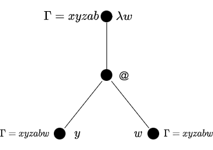

※1. この記事は「[KLab Engineer Advent Calendar 2020](https://qiita.com/advent-calendar/2020/klab)」の
16 日目にエントリしています<br>
※2. 普段のこのブログの文体は常体ですが,
本記事においては
Advent Calendar 用に敬体を使用します

, [Attribution 2.0 Generic (CC BY 2.0)](https://creativecommons.org/licenses/by/2.0/)](./11721476176_991181199b_w.jpg)

## はじめに

この記事の公開日の 1 日前[^1]に, プログラミング言語 C++
の新バージョン ISO/IEC 14882:2020, 
通称 C++20 が国際標準として公開されました.
これにより,
いくつかの新しい言語機能や標準ライブラリが追加されます.
その中でも, とくにコンセプトという言語機能は, 
テンプレートメタプログラミングが話題として盛んであった時代[^2]から待望されていた言語機能のうちの 1 つなのではないでしょうか.
この標準化によって, 
C++17 までで行う必要のあった多くの型制約のためのテンプレートメタプログラミングは,
よりそれ専用の言語機能であるコンセプトを使う形に置き換えられるであろうと思われます.
そのようなわけで, 
今後徐々に出番を失っていくであろうテンプレートメタプログラミングを将来懐かしめるよう (?),
テンプレートメタプログラミングによってコンパイル時に Lazy K
ソースコードをパースして評価するインタプリタのようなものを書いてみました.
本記事では, これに関する実装と理論について紹介します.
(型無し \\(\lambda\\) 計算について既知のものとします)

<!--more-->

## Lazy K とは

そもそも Lazy K がどのような言語であるかについては,
既にインターネット上に数多くの説明がありますので,
ここでは簡潔に取り上げることとします ([参考文献 7](#ref-7)).
この説明には \\(\lambda\\) 式が使われますので, 先に本記事で扱われる \\(\lambda\\) 式の定義を以下の BN 式で与えることとします.

<div class="m-def">
<header class="m-def-title"><p>\\(\lambda\\) 式</p></header>
<div class="m-def-content">
$$\begin{array}{ccc}
\langle\text{変数}\rangle&::=&v_n\\
\langle\lambda\text{式}\rangle&::=&\langle\text{変数}\rangle\mid\left(\langle\lambda\text{式}\rangle\langle\lambda\text{式}\rangle\right)\mid\left(\lambda\langle\text{変数}\rangle .\langle\lambda\text{式}\rangle\right)
\end{array}$$
</div>
</div>

ここで, 以下の略記法について許可するものとします.
任意の \\(\lambda\\) 式 \\(M_n\\) について

$$\begin{array}{ccc}
M_1M_2M_3\cdots M_n&:=&\left(\left(\cdots\left(\left(M_1M_2\right)M_3\right)\cdots\right)M_n\right)\\
\lambda v_1v_2\cdots v_n.M&:=&\lambda v_1.\left(\lambda v_2.\left(\cdots\left(\lambda v_n.M\right)\cdots\right)\right)
\end{array}$$

Lazy K は入力として自然数のリストを受け取り,
以下に定義される \\(\lambda\\) 式 \\(\mathrm{S},\mathrm{K},\mathrm{I}\\) 
の組み合わせ/計算によって自然数のリストを返すプログラム言語のことです.

$$\begin{array}{lcl}
\mathrm{S}&:=&\lambda v_1v_2v_3.(v_1v_3)(v_2v_3)\\
\mathrm{K}&:=&\lambda v_1v_2.v_1\\
\mathrm{I}&:=&\lambda v_1.v_1
\end{array}$$

上記の通り Lazy K のソースコードは 1 つの \\(\lambda\\) 式そのものです.
"通常の" \\(\lambda\\) 計算では束縛変数を使って \\(\lambda\\) 抽象を定義するのに対し,
上記に定義された \\(\mathrm{S},\mathrm{K},\mathrm{I}\\) のみによって束縛変数を使わずに 
\\(\lambda\\) 抽象と同等の仕組みを実現する, コンビネータ理論という体系があります.
Lazy K 
はこのコンビネータ理論の計算機構を使って記述するチューリング完全な参照透過性を持つ関数型言語です.
このコンビネータ理論が \\(\lambda\\) 
抽象と同等の仕組みを実現できることに関する証明についてここでは省略しますが,
その方法の 1 つとしては,
例えばコンビネータ理論が扱う式の構造に関する帰納法によるもので可能であることがわかっています.


## Lazy K の処理系の設計

Lazy K のプログラムを実行するときの大まかな処理の内容は,
以下のような流れになります.

1. 入力文字列 \\(V\\) をチャーチ数のリスト \\(V'\\) に変換する
2. ソースコードを \\(\lambda\\) 式 \\(E\\) として解釈する
3. \\(EV'\\) から得られる新たな \\(\lambda\\) 式 \\(E'\\) を得る
4. \\(E'\\) をチャーチ数のリストと見なし, 文字列に変換, 出力する

今回行った実装では,
この一連の流れを C++ テンプレートのインスタンス化によって行うために,
まず \\(\lambda\\) 計算を抽象構文木として扱うためのノードについて, 以下のように定義しています.

<script src="https://gist-it.appspot.com/github/falgon/mpl-lazyk/blob/abe9289af6b781b5556b010f98c78d9207db2af8/app/combinators.hpp?slice=7:31" type="text/javascript" ></script>

\\(\lambda\\) 式の計算体系には \\(\alpha\\) 変換と呼ばれる変換規則が定められていますが,
入力されたソースコードから成る変数の名前 (すなわち文字) に対して 
この \\(\alpha\\) 変換の処理を愚直に行っていくのは少々大変そうです.
そこで, これを避けるために, \\(\lambda\\) 式内の変数を自然数
(変数が自然数のある位置から何番目の \\(\lambda\\) によって束縛されているか, どれだけ離れているか)
で表現するようにします. これを \\(\lambda\\) 式の de Bruijn index 化といい,
それによって表される項を名無し項, もしくは de Bruijn index 項といいます[^3].
以下は, 先に定義した \\(\mathrm{S},\mathrm{K},\mathrm{I}\\) による例です.
プログラムでの扱いを容易にするため, 
\\(0\\) からのカウントによって表記しています.

$$\begin{array}{lcl}
\mathrm{S}&\xrightarrow{\text{de Bruijn index}}&\lambda\lambda\lambda2\ 0(1\ 0) \\
\mathrm{K}&\xrightarrow{\text{de Bruijn index}}&\lambda\lambda 1 \\
\mathrm{I}&\xrightarrow{\text{de Bruijn index}}&\lambda 0
\end{array}$$

これらは, それぞれ先に定義した型を用いて下記のように定義しています.

<script src="https://gist-it.appspot.com/github/falgon/mpl-lazyk/blob/abe9289af6b781b5556b010f98c78d9207db2af8/app/combinators.hpp?slice=32:38" type="text/javascript" ></script>

続いて, 名無し項の \\(\beta\\) 簡約について考えてみます.
例えば
\\(\left(\lambda\lambda 3\ 1\left(\lambda 0\ 2\right)\right)M\\) の \\(\beta\\) 簡約について,
置換対象を \\(\Box_n\\) として表記すると,
\\(\left(\lambda\lambda 3\Box_1\left(\lambda 0\Box_2\right)\right)M\\) になります.
de Bruijn index の性質上,
\\(M\\) の内部の自由変数の index は, 置換対象からの \\(\lambda\\) 式のネスト分追加されていなければなりません.
いま, \\(M=\left(\lambda 4\ 0\right)\\) としたとき,
\\(\Box_1\\) への置換結果は, \\(\Box_1\\) の束縛位置から 1 つの \\(\lambda\\) 式の下にあるため
\\(\left(\lambda 5\ 0\right)\\),
\\(\Box_2\\) への置換結果は, \\(\Box_2\\) の束縛位置から 2 つの \\(\lambda\\) 式の下にあるため
\\(\left(\lambda 6\ 0\right)\\) となります
(先に index のカウントを \\(0\\) から始めるようにしたため,
置換対象の変数の index を \\(n\\) としたとき,
置き換える側の \\(\lambda\\) 式内のすべての自由変数の index へ単に \\(n\\) を加えれば良くなっています).

また, \\(M\\) への置き換えによって \\(\lambda\\) のネストが一段なくなるので,
適用される \\(\lambda\\) 式の自由変数はデクリメントされなければなりません.
よって \\(\lambda 2\Box_1\left(\lambda 0\Box_2\right)\\) という形になり, 結果として以下を得ます.

\\[
\left(\lambda\lambda 3\ 1\left(\lambda 0\ 2\right)\right)\left(\lambda 4\ 0\right)\to_\beta
\lambda 2\left(\lambda 5\ 0\right)\left(\lambda 0\left(\lambda 6\ 0\right)\right)
\\]

以上で行った自由変数のインデックスに対する操作をシフトといいます.
上記では, \\(\lambda\\) 式を視覚的に捉えることで \\(\beta\\) 簡約しましたが
(プログラムでの扱いを容易とするため) これをより形式的に定義することを考えます.
これには, まず項の内部のどの変数が自由変数であるかを識別する必要がありますが,
束縛変数は常に項の最小のインデックスを構成する[^4]ので, この性質を利用することとします.

いま,
自由変数が持つ可能性のある最小のインデックスを \\(c\\) とし,
シフトを以下の関数によって定義します (\\(c\\) はしばしばカットオフといわれます).

<div class="m-def">
<header class="m-def-title"><p>シフト関数</p></header>
<div class="m-def-content">
$$\begin{array}{lcl}
\uparrow^d_c(i)&=&\begin{cases}i&\left(i\lt c\right)\\ i+d&\left(\text{otherwise}\right)\end{cases}\\
\uparrow^d_c(\lambda t)&=&\lambda \uparrow^d_{c+1}(t)\\
\uparrow^d_c(t_1\ t_2)&=&\uparrow^d_c(t_1)\uparrow^d_c(t_2)
\end{array}$$
ここで \\[\uparrow^d(t):=\uparrow^d_0(t)\\]
</div>
</div>

\\(c\\) によって, 束縛子による深さをカウントアップしていますが,
任意の項 \\(t\\) の内部における任意の識別子 \\(i\\) について,
de Bruijn index の定義から \\(i\lt c\\) となるものは束縛されていると分かります.
よって, それ以外のものは自由変数なので, (\\(d\\) を加えることで) インデックスを操作します.
シフトが定義できたので, 項 \\(i\\) の識別子 \\(j\\) の項 \\(t\\) への置換
\\(\left[j\mapsto t\right]i\\) を以下のように定義できます.

<div class="m-def">
<header class="m-def-title"><p>置換</p></header>
<div class="m-def-content">
$$\begin{array}{lcl}
\left[j\mapsto t\right]i&=&\begin{cases}t&\left(i=j\right)\\ i&\left(\text{otherwise}\right)\end{cases}\\
\left[j\mapsto t\right]\lambda t'&=&\lambda\left[j+1\mapsto\uparrow^1(t)\right]t'\\
\left[j\mapsto t\right]t_1\ t_2&=&\left[j\mapsto t\right]t_1\ \left[j\mapsto t\right]t_2
\end{array}$$
</div>
</div>

束縛子を通る度に元の置き換え対象はその内側で 1 つシフトされているはずで,
また, 置かれる項は, それが置かれる項の束縛子の個数分シフトされていなければなりません.
これらの手続きをしつつ, それが置き換える対象そのものであったときに置き換えます.
以上の定義を使って, 以下に名無し項の \\(\beta\\) 簡約を定義します.

<div class="m-def">
<header class="m-def-title"><p>名無し項の \\(\beta\\) 簡約</p></header>
<div class="m-def-content">
$$(\lambda t_1)t_2 =\uparrow^{-1}\left(\left[0\mapsto\uparrow^1(t_2)\right]t_1\right)$$
</div>
</div>

\\(t_1\\) に対して置換する前に, 置換される \\(t_2\\) は \\(t_1\\) の内部にくる関係上,
\\(\lambda\\) のネストが 1 つ増加されるため, 1 を加えるシフトを行う必要があります
(\\(t_1\\) は \\(t_2\\) よりもより大きな文脈で定義されているため, とも言えます).
また, 先に直感的に \\(\beta\\) 簡約をした際にも考慮したように,
置換によって \\(\lambda\\) のネストがなくなりますので, その分の負のシフトをします.
例えば, 先に直感的に求めた 
\\(\left(\lambda\lambda 3\ 1\left(\lambda 0\ 2\right)\right)\left(\lambda 4\ 0\right)\\) の \\(\beta\\) 
簡約は以下のように計算できます.

$$\begin{array}{lcl}
\left(\lambda\lambda 3\ 1\left(\lambda 0\ 2\right)\right)\left(\lambda 4\ 0\right)&\to_\beta&\uparrow^{-1}\left(\left[0\mapsto\uparrow^1\left(\lambda 4\ 0\right)\right]\lambda 3\ 1\left(\lambda 0\ 2\right)\right)\\
&=&\uparrow^{-1}\left(\left[0\mapsto(\lambda 5\ 0)\right]\lambda 3\ 1\left(\lambda 0\ 2\right)\right)\\
&=&\uparrow^{-1}\left(\lambda\left[1\mapsto\left(\lambda 6\ 0\right)\right]3\ 1\left(\lambda 0\ 2\right)\right)\\
&=&\uparrow^{-1}\left(\lambda\left[1\mapsto\left(\lambda 6\ 0\right)\right]3\ \left[1\mapsto\left(\lambda 6\ 0\right)\right]1\ \left(\lambda 0\ 2\right)\right)\\
&=&\uparrow^{-1}\left(\lambda 3\left(\left[1\mapsto\left(\lambda 6\ 0\right)\right]1\ \left[1\mapsto\left(\lambda 6\ 0\right)\right]\left(\lambda 0\ 2\right)\right)\right)\\
&=&\uparrow^{-1}\left(\lambda 3\left(\lambda 6\ 0\right)\left(\lambda\left[2\mapsto\left(\lambda 7\ 0\right)\right]0\ 2\right)\right)\\
&=&\uparrow^{-1}\left(\lambda 3\left(\lambda 6\ 0\right)\left(\lambda\left[2\mapsto\left(\lambda 7\ 0\right)\right]0\ \left[2\mapsto\left(\lambda 7\ 0\right)\right]2\right)\right)\\
&=&\uparrow^{-1}\left(\lambda 3\left(\lambda 6\ 0\right)\left(\lambda 0\ \left(\lambda 7\ 0\right)\right)\right)\\
&=&\lambda 2\left(\lambda 5\ 0\right)\left(\lambda 0\left(\lambda 6\ 0\right)\right)
\end{array}$$

以上が, 名無し項の \\(\beta\\) 簡約に関する形式的な定義となります.
また, 今回の処理系全体の実装としては, 以下のようになっています.

<div style="max-height: 400px; overflow-y: scroll;">
<script src="https://gist-it.appspot.com/github/falgon/mpl-lazyk/blob/abe9289af6b781b5556b010f98c78d9207db2af8/app/evaluate.hpp" type="text/javascript" ></script>
</div>

## パーサコンビネータ

ここからは, パーサの実装の話題に移ります.
構文解析の有名な手法の 1 つとしては,
モナディックなパーサコンビネータをつくるといったことが挙げられます.
単純なパーサコンビネータの最低限必要な機能を考えると,
未処理の入力文字列の状態と,
その入力文字列に対する異常性を管理できればよいでしょう.
このように考えると,
状態モナド変換子と Either モナドを合成することでうまく扱えそうです.
これに従い, 今回の実装では `state_transformer` と `either` を実装し,
それらの合成をラップする形で必要最低限のパーサーコンビネータを作っています
(mpl-lazyk/mlk/text/parsec.hpp).
mpl-lazyk/tests/text/parsec.cpp は,
この実装に対するユニットテストですが,
その使用例として見ることもできるので,
そのような意図で下記に掲載します.

<div class="tabs is-toggle is-boxed is-centered mb-0" id="tabs">
<ul>
<li class="is-active" data-tab="1">
<a>
<span class="icon is-small"><i class="fas fa-file-code fa-fw"></i></span>
<span>mpl-lazyk/mlk/text/parsec.hpp</span>
</a>
</li>
<li data-tab="2">
<a>
<span class="icon is-small"><i class="fas fa-file-code fa-fw"></i></span>
<span>mpl-lazyk/tests/text/parsec.cpp</span>
</a>
</li>
</ul>
</div>
<div id="tab-content" class="mb-3" style="max-height: 400px; overflow-y: scroll;">
<div class="is-active acontent" data-content="1">
<script src="https://gist-it.appspot.com/github/falgon/mpl-lazyk/blob/abe9289af6b781b5556b010f98c78d9207db2af8/mlk/text/parsec.hpp" type="text/javascript"></script>
</div>
<div class="acontent" data-content="2">
<script src="https://gist-it.appspot.com/github/falgon/mpl-lazyk/blob/abe9289af6b781b5556b010f98c78d9207db2af8/tests/text/parsec.cpp" type="text/javascript"></script>
</div>
</div>
<script type="text/javascript" src="/js/uniq_tab.js"></script>

`state_transformer` と `either` の合成はモナドなので, 
スコープ解決演算子 `::` でメソッドチェインのように記述できます.
2 つのアクションを順番に実行し, 最初のアクションで生成された値を
2 番目のアクションに渡す `bind`, `bind` と同様ですが, 最初のアクションの値を捨てる `dbind`,
モナドの型に値を包む `eta` を基本として,
その他パーサを容易に記述するための"便利な型"をいくつか定義しています.
ここで, `bind`, `dbind`, `eta` 以外のそれら"便利な型"は,
最初のアクションの値を捨てるという動作で統一しています.
つまり, 以下のテストで示されるように, `::dbind<便利な型>` と `::便利な型` は等価な関係にあります.

<script src="https://gist-it.appspot.com/github/falgon/mpl-lazyk/blob/abe9289af6b781b5556b010f98c78d9207db2af8/tests/text/parsec.cpp?slice=466:503" type="text/javascript" ></script>

なお, 実装における各命名については, 
Haskell や圏論にインスパイアされた形式をとっています
(例えば, `eta` は圏論の \\(\eta\\) など).


## C++ テンプレートと遅延評価

C++ テンプレートはチューリング完全な純粋関数型言語[^5]であり,
うまくテンプレートのインスタンス化のタイミングを制御することで, 
いわゆる遅延評価的な評価戦略によって計算させることができます.
例を 1 つ挙げましょう. 説明の便宜上, まず以下のようなモノを定義します.

```cpp
template <class T>
struct def_type : std::enable_if<true, T> {};

struct left;
struct right;
struct nothing;
```

ここで, あるコンパイル時定数 `value` が参照可能な 2 つのメタ関数についての論理和,
すなわち左辺が真のときに `left`, 右辺が真のときに `right`, どちらも真でないときに `nothing` 
を返す 2 項メタ関数 `lor` を考えます.
インスタンス化のタイミングに関して何の考慮もしていない実装は, 
例えば, 以下のようなものが挙げられるでしょう.

```cpp
template <class Lhs, class Rhs>
struct lor
    : std::conditional<
        Lhs::value,
        left,
        std::conditional_t<
            Rhs::value,
            right,
            nothing
        >
    > {};

template <class Lhs, class Rhs>
using lor_t = typename lor<Lhs, Rhs>::type;
```

これでも問題はなさそうです.
実際, 以下のようにテストしてみると, うまくいっているように見えます.

```cpp
static_assert(
    std::conjunction_v<
        std::is_same<lor_t<std::true_type, std::true_type>, left>,      // OK
        std::is_same<lor_t<std::false_type, std::true_type>, right>,    // OK
        std::is_same<lor_t<std::false_type, std::false_type>, nothing>  // OK
    >
);
```

では, ここで, このメタ関数 `lor` に与える引数を以下のように変更するとどうなるでしょうか.

```cpp
struct X;
static_assert(std::is_same_v<lor_t<std::true_type, X>, left>); // NG
```

残念ながら, これはコンパイルに失敗します.
`X` が定義されていないからです.
不完全なクラス型に関する言及, N4659 § 17.7.1:

> If a class template has been declared, but not defined, 
> at the point of instantiation, the instantiation yields an incomplete class type ([basic.types]).

直感的には, 左辺が真である時点でもう右辺の評価をする必要はないので,
`X` がどうであろうと, ここでは `left` が返ってきてほしいところですが,
`std::conditional` では, 普通のプログラミング言語で行われるような論理演算に関する 
short circuit 的な評価は行われません.
与えられた引数はすべて積極評価されます.
この問題は, 左辺の状態に関わらず右辺の `::type` を参照してしまうこと,
すなわち, 
右辺のクラス型の完全性がプログラムのセマンティックスに影響を与えるよう, 実装してしまっていることに起因します.
クラス型の完全性に関する言及, N4659 § 17.7.1:

> Unless a class template specialization has been explicitly instantiated or explicitly specialized, 
> the class template specialization is implicitly instantiated when the specialization is referenced in 
> a context that requires a completely-defined object type or when the completeness 
> of the class type affects the semantics of the program.

したがって, それを回避するために,
テンプレートの特殊化, SFINAE を利用して, 段階的にインスタンス化を実行させるようにします[^6].

```cpp
template <class Lhs, class Rhs>
class lor {
    template <class, class = void>
    struct lor_base2 : def_type<nothing> {};
    template <class R>
    struct lor_base2<R, std::enable_if_t<R::value>> : def_type<right> {};

    template <class, class R, class = void>
    struct lor_base1 : lor_base2<R> {};
    template <class L, class R>
    struct lor_base1<L, R, std::enable_if_t<L::value>> : def_type<left> {};
public:
    typedef typename lor_base1<Lhs, Rhs>::type type;
};

template <class Lhs, class Rhs>
using lor_t = typename lor<Lhs, Rhs>::type;

struct X;
static_assert(
    std::conjunction_v<
        std::is_same<lor_t<std::true_type, X>, left>,       // OK
        std::is_same<lor_t<std::false_type, X>, nothing>,   // OK
        std::is_same<lor_t<X, std::true_type>, right>,      // OK
        std::is_same<lor_t<X, std::false_type>, nothing>,   // OK
        std::is_same<lor_t<X, X>, nothing>                  // OK
    >
);
```

ここで上記の実装は, 以下のようなより一般的な遅延評価版 `conditional` 
メタ関数を用意してやることで,
全体として少し直感的な実装にできます.

```cpp
template <class B, class L, class R>
class conditional {
    template <class, class, class RR, class = void>
    struct conditional_base : def_type<RR> {};   
    template <class BB, class LL, class RR>
    struct conditional_base<BB, LL, RR, std::enable_if_t<BB::value>> : def_type<LL> {};
public:
    typedef typename conditional_base<B, L, R>::type type;
};

template <class B, class L, class R>
using conditional_t = typename conditional<B, L, R>::type;

template <class Lhs, class Rhs>
struct lor
    : conditional<
        Lhs,
        left,
        conditional_t<
            Rhs,
            right,
            nothing
        >
    > {};

template <class Lhs, class Rhs>
using lor_t = typename lor<Lhs, Rhs>::type;
```

これが, 冒頭で述べた, 
「うまくテンプレートのインスタンス化のタイミングを制御すること」の一例であり,
このような工夫によってインスタンス化を遅らせることが可能である事実は,
今回作ったような, パーサコンビネータによるパーサの実装に関して, 重要な意味がありました.
例えば, 以下は今回実装したパーサの一部ですが,
`pTerm` の定義には `pCb` が, `pCb` の定義には `pTerm` が含まれており,
これらはいわゆる相互再帰の形となっています.

<script src="https://gist-it.appspot.com/github/falgon/mpl-lazyk/blob/abe9289af6b781b5556b010f98c78d9207db2af8/app/parse.hpp?slice=40:72" type="text/javascript" ></script>

これらは,
パーサコンビネータを「うまくテンプレートのインスタンス化のタイミングを制御すること」で遅延評価するように実装しており,
それがもし不可能であったならば, 
今回のような方法での実装は恐らくかなわなかったでしょう.

## 成果物

実装は下記リポジトリにて公開しています.

<div class="has-text-centered mb-2">
<i class="fab fa-github fa-fw"></i>
<a href="https://github.com/falgon/mpl-lazyk">falgon/mpl-lazyk - Compile-time Lazy K interpreter with C++17 template metaprogramming
</a>
</div>

実行例は以下のとおりです.

```bash
$ cd app
$ make LAZYK_CODE='"(SKK)I"' INPUT='"Hello, world!"'
Hello, world!
$ INPUT="Que Sera, Sera" LAZYK_CODE="(SKK)I" docker-compose -f ./docker/docker-compose.yml run lazyk # または
Que Sera, Sera
```

実は, Lazy K にはコンビネータ記法, Unlambda 記法, Iota 記法, Jot 記法の 4 つの記法があり,
これらの記法を 1 つ以上使って書くことができます (つまり, これらの記法を同時に混ぜて使うことができます).
今回の実装では, その全ての記法に対応してい~~るつもりです~~ます.
例えば, 以下は Iota 記法による恒等関数の実装です.

```bash
$ INPUT="Que Sera, Sera" LAZYK_CODE="****i*i*i*ii*ii*ii11111110001111111110000011111111100000" docker-compose -f docker/docker-compose.yml run lazyk # Iota 記法
Que Sera, Sera
```

もちろん, この mpl-lazyk の動作としては, 
Lazy K のソースコードを読み込み,
構文解析によって構文木をつくり,
それを基に評価して Ascii characters 
のリストを構築するという部分まで全てコンパイル時に行われます.
実行時に行われているのは, 標準出力へ文字列を出力することのみです.<br>
なお, テストは以下のように実行できます.

```bash
$ cd tests && make
$ docker-compose -f ./docker/docker-compose.yml run test # または
```

なお, 上記で述べたように,
「Lazy K のソースコードを読み込み,
構文解析によって構文木をつくり,
それを基に評価して Ascii characters のリストを構築するという部分まで全てコンパイル時に行われる」
ので, 残念ながら, 実行不可能な Lazy K プログラムが必然的に存在します.
例えば, 無限ループを含む Lazy K プログラムなどがそれです.
通常の Lazy K インタプリタでは構築されたリストを遅延評価するか,
もしくはそれをシミュレートする方法によって, 随時的に文字を出力できますが,
コンパイル時に本処理を行っている以上, それは不可能です.
無論, プログラムの停止性問題により, 
無限ループを含む Lazy K プログラムが入力されたときに, 何かをするということはできません.
また, C++ テンプレートはチューリング完全であるものの再起深度に限度があるので,
その回数を上回るような Lazy K プログラムも必然的に実行できません.
N4659 §17.7.1:
<blockquote>
There is an implementation-defined quantity that specifies the limit on the total depth of 
recursive instantiations ([implimits]), which could involve more than one template. The result of an infinite recursion 
in instantiation is undefined.
</blockquote>

例えば, 以下はエラトステネスのふるいによって素数を出力し続ける Lazy K 
プログラムを入力として与えていますが,
再帰深度の限界に到達しています.

```bash
$ make LAZYK_CODE='"K(SII(S(K(S(S(K(SII(S(S(KS)(S(K(S(KS)))(S(K(S(S(KS)(SS(S(S(KS)K))(KK)))))(S(S(KS)(S(KK)(S(KS)(S(S(KS)(S(KK)(S(KS)(S(S(KS)(S(KK)(SII)))(K(SI(KK)))))))(K(S(K(S(S(KS)(S(K(SI))(S(KK)(S(K(S(S(KS)K)(S(S(KS)K)I)(S(SII)I(S(S(KS)K)I)(S(S(KS)K)))))(SI(K(KI)))))))))(S(KK)K)))))))(K(S(KK)(S(SI(K(S(S(S(S(SSK(SI(K(KI))))(K(S(S(KS)K)I(S(S(KS)K)(S(S(KS)K)I))(S(K(S(SI(K(KI)))))K)(KK))))(KK))(S(S(KS)(S(K(SI))(S(KK)(S(K(S(S(KS)K)))(SI(KK))))))(K(K(KI)))))(S(S(KS)(S(K(SI))(SS(SI)(KK))))(S(KK)(S(K(S(S(KS)K)))(SI(K(KI)))))))))(K(K(KI))))))))))(K(KI)))))(SI(KK)))))(S(K(S(K(S(K(S(SI(K(S(K(S(S(KS)K)I))(S(SII)I(S(S(KS)K)I)))))))K))))(S(S(KS)(S(KK)(SII)))(K(SI(K(KI)))))))(SII(S(K(S(S(KS)(S(K(S(S(SI(KK))(KI))))(SS(S(S(KS)(S(KK)(S(KS)(S(K(SI))K)))))(KK))))))(S(S(KS)(S(K(S(KS)))(S(K(S(KK)))(S(S(KS)(S(KK)(SII)))(K(S(S(KS)K)))))))(K(S(S(KS)(S(K(S(S(SI(KK))(KI))))(S(KK)(S(K(SII(S(K(S(S(KS)(S(K(S(K(S(S(KS)(S(KK)(S(KS)(S(K(SI))K))))(KK)))))(S(S(KS)(S(KK)(S(K(SI(KK)))(SI(KK)))))(K(SI(KK))))))))(S(S(KS)(S(K(S(KS)))(S(K(S(KK)))(S(S(KS)(S(KK)(SII)))(K(SI(K(KI))))))))(K(K(SI(K(KI)))))))))(S(K(SII))(S(K(S(K(SI(K(KI))))))(S(S(KS)(S(KK)(SI(K(S(K(S(SI(K(KI)))))K)))))(K(S(K(S(SI(KK))))(S(KK)(SII)))))))))))(K(SI(K(KI))))))))(S(S(KS)K)I)(SII(S(K(S(K(S(SI(K(KI)))))K))(SII)))))"' INPUT='""'

fatal error: template instantiation depth exceeds maximum of 900 (use -ftemplate-depth= to increase the maximum)
     typedef typename exec_impl<F>::type type;
                                         ^~~~
compilation terminated.
```

なお, N4659 Annex B によると,
この深度の最小推奨値は 1024 であるとされていますが, 依然としてこれはガイドラインに過ぎず, 
implementation-defined です.

<blockquote>Recursively nested template instantiations, 
including substitution during template argument deduction ([temp.deduct]) [1024].
</blockquote>

また, 今回の実行環境である GCC 7.5.0 のデフォルトでは, 
上記のエラーメッセージの通り 900 です. 
`-ftemplate-depth` でこの値は変更できるのですが, 
あまりにも大きい数値に設定すると,
現実的な時間内でコンパイルが終了しなくなってしまうこともあります.
これに関しては, 
もう少し深度を抑えるための工夫や別の実装方法への変更が必要になるでしょう.

## おわり

ほとんどの場合 (恐らく, きっと), テンプレートメタプログラミングを行うことの主な目的は,
型に対して制約を与えることでしょう.
冒頭で述べましたとおり,
C++20 以降において, これはコンセプトという言語機能によって置き換えることができるはずです
(これには諸説あり, 一部願望が入り混じっています).
また,
テンプレートメタプログラミングをしていると,
下図のような爆発的なエラーメッセージ[^7]と格闘することになる可能性もあります:innocent:

{ width=500px }

したがって, 無駄な混乱を避けるためにも,
テンプレートメタプログラミングは**本当に必要でない限りするべきではありません**[^8].
[C++ Core Guidelines](http://isocpp.github.io/CppCoreGuidelines/CppCoreGuidelines#S-templates)
には以下のような記載があります.

<blockquote>
Metaprogramming rule summary:
<ul>
<li>T.120: Use template metaprogramming only when you really need to</li>
<li>T.121: Use template metaprogramming primarily to emulate concepts</li>
<li>T.122: Use templates (usually template aliases) to compute types at compile time</li>
<li>T.123: Use constexpr functions to compute values at compile time</li>
<li>T.124: Prefer to use standard-library TMP facilities</li>
<li>T.125: If you need to go beyond the standard-library TMP facilities, use an existing library</li>
</blockquote>

とは言え, C++ テンプレートがチューリング完全であることは (一部の界隈で) 有名であり,
また手続き型言語のプリミティブ, EsoLang としても有名である brainf\*\*k
のテンプレートメタプログラミングによるコンパイル時インタプリタの実装は既にインターネット上にあるので,
今回実装したようなテンプレートメタプログラミングによる Lazy K
の処理系についても既に存在するだろう...と考えていました.
しかし,
私の観測範囲内 (Google, GitHub 検索)
では見つけることができませんでしたね...:thinking:

## 付録: \\(\lambda\\) 式の de Bruijn index 化

先に挙げた例では, 変数が自然数のある位置から何番目の \\(\lambda\\) 
によって束縛されているか, と直感的に考えることで上記の名無し項を得ることができていましたが,
これをもっと形式的に求めることを考えます.
その考察にあたって, 名付け文脈といわれる仕組みを導入することとします.
この仕組みを導入することの動機としては, 例えば \\(\lambda w.yw\\) を名無し項として表現することを考えたとき,
\\(w\\) についての扱い方は陽に分かりますが,
\\(y\\) については束縛子が見つからないため, 
何の数を割り振れば適切か断定のしようがなく, 名無し項を得ることができないというものが挙げられます.
この解決策としては, あらかじめ (名前付け文脈といわれる) 自由変数から自然数への写像を定義し,
自由変数に対して自然数を選択する必要が生じた際, 
一貫してそれへ従うようにするというものが考えられます.
例として, 名付け文脈 \\(\Gamma\\) を以下のように定義できます.

$$\begin{array}{ccc}
\Gamma&=&x\mapsto 4\\
&&y\mapsto 3\\
&&z\mapsto 2\\
&&a\mapsto 1\\
&&b\mapsto 0
\end{array}$$

上記の通り, インデックスは \\(\Gamma\\) に出現する順序で決まります.
したがって, より簡潔に \\(\Gamma\\) を列 \\(\Gamma=xyzab\\) として記述して, 
各自由変数名との対応である[二項関係](/roki.log/2019/03/15/Relation)
$\left\{\langle x,4\rangle,\langle y,3\rangle,\langle z,2\rangle,\langle a,1\rangle,\langle b, 0\rangle\right\}$
を表すこととします.
また, これをより一般化し, 
変数名の順序付けられた可算集合 \\(\mathcal{V}\\) から取った変数名 \\(x_0,\cdots,x_n\in\mathcal{V}\\) 
に対して,
名付け文脈 \\(\Gamma=x_n,x_{n-1},\cdots,x_1,x_0\\)
により, 各自由変数名との対応である二項関係
$\left\{\langle x_n,n\rangle,\langle x_{n-1},n-1\rangle,\cdots,\langle x_1, 1\rangle,\langle x_0,0\rangle\right\}$
を表すこととします. さらに \\(\mathrm{dom}(\Gamma)\\) と書いて \\(\Gamma\\) 
で扱われる変数名の集合を意味するとします.



上図を参考に名無し項の取得を考えると, 各文脈における名付け文脈 \\(\Gamma\\) の定義により,
\\(y\mapsto 4, w\mapsto 0\\) なので \\(\lambda w.yw\Leftrightarrow \lambda 4\ 0\\) ということが分かります.
つまり, 単に各変数のノードを名付け文脈 \\(\lambda\\) の最小のインデックスとして置き換え,
その名付け文脈 \\(\lambda\\) を参照すればよいということなので,
以下のように, 名付け文脈を持つ \\(\lambda\\) 項の下で名無し項への変換関数が定義できます.
いま, 任意の列 \\(A=\left\{a_n\right\}_{n\in\mathbb{N}}\\) に対し 
\\(A_{-1}:=A_{n}\\) としたとき

$$
\begin{array}{lcl}
dB_\Gamma(x)&=&\left\{y\in\Gamma\mid x=y\text{ の名前}\right\}_{-1}\\
dB_\Gamma(\lambda x.t)&=&\lambda dB_{\Gamma,x}(t)\\
dB_\Gamma(t_1\ t_2)&=&dB_\Gamma(t_1)dB_\Gamma(t_2)
\end{array}
$$

同時に, この逆関数についても以下のように定義できます.

$$
\begin{array}{lcll}
bD_\Gamma(i)&=&\Gamma_i\text{ の名前}\\
bD_\Gamma(\lambda t)&=&\lambda x.bD_{\Gamma,x}(t)&\left(\text{ここで, }x=(\mathcal{V}\setminus\text{dom}(\Gamma))_0\right)\\
bD_\Gamma(t_1\ t_2)&=&bD_\Gamma(t_1)bD_\Gamma(t_2)
\end{array}
$$

ここで当然,
\\(dB_\Gamma(bD_\Gamma(t))=t\\) また束縛変数名の付け替えによる相違を構文レベルで同一視する[^9]と,
\\(bD_\Gamma(dB_\Gamma(M))=M\\) です.


例えば, 先に扱った 
\\(\left(\lambda\lambda 3\ 1\left(\lambda 0\ 2\right)\right)\left(\lambda 4\ 0\right)\\)
についても, この名付け文脈 \\(\Gamma\\) に従った名無し項 
\\(dB_\Gamma(\left(\lambda xy.ax\left(\lambda u.ux\right)\right)\left(\lambda x.yx\right))\\)
が利用されていることがわかります.

## 後日談

後日, 何かリアクションがもらえればと思いつき,
この話題について
[Reddit の r/cpp に投下 (Reddit デビュー) してみた](https://www.reddit.com/r/cpp/comments/kt72dz/lazy_k_interpreter_in_c_template_metaprogramming/).

また, 別件として, 本記事について
KLab Engineer Advent Calendar 2020 Recap Day1
にて発表をさせて頂いた.

<blockquote class="mt-3 mb-3 twitter-tweet" data-align="center"><p lang="ja" dir="ltr">しゃべります<a href="https://t.co/XO6ajK4CFy">https://t.co/XO6ajK4CFy</a></p>&mdash; Roki (@530506) <a href="https://twitter.com/530506/status/1342403203459997696?ref_src=twsrc%5Etfw">December 25, 2020</a></blockquote> <script async src="https://platform.twitter.com/widgets.js" charset="utf-8"></script>

当日は Zoom を利用してのウェビナー形式で行われた.
その後 YouTube に発表の様子をアーカイブとして公開して頂いたので, 下記にて掲載する.

<div style="text-align: center;" class="mt-3 mb-3">
<iframe width="560" height="315" src="https://www.youtube.com/embed/OTYsKSZNbZc" frameborder="0" allow="accelerometer; autoplay; clipboard-write; encrypted-media; gyroscope; picture-in-picture" allowfullscreen></iframe>
</div>

## 参考文献

<ol>
<li>Andrei Alexandrescu (2001) "Modern C++ Design: Generic Programming and Design Patterns Applied", Addison-Wesley Professional, ISBN: 978-0201704310</li>
<li>Benjamin C. Pierce (2002) "Types and Programming Languages", The MIT Press, ISBN: 978-0262162098</li>
<li id="ref-3">de Bruijn, Nicolaas Govert (1972) "Lambda Calculus Notation with Nameless Dummies: A Tool for Automatic Formula Manipulation, with Application to the Church-Rosser Theorem"</li>
<li>ISO/IEC 14882:2017, N4659 Working Draft, Standard for Programming Language C++</li>
<li>ISO/IEC TS 19568:2017, N4617 C++ Extensions for Library Fundamentals, Version 2</li>
<li id="ref-6">Todd L. Veldhuizen (2003) "C++ Template are Turing Complete",  <https://rtraba.files.wordpress.com/2015/05/cppturing.pdf></li>
<li id="ref-7">"The Lazy K Programming Language", <https://tromp.github.io/cl/lazy-k.html></li>
<li>"De Bruijn index - Wikipedia", <https://en.wikipedia.org/wiki/De_Bruijn_index></li>
</ol>

[^1]: [ISO/IEC PRF 14882](https://www.iso.org/standard/79358.html), Publication date より. 実は, 本記事の公開の 2 日程前までは, ISO/IEC のページの Publication date に 2021-2 と記載されていました. しかし, [いつの間にか Publication date が 2020-12 になっており, 国際標準規格として公開されていた](https://twitter.com/530506/status/133887800769232896)ので, 急遽一部の内容について微調整しています
[^2]: 参考文献 1 はかつて C++ にテンプレートメタプログラミングを世に広めた文献のうちの 1 つでしょう. そのうちの Foreword の一部を引用: <blockquote>Some of the techniques herein are admittedly tricky to grasp, especially the template metaprogramming in Chapter 3. Once you've mastered that, however, you'll have a solid foundation for the edifice of generic componentry, which almost builds itself in the ensuing chapters. In fact, I would argue that the metaprogramming material of Chapter 3 alone is worth the book's price</blockquote>第 3 章のメタプログラミングに関する内容だけでも, この本は価格に見合うだけの価値があると述べられていますが, 初めてこの本を読んだときは, 全くそのままそのように感じたことを覚えています...
[^3]: 本来 \\(\lambda\\) 式の de Bruijn index 化の手続きはもちろんこのようなラフな定義ではなく, 厳密に名無し項を得るための手順を形式的に定めることができますが, Lazy K 処理系を実装するということに当たっては, 入力の関数は (\\(\mathrm{S},\mathrm{K},\mathrm{I}\\) を名無し項として定義すれば) 全てはじめから de Bruijn index 化されていることもあり, 今回はあまり重要でないため, この時点では特に触れていません. 念の為, 詳細については末尾に付録として記載することとしました.
[^4]: 何故ならば, それらが最も束縛子から近いためです. de Bruijn index の定義から考慮すると当然の帰結ではありますが, より形式的なインデックスの割り当て方に関する詳細は付録を参照してください
[^5]: チューリング完全性については[参考文献 6](#ref-6) を参照してください
[^6]: C++17 標準規格を厳密に考慮した上でこの実装について考えてみると, 実は, 部分特殊化における SFINAE について C++17 標準規格では言及されていないので, この実装に対する正式な標準のサポートがあるとはいえません. これは, [CWG Issue 2054](https://wg21.cmeerw.net/cwg/issue2054) として報告されている内容です. しかし, 今回実装の Lazy K インタプリタの内部では, マクロによって使用可否を検出した上で library fundamentals TS v2 の機能の一部を使っています. library fundamentals TS v2 には, 例えば `is_detected`, `detected_t`, `detected_or` (N4617 § 3.3.1) が含まれていますが, この実装では部分特殊化における SFINAE が用いられるので, 必然的に, library fundamentals TS v2 が有効な環境においては, 部分特殊化における SFINAE について有効でなければならないということとなります. これは, 先に述べたマクロによってプリプロセス時に判別することが出来ているので, 今回の実装においては, この問題について特に重要視していません
[^7]: そういえば, この記事の執筆時から 5〜6 年程前には,
[Grand C++ Error Explosion Competition](https://tgceec.tumblr.com/) 
という C++ のコンパイルエラーの長さを競うコンテストが開催されることもありました
[^8]: これは少なくとも [2015 年の時点から言われています](https://github.com/isocpp/CppCoreGuidelines/commit/947cf3affcdfc392a316a32f73cdea7383ae55bd#diff-10589f52a46524ed019833fb39740530034f84871ad0c5e547f56e3f7b465c7aR8778).
[^9]: 因みに, このような \\(\alpha\\) 変換を陽に扱わないとした断りは de Bruijn index を発明したオランダの数学者 Nicolaas Govert de Bruijn による書物 ([参考文献 3](ref-3)) においても使われています
